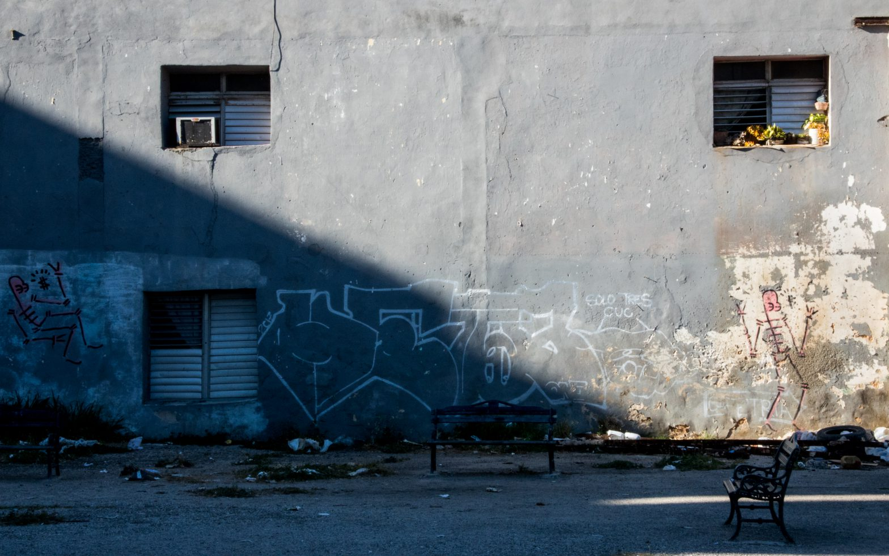
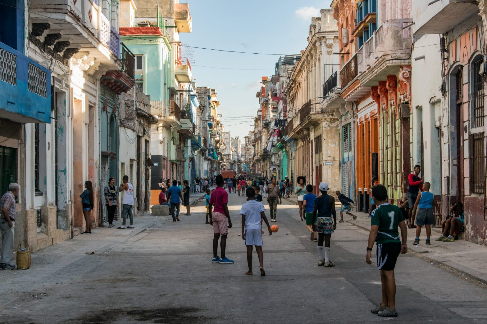
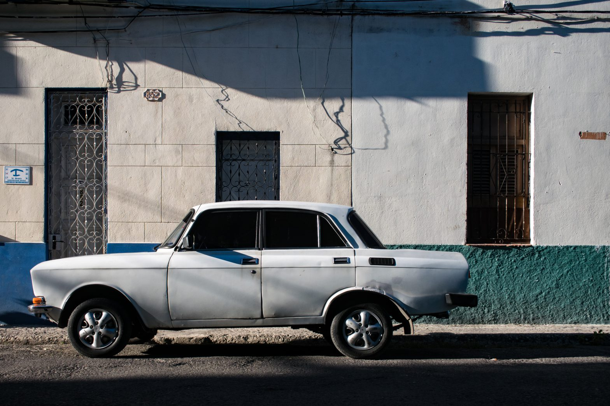
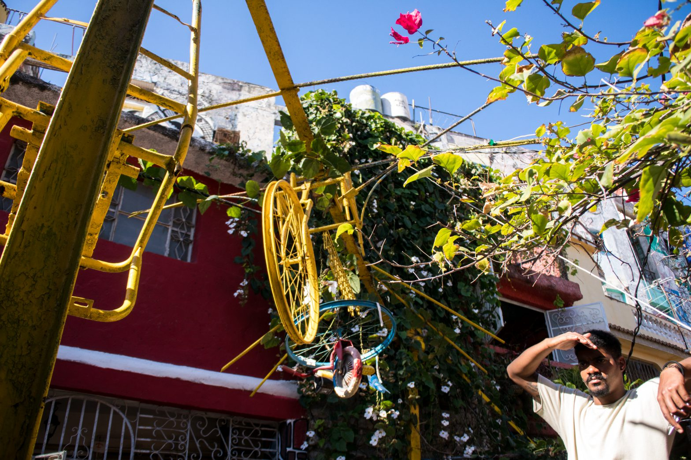
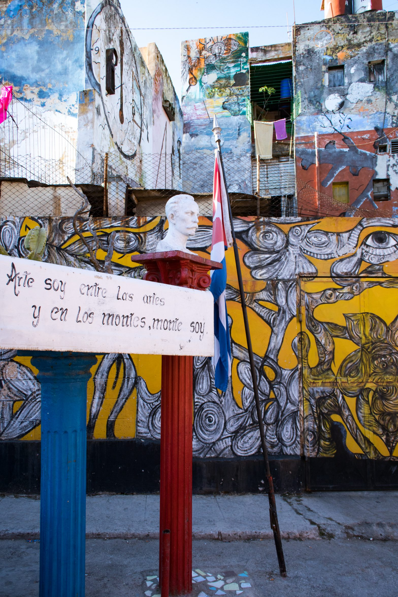
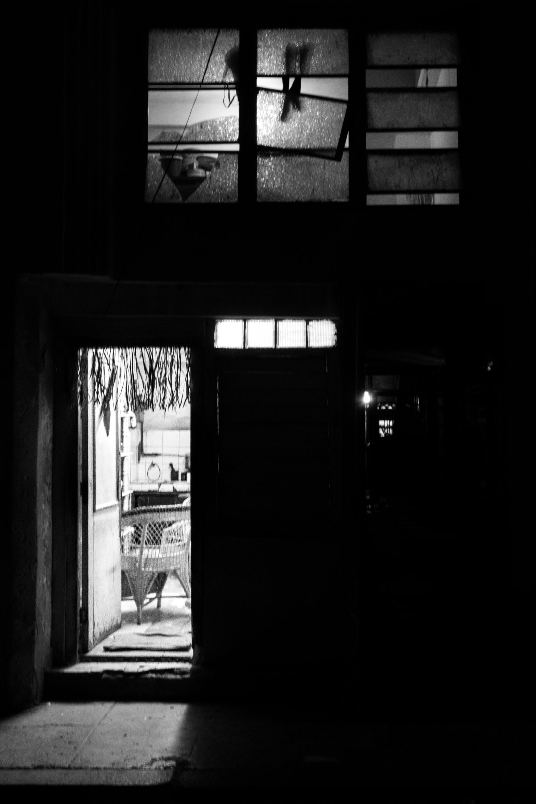
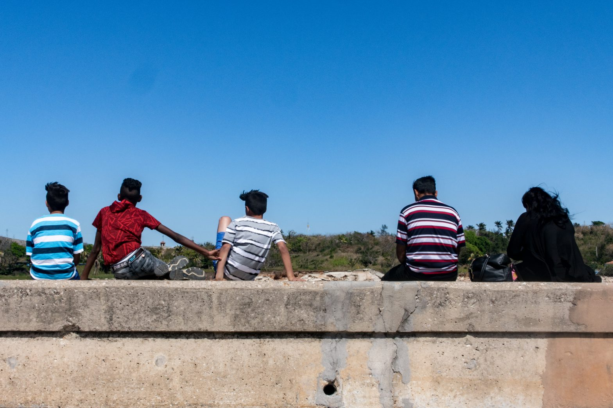
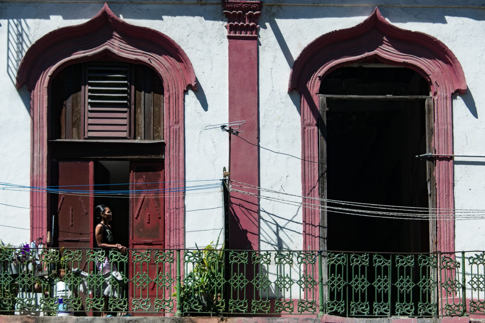
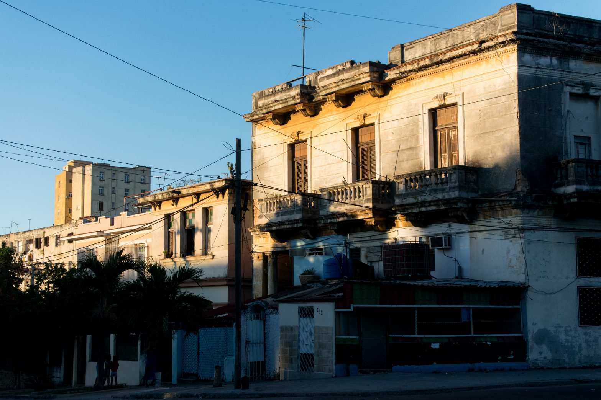

Running in Havana is definitely not as peaceful as in Amsterdam. It is just a mean to discover the city in another manner. The old American cars still stand in the streets and darken the air when they pass by, adding an inescapable pollution to the morning heat. Fortunately, after a 50 year old Chevrolet or Pontiac goes down the street, the opaque smoke rapidly vanishes and the next car appears only a few minutes later. The small streets of _Centro Habana_ (Havana Center), as well as the big arterial roads of Cuba, are not used by many motorists - less than 10% of the people have a car. It is here, anyway, that I decided to go for a run the day after I arrived in the island.

After some steps in the city's polluted streets and along the Malecòn - long avenue bordering the water that separates the communist country from the promise land of capitalism - I decide to buy an [Internet card](https://anothervyou.world/en/cuba-and-the-internet/). I arrived the day before and left my hometown two days earlier, but I still have not been able to contact my loved ones. Being that disconnected lets you entirely dive into the travel, and even more when you are alone: the usual social distraction you have online disappears with the difficulty to find Internet. My friends will land two days later and, because I sleep in a shared room, I have been able to meet many people, among who a Chilean girl who will visit the city with me before I go to Viñales. Travelling in a radically different country clearly brings visitors together and encourages to interact.

However, I am alone for this first evening in Havana. Even if I am tired from the journey, I go and walk in the streets to start learning about the local culture. After crossing a dozens of kids playing football on the pathway, I make a stop in front of a house where a family and their friends in a state of trance sing and dance together. A few meters further, while I am photographing a dilapidated building, a man standing at the beginning of his small street, winding through houses, starts talking to me. Despite my mediocre academic Spanish in these first days, he brings me along the houses. Some opened condom packages are scattered on the ground.

According to my standards, his home is rudimentary; to him, it has everything it needs. Visible as soon as you enter, an old television with a cathode ray tube is put in one of the corners of the first floor. The image is bouncing and the sound crackling when we go to the second floor, five or six square meters wide, and where you can only find his bed. Downstairs, a small kitchen is between a picture of his children, hung on the wall, and the entrance door, always opened. Something I learned for sure this evening is that Cubans do not live side by side but certainly together. We go out, he takes his place back and speaks about Mitterrand receiving Castro in the 90s - he was the French president back in the time. Then, a little girl passes by with her mother. He might not know them, but he starts talking and a new discussion goes on. I decide to head for the _Plaza de la Revolución_.

On the way, another man joins my walk trip and asks where I come from. Security gard in a hospital, he earns 10 dollars a month - when the average is about 25 dollars. His house is the family's house but, like the previous man I met, he has to pay for electricity, water and gaz. We spend more than an hour together, drink a mojito and leave each other. He jumps in a bus he has to pay the equivalent of 4 cents of dollar, while I go to the _Fabrica de Arte Cubano_ (factory of Cuban art). Cuba is famous for its musical richness and its heated dances, and this cultural space in the West of _Vedado _welcomes a _Cuban son _show tonight. There are also exhibitions, as well as several bars and a restaurant: taking place in an old oil factory, the venue is huge.

Music has an important place in the local life. Very young, children dance to the rhythm of very diverse musics such as _salsa _and _reggaeton_. Groups play everywhere, in the street as in the bars, in the parks as in the restaurants. Every time, crazy dancers come and do dancing steps that, through the eyes of a beginner like me, only experts could do. Each Sunday, the _callejón de Hamel _(Hamel alley) is a perfect example of this: in the middle of a tight street with colourful walls, musicians play _rumba _one after the other. _Rumba_ is born in Cuba, created by African slaves. The percussions and the pace of this catchy music perfectly match the charm of the alley, full of decorations, sculptures, stone seats and mural paintings - with, again, African influences. The folkloric atmosphere could not be more immersive.

_"Cuba es un país libre" (Cuba is free)_, keeps saying a man passing in front of Valentina and me while we are sitting on a bench. Once the party ended, we decided to go to a park to be able to use the Wi-Fi. I let my camera by my side and, after asking our home country - the same question always opens the discussions here - the man insists and wants us to know that nobody would rob anything here. This pride he had for his country still sounds in my head. If it is most of the time shared, Cubans are still very keen to criticise some of their government's decisions. All of them are happy with the - relative - sovereignty they won after the revolution of 1959 but, as I will be able to notice later, a lot do not agree with the politics led by the Communist Party of Cuba (PCC, single party). New wishes arise with the easier access to Intenet and the window on our consumption pattern: consumerism enters, timidly but surely, in a country that has been communist for five decades.

Once the night falls, the value of music and the freedom people feel about it strike again. In the boat going from _Havana Regla _to _Havana Vieja_, and under the eyes of a policeman who will tell us he is used to that kind of performance, a group of teenagers loudly sings sensual - to sexual - songs. They jump, scream and dance very close to each other, one of them holding a child in her arms. Their happiness is only equalled by the surrealistic aspect of the scene. Now the craft is docked, everybody goes out and, a bit further, another of the teenager falls and heavily lands on the ground. All of them, including the stuntwoman, could not laugh more. Welcome to Cuba!

-----

As a bonus, here are some more pictures:

