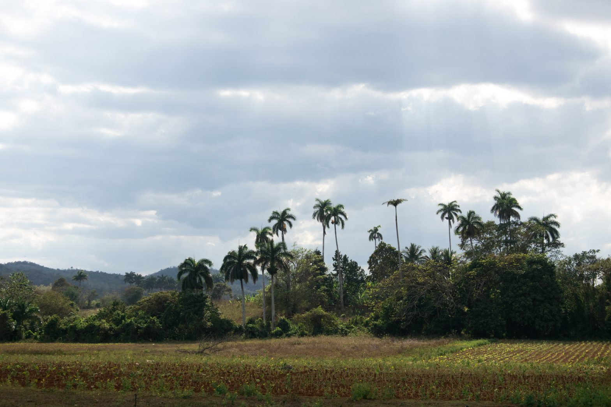
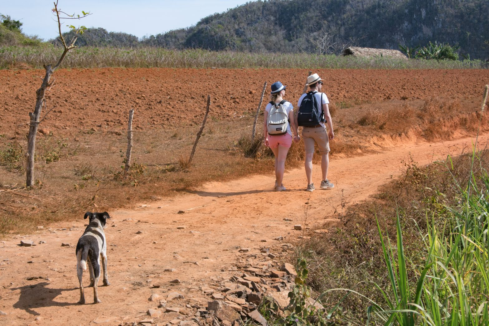
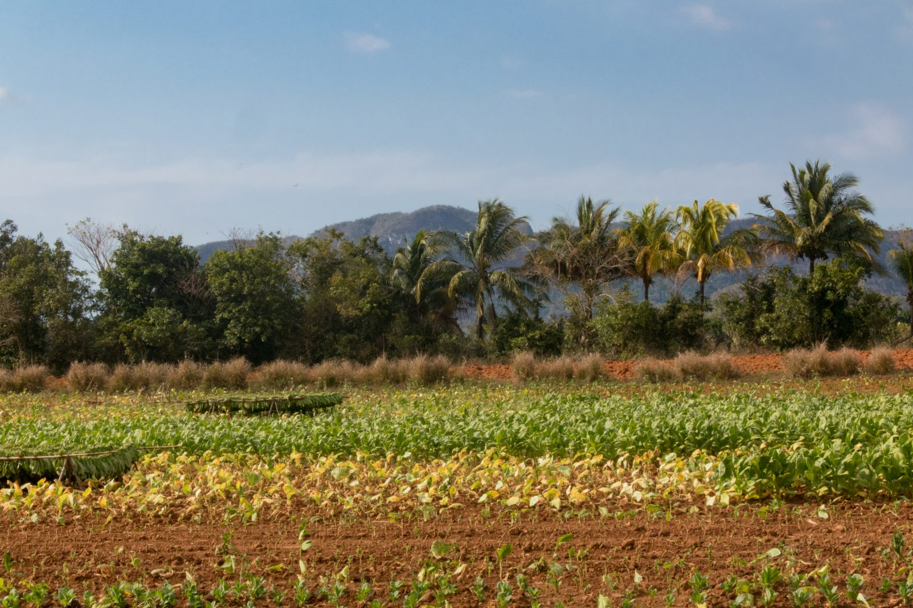

This morning, despite the early hour, the blazing sun is tougher than 
in [Havana](/en/havana---rhythms-and-people). The gulf 
of Mexico is further from Viñales, and the surrounding karstic relief prevent 
the wind from reaching us. The valley also draws the landscape so many 
travellers come for. On our side, our trip from the capital was arranged by the 
landlord there. The day before, a _collectivo_ (collective taxi) came in the 
beginning of the day and let us in the hands of our new family for two nights. 
We could otherwise have taken a bus from the national company Viazul, but it 
would have been as expensive and longer.

The asphalt in the northern part of Cuba gives a brief overview of the country's road infrastructures. We travelled the 180 kilometers between Havana and the touristic town in slightly more than three hours. On what seemed to be - and not to be at the same time - a highway, we overtook bikes, pedestrians, and most of all we breathed the dark smoke escaping from the cars cutting the air in front of us. Halfway, we crossed the opposite road and went on a holed path that none of the - very few - signs signalled. Zigzags, right, pothole, left, and we passed the gate of a house where women were washing the entrance. In an pitiful outbuilding, pigs were doing the absolute inverse work. Finally, men transferred the liquid of a white plastic jug into our car. Odd service station...

The scorching sun is actually not the only one to tag along this morning. In the city's main street, one of the many abandoned dogs joins the walk. In a few hundreds meters, he makes six or seven more coming with us and leaving, a bit further, the concrete for the dust. Most of them escort us until the cliff we need to cross via a cave, taking place a dozen meters higher. None of the dogs try and risk climbing the steep stairs leading to the entrance. Twenty minutes later and right after we are done coming down the other side, one of them actually appears from nowhere. He will follow us for about three hours, before saying goodbye near a lake where he will find other fellow travellers.

After eating in a restaurant where only the vegetables they grow on the hill are cooked and served, we stop in an organic cigar factory. The man who welcomes us, grandson of the fields' owner, explains that the government takes 90% of the produced tobacco leaves to make its own cigars. The bitter observation looks like a criticism of the current system. When going out, his cousin - working here as well and wearing the same outfit - pretends speaking a mediocre French to gain our attention. This is the opportunity to have another view on the Cuban politics.

If he is surprised that we have been visiting for hours on foot and with no guide, it is because a lot choose to do it on a horse's back. Skinny and packed with no food nor water when they are not used, they also reduce the freedom you have when you walk on the valley's winding paths. He tells us how hard it is to find an official guide here since the government delivers only sporadically the precious licenses. According to him, the reason why makes sense. These professionals, who need to speak at least Spanish plus two other languages, have a better wage than professors: teachers would, with no doubts, leave their current work if they could easily become guides.

Ironically, he was himself a teacher in the past. To be honest, his perfect French could have betrayed him. He lets us know his most vivid criticism, and it is about the education: it is very hard if not impossible to choose where to teach in the country, and some decide to corrupt the leadership bodies to go wherever they want. Back in the days, he had to threaten to quit to have the position he deserved. Working in the middle of tobacco fields nowadays, his teacher career actually stopped on a lighter note. During a class of natural sciences, his pupils drew a male sex on of a woman's body he sketched on the whiteboard. Disillusioned, he cut his first work experience short since he could not find in them this desire to learn he has himself.

On the way back, tags of the Committees for the Defense of the Revolution (CDR) are painted on some houses. These organisations, sometimes controversial and accused to lead ideologically coercitive actions, essentially take care of practical aspects of the neighbourhood daily life - maintenance of roads, delivery of medication, etc. Right of the commemoration of a revolution past anniversary, we can read: _"The neighbourhood unites us"_. The people we met today show that divergence in opinions exists despite this unity.

