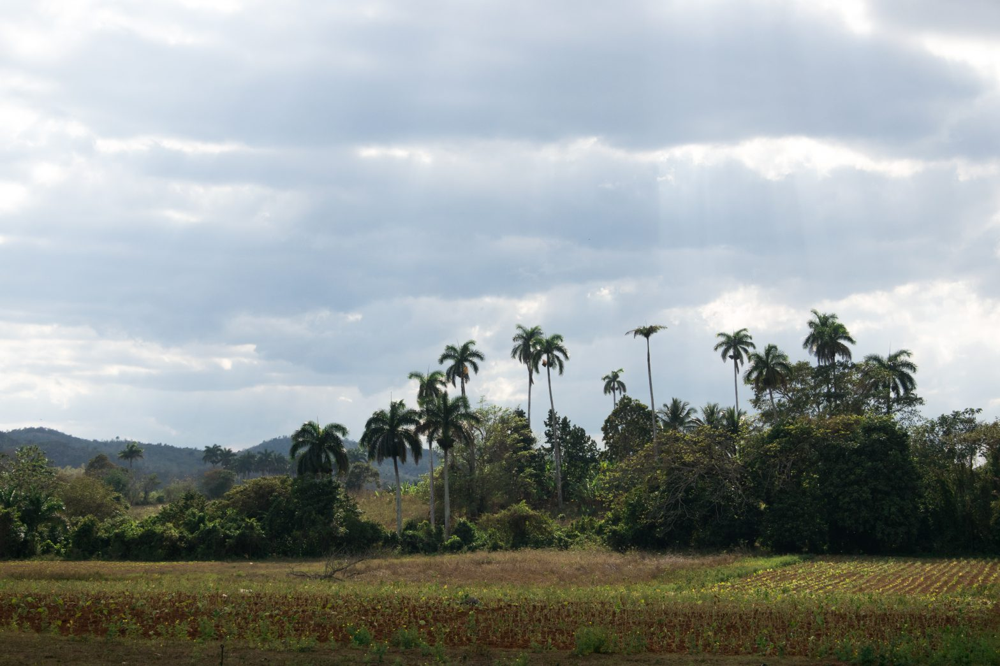
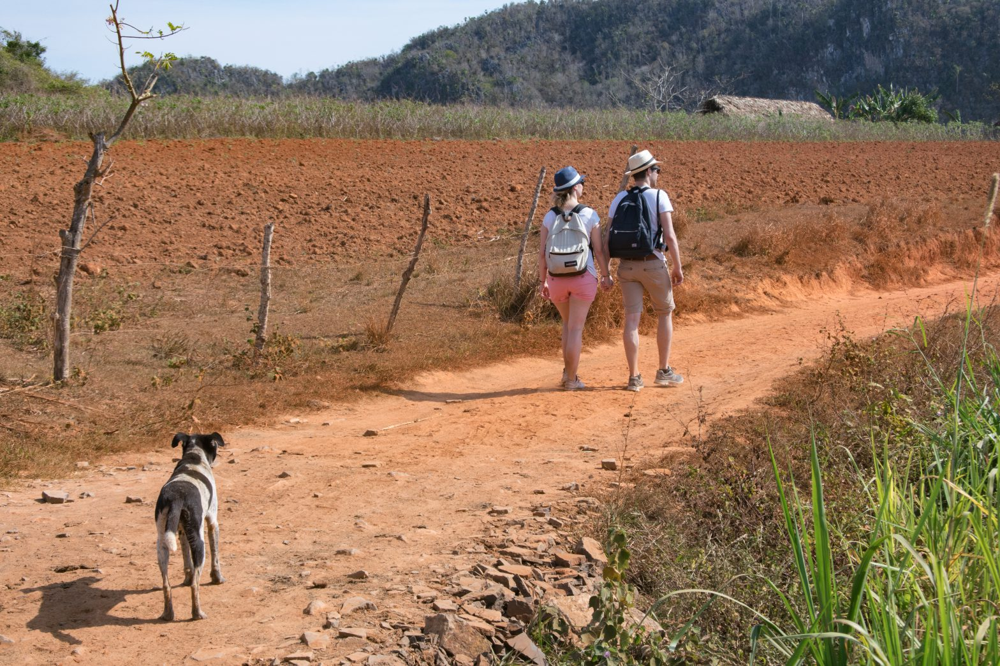
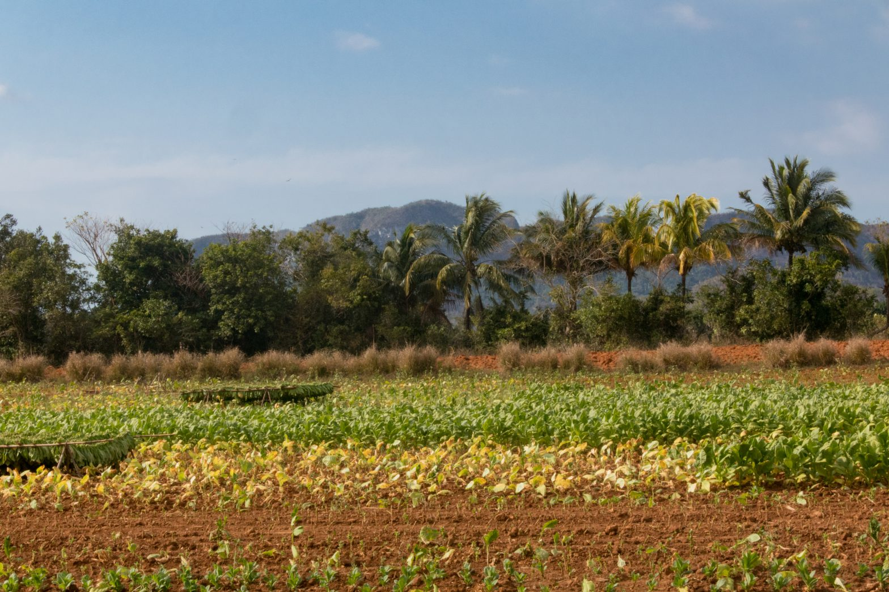

Ce matin, malgré l'heure, l'intransigeance du soleil est encore plus frappante qu'à [La Havane](https://anothervyou.world/fr/la-havane-rythmees-rencontres/). Le golfe du Mexique se situe plus loin de Viñales, et le relief karstique alentour empêche le vent de progresser jusqu'à nous. La vallée dessine également le paysage pour lequel tant de voyageurs prennent la route jusqu'ici et y sillonnent les chemins de terre à pied ou à cheval. Pour notre part, le trajet depuis la capitale a été organisé, comme plus tard au cours du voyage, par le propriétaire qui nous accueillait alors. La veille, un _collectivo _(taxi collectif) est effectivement passé en début de journée et nous a laissé, à destination, entre les mains de notre nouvelle famille pour deux nuits. Prendre un des bus de la compagnie nationale Viazul aurait été une autre possibilité mais, pour ce trajet, elle est aussi coûteuse et bien plus longue.

L'asphalte du Nord de Cuba donne un bref aperçu des infrastructures routières du pays. Nous avons effectué les 180 kilomètres qui séparent La Havane du village touristique en un peu plus de trois heures. Sur ce qui semblait - et en même temps ne semblait pas - être une autoroute, nous doublions des vélos, des piétons, et nous respirions surtout les traînées noires qui s'échappaient des voitures qui fendaient l'air devant nous. A mi-chemin, nous avons traversé les voies opposées et nous sommes engagés avec détermination sur une route à trous qu'aucun des - rares - panneaux de signalisation n'indiquait. Zig-zags, droite, nid-de-poule, gauche, et nous avons passé le portail d'une maison à l'extérieur de laquelle des femmes lavaient le sol. Dans une dépendance, des porcs faisaient le travail inverse. Les hommes, eux, s'occupaient de transférer le liquide d'un bidon blanc dans notre voiture. Particulière station service...

Le soleil ardent n'est en fait pas le seul à nous accompagner ce matin. Dans la rue principale de la ville, un des nombreux chiens laissés à leur sort se joint à nous. En quelques centaines de mètres, sa présence en rameute six ou sept supplémentaires qui, un peu plus loin, quittent le bitume à nos côtés. La plupart d'entre eux nous escortent jusqu'à la falaise que nous devons traverser via la grotte qui la perfore à plusieurs dizaines de mètres de hauteur. Aucun ne se risque à s'aventurer sur les escaliers escarpés qui mènent à l'entrée. Une vingtaine de minutes après les avoir quittés et quelques secondes après notre descente de l'autre côté, l'un d'entre eux se fraye finalement un chemin et semble apparaître de nulle part. Il nous suivra pendant près de trois heures, avant de nous dire adieu près d'un lac où il trouvera d'autres compagnons de route.

Après être passés dans un restaurant dont le menu unique est notamment composé des légumes qu'ils cultivent sur la colline, nous nous arrêtons visiter une fabrique de cigars biologiques. Celui qui nous accueille, petit-fils du gérant de l'exploitation, nous explique que le gouvernement ponctionne 90% des récoltes de feuilles de tabac pour fabriquer ses propres cigars. Le constat, amèrement prononcé, sonne comme une critique du système actuel. En sortant, son cousin - travaillant également ici et portant le même uniforme - nous harangue en feignant parler un français plutôt médiocre. L'occasion de découvrir un nouveau point de vue sur la politique cubaine.

S'il est surpris d'apprendre que nous nous promenons depuis des heures sans guide et à pied, c'est que beaucoup choisissent de se balader à dos de cheval. Faméliques et agglutinés sans eau ni nourriture lorsqu'ils ne sont pas en service, ils réduisent d'autre part drastiquement la liberté de parcours sur les pistes sinueuses de la vallée. Il nous fait savoir qu'il est aussi très difficile de trouver un guide officiel par ici, le gouvernement ne délivrant que sporadiquement les précieuses licences. Selon lui, le point de vue se défend. Ces professionnels, qui doivent parler au moins deux langues en plus de l'Espagnol, bénéficient d'un salaire plus attractif que celui des professeurs : ceux-ci déserteraient sans doute le métier d'enseignant s'il était si facile de devenir guide.

Ironiquement, lui-même était professeur par le passé. Avec du recul, son excellent français aurait pu le trahir. C'est au sujet du métier d'enseignant qu'il rend sa plus vive critique : il est difficile voire impossible de choisir l'endroit d'affectation, et certains décident de corrompre les instances dirigeantes pour obtenir le poste qu'ils désirent. Pour sa part, il avait à l'époque dû menacer de quitter son poste pour être affecté, sans corruption, dans l'établissement qu'il méritait selon ses résultats passés. Aujourd'hui travaillant au milieu des champs de tabac, sa carrière professorale s'est cependant arrêtée sur une scène plus légère. Pendant un cours de sciences et vie de la Terre, ses collégiens ont dessiné un sexe masculin sur le corps d'une femme qu'il avait esquissée au tableau. Désabusé, il a coupé court à cette première expérience professionnelle, ne retrouvant pas en eux cette soif d'apprentissage qui semble l'animer lui.

Sur le chemin du retour, des maisons arborent les peintures des Comités de Défense de la Révolution (CDR). Ces organismes d'État, parfois controversés et accusés d'actions idéologiquement coercitives, s'occupent essentiellement d'aspects pratiques de la vie quotidienne de quartier - entretien des routes, délivrance de médicaments, etc. Aux côtés de la commémoration d'un anniversaire passé de la révolution, nous pouvons lire : _"Le quartier nous unit"_. Les rencontres d'aujourd'hui montrent finalement que les divergences d'opinion existent malgré l'unité affichée.

