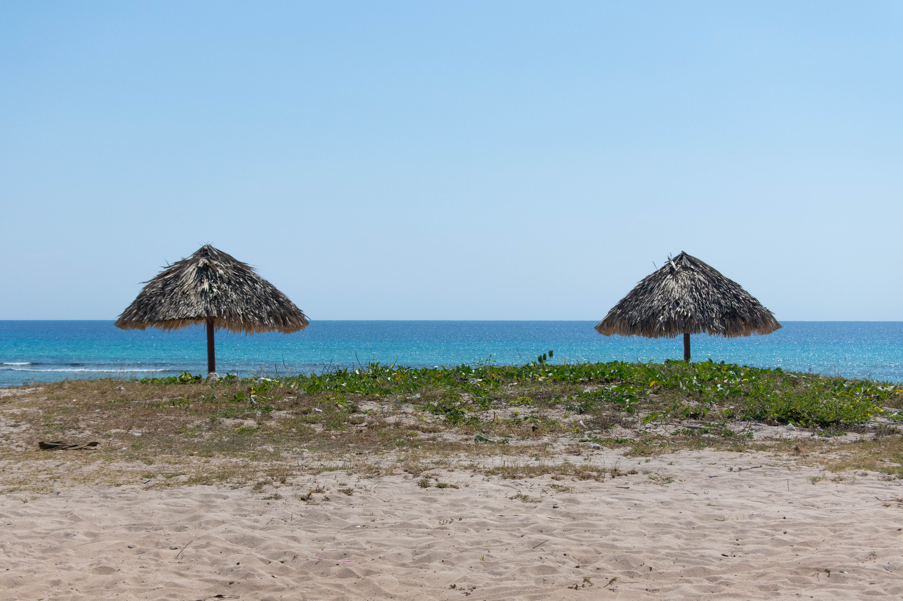

After we walked on the burning asphalt of Havana and wandered through the sultry reliefs of Viñales, the same car that took us between these two cities brings us to the beaches of the Bay of Pigs, a bit more South. It is on this fine sand that hundreds of US soldiers heavily failed when they tried to invade Cuba in 1961. The historic turning point is not the only reason the area is well known: its breathtaking seabed is also very easily accessible. This is the opportunity to dive into a colourful world - dangerously full of sea urchins.

On the way to Playa Larga, we actually go through Havana again, change car and meet our new driver for the next two hours. In a moment of hesitation, and hardly understanding how taxis are organised, we have to pay one of them for the entire trip. The organisation is actually quite simple: some of them spend their days bouncing between Viñales and Havana while the others dispatch travellers from the capital to other cities. The drivers rarely find their ephemeral travelling companions themselves. This is a mission for touts, filling up their pockets of dollars as they fill the old metallic shells of foreign flesh - Cubans travel very little themselves.

The township seems to be - relatively - expanding. Two or three houses are being constructed next to the one we spend the night, and a public Wi-Fi hotspot was placed in a park a few months before we arrive. After swimming with hundreds of fishes just some dozens of meters from the dry land, thanks to the snorkeling equipment we were given in our _casa_, we eat at one of our host's friend's. When leaving the place, we are attracted by music and laughs coming from the darkness, on the other side of the street.

Right after we arrive in front of the garden full of people of different ages, we are invited to join the party. Program: weird chicken and pork stew, coconut alcohol and rum - to enjoy pure, of course. All drunker the ones than the others, the neighbours are highly interested in our lives and end up bringing us around one of them, playing classic Cuban musics with his guitar. Drunkenness get into us as well and we are taken to another level when _Chan Chan_, from the infamous Buena Vista Social Club, is sung by everybody around. The house is quite empty and rustic, but alcohol does not stop flowing and they look delighted by our presence. Yliana, our host for the night, tell us the day after that her friends came and spent a girls night _"drinking, eating and talking"_ in honour of the women's day. The party we attended this evening was to celebrate this special event too: everyone can choose his way of marking the occasion!

These celebrations are rather surprising given the way some men see women in Cuba. On the bumpy way to Cienfuegos, our driver keeps on talking about _chicas _(girls) that we see by the roadside. He also tells me that I will be able, for sure, to find as many as I want along the Malecón - broad esplanade - of the city we are heading to. In Havana, spending two days with Valentina gave me a preview already: men looked at here insistently and sometimes whistle at her. On another hand, this question is often asked - almost animally: _"¿y qué piensas de las chicas cubanas?" (and what do you think about the Cuban girls?)_. Later during the trip, when I hop in front of on one of these half centenarian livestock transporters used as buses, the driver will shout at random teenagers to introduce them to me. His age - forty or so - the fact he is a father and my previous downright refusal will not change anything. He will even be helped by an old man, supposed to control the legality of our mean of transportation. The girls' ignorance will speak for itself...

Before heading to Cienfuegos, we take a four-hour break at Playa Girón to enjoy the marine ecosystem a bit longer. During the morning, we were able to do birdwatching and see some of the island's endemic birds in the national park standing between the two beaches. Two days in the Bay of Pigs, and we are on the road again. By the way, for your information, the Bay of Pigs is named after a fish specie called _cochinos_, which also means pig, in Cuban Spanish. Nothing to do with pigs of any sort, then...

