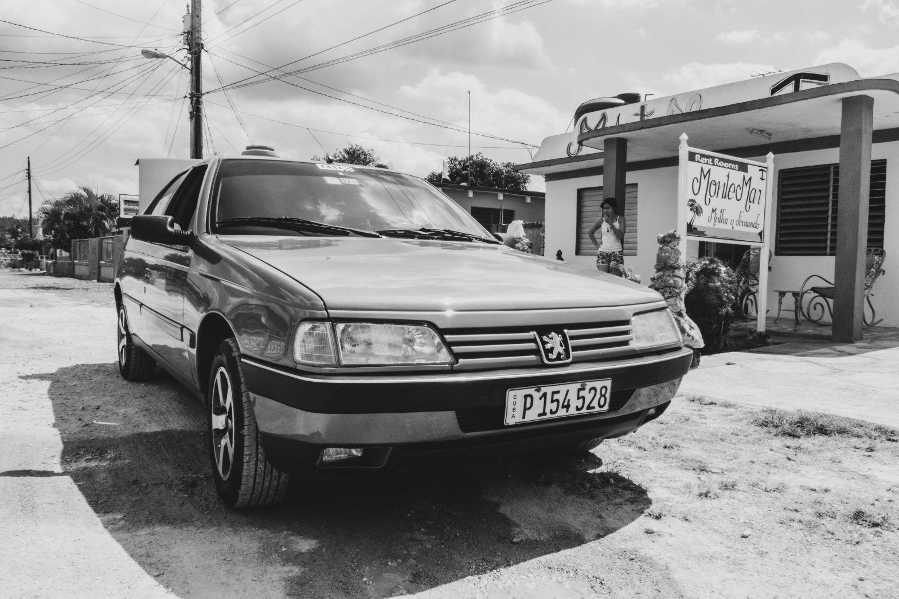
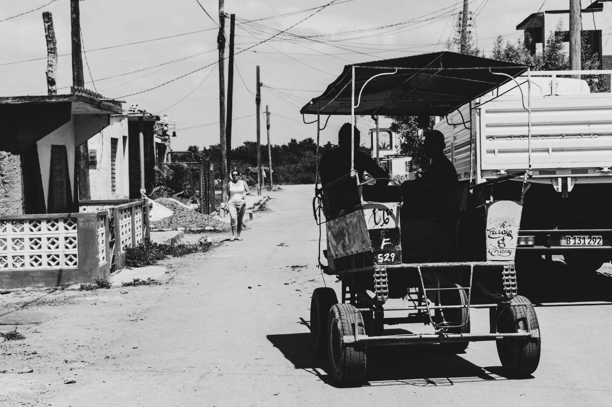
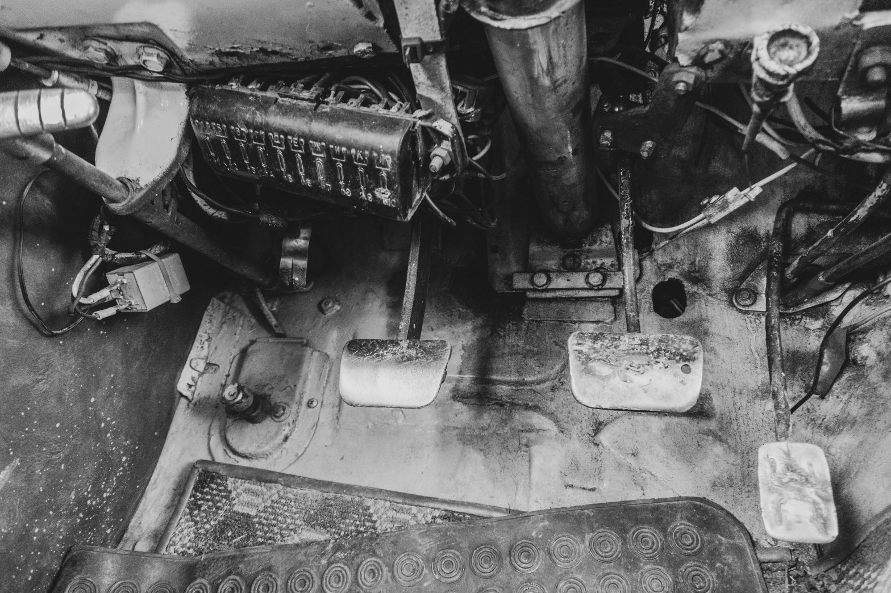
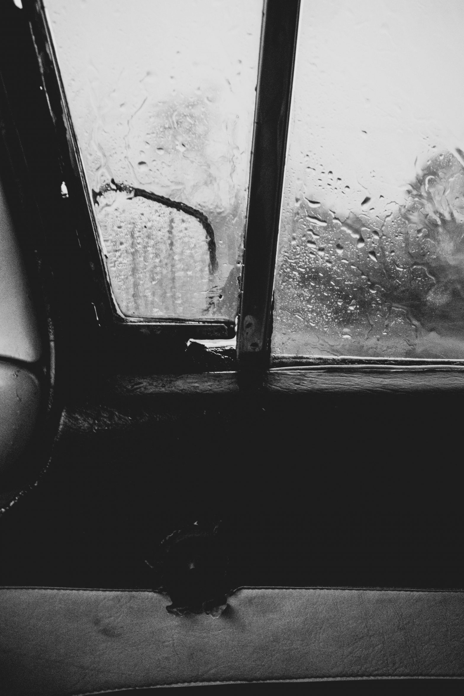
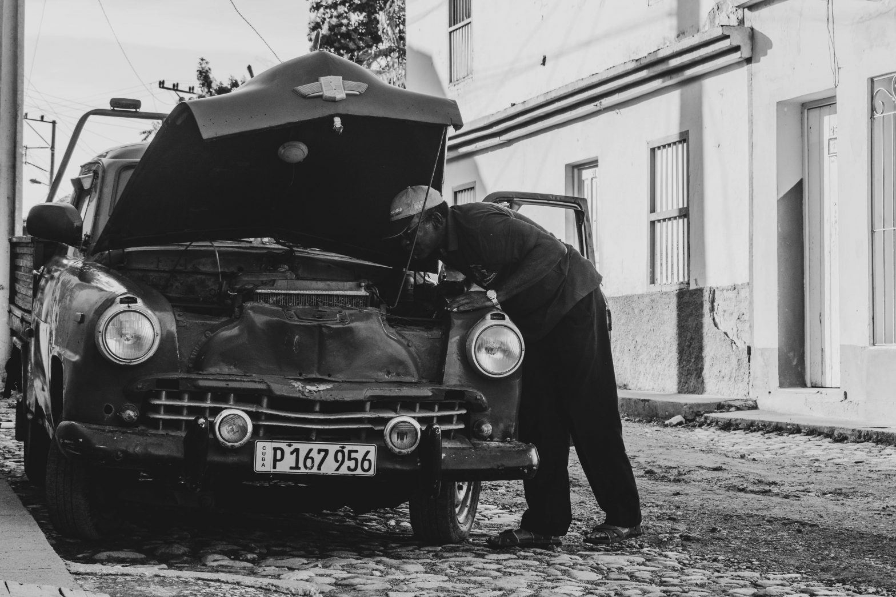
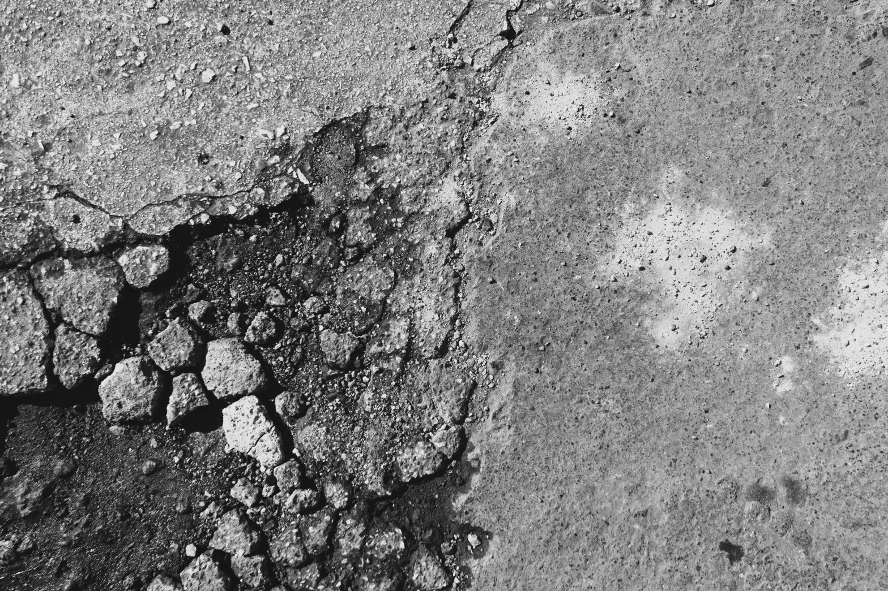

Even if we are tacking like a spaceship dodging obstacles in a video game, the bumpy roads of the Caribbean island are less dangerous during the day. At night, the random dance of horse-drawn carriages - although they are forbidden to ride from dusk to dawn -, pedestrians and bikes going out of the darkness at the very last moment makes driving particularly hard. The only lamp is high in the sky and sometimes hidden behind the clouds, and the old cars' headlights struggle to show the way otherwise. After explaining why he drives by day and not by night, the man who brings us to Cienfuegos takes his phone to show me something.

As is often the case, the speedometer's needle does not leave its bed and indicate zero kilometre per hour, but we do are speeding along the way, perfectly avoiding the potholes scattered on the ground. After overtaking a herd of servicemen, standing in a tractor's trailer, our driver searches a picture of his damaged car, lost in the middle of his selfies. One night, he crashed into an animal which was crossing the road without any warning. The shell is completely smashed in, the driver beaming and I sticked to my seat. How ironic...

If the state often owns the city taxis' cars, the one we are heading to the next destination into belongs to the driver's father and does not seem to be worth the 40.000 dollars he estimates. Two days ago, when we were going to Playa Larga, the car was owned by the driver himself. His Peugeot 405, coming straight from the 90s, had more than three million kilometres and still costed around 50.000 dollars on the Cuban market. The Pontiac and Chevrolet from another age would cost, on their side, about 30.000 dollars.

The exorbitant price of Cuban cars is explained by a shortage unique in the world - around 650.000 automobiles for 11 million inhabitants, against 39 million for 67 million in France. For a long time, the American embargo prevented the cars from entering the country. Today, the state controls the sales of new cars and set the custom duties: a Peugeot 508 is as expensive as 250.000 dollars, six times more than in Europe, while the average salary reaches a ceiling at 25 dollars a month. Even if it is still possible to find a few recent vehicles in the cities' chaotic streets, most of the car fleet is actually compounded by cars that are more than sixty years old or that come from the soviet side, when the cold war was going on - Lada, Moskvitch, etc.

The four-wheels low density gives space to bicycles, scooters and horses which move aside when a honk rings out. The picturesque paving stones of Trinidad perfectly highlight the use of honks in Cuba, rather informative than agressive. When leaving the city for Camagüey, we also learn some basic rudiments of the local driving: doing a reversed V with your index and your middle fingers means the police is a bit further, as well as doing one lights flash; whereas more than one lights flash or a sign with the index and the little fingers alert of something on the road - usually an animal.

Like in France, Cubans have a driving licence with penalty point system. If running a stop sign costs four points in France, it costs twelve on the island - three times more, like the initial total number of available points. Twelve points as well after illicitly overtaking or exceeding the speed limit. After these explanations, Ernesto, who takes us to the city where we will stop over before Santiago de Cuba, removes his elbow from the car door and puts his hands back on the wheel. We are approaching a police control checkpoint, and not having your two hands on the wheel can cost eight points. However, the seatbelt is only mandatory in the new cars: Cubans are, by fact, not really prone to this law...

Once in Camagüey, we have the opportunity to see how the Cuban GPS works. It is as simple as stopping on the verge - or, better, in the middle of the road - and asking around if anybody knows where our hosts live. If their name is always given to us, their address often remains mysterious or does not have a number, making the orienteering race a bit funnier. After dropping passengers off, drivers sometimes spend the night in the city and turn back the day after, with other tourists on board. But better be careful to the evenings with too much alcohol: driving while being drunk can cost up to five years of driving license. It is also suspended for a time set by the authorities when it has no points anymore, before they give it back with its full thirty-six points.

Interestingly, taxis taking foreigners on long distances are among the wealthiest in the Cuban society. One of them told me he wins 1.700 dollars a month, from which 700 are given to the state to be able to practise, and 500 spent for the car maintenance costs. In the end remains a sum that is twenty-five times bigger than the monthly average salary, used to meet his family's needs. However, another taxi driver, practising in Havana - and therefore driving only in the city itself -, refuted these statements and assured he never won that much. But both of them are at the same page on one point: they work everyday, including week-ends, without taking a single day of holiday ever.

The car we are heading to Santiago the Cuba into is a typical exemple of the antiques crossing the country: it is American but full of Russian pieces, it rains inside when it rains outside and, of course, seatbelts are missing. But, in compensation, it is possible to connect our phones thanks to the Bluetooth technology: the opportunity for us to listen to _Clandestino_, from Manu Chao, windows opened and sun blazing. The wind rushing through the windows eases the heat and reinforce the feeling of freedom characterising the present moment.

Turn of events. After a few hours of travel, we have to reduce drastically the sound volume when a torrential rain beats down on us. It seems like a waterfall crashed on the roof and the car is acting as a submarine. As best as possible, the windscreen is defogged with a newspaper becoming completely soaked very quickly. As a consequence, we run off the road a few times but the driver always make up for it just on time. Step by step, the clouds clear and are replaced by a dark smoke, coming out of the tall chimneys splitting the horizon. The sugar refineries are, in turn, replaced by houses and, after six hours of a drive full of emotions, Georgina welcomes us in her charming flat.

Just the once will not hurt, we had no mechanical problems on this way. If the car wrecks on the roadsides make one wonder, seing the mechanics-despite-them repairing some of them gives a bit of hope. The years of blockade forced Cubans to manage to do with the vehicles arrived in the country before Castro came into power, in 1959. A lot of them are actually patched up more than repaired, some have as many lives as the belief give to cats, while others made the pavements their deathbed. The cars, in form of patchworks, are therefore as responsible as the state of the roads for the time spent between travelling inside the country.

In order to experience something different from these endless yet instructive journeys, the train will replace the old metallic shells ten days later when I go from Las Tunas to Santa Clara. The Cubans' reaction is quite funny... and portends, once again, a very long trip!

