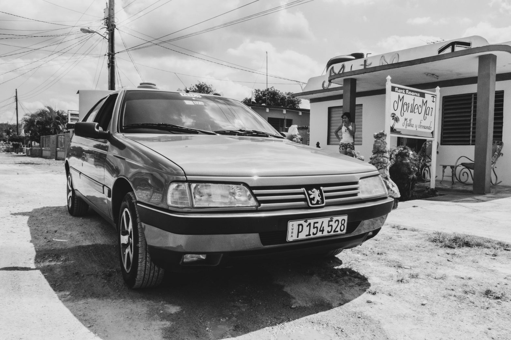
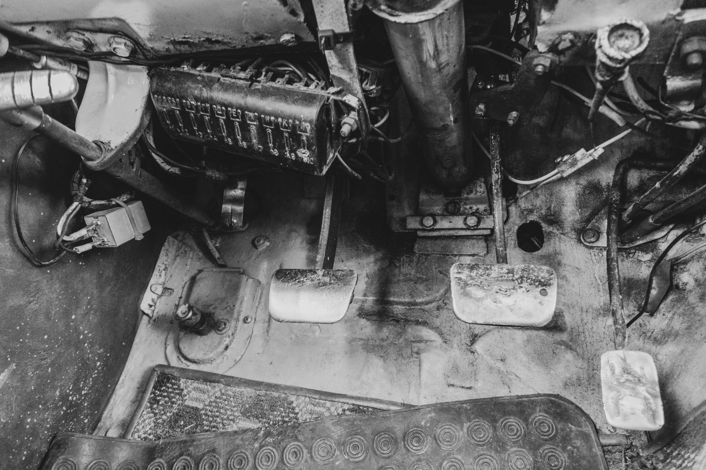
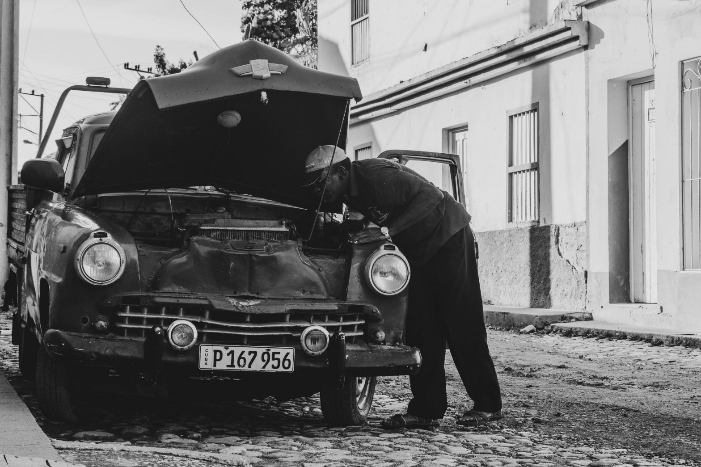

Même si nous louvoyons tel un vaisseau évitant les obstacles dans un jeu vidéo, il faut admettre que les routes cahoteuses de l'île caribéenne sont moins dangereuses la journée. La nuit, la danse aléatoire des calèches - dont l'utilisation des voies est pourtant interdite du coucher au lever du soleil -, des piétons et des vélos qui s'extirpent de la pénombre au tout dernier moment rend la conduite particulièrement difficile. Le seul lampadaire est perché haut dans le ciel et se retrouve parfois caché par les nuages, tandis que les phares des vieilles voitures peinent autrement à montrer la voie. Après m'avoir expliqué pourquoi il roulait de jour plutôt que de nuit, le chauffeur qui nous emmène jusque Cienfuegos sort son téléphone pour me montrer quelque chose.

Comme souvent, l'aiguille du compteur de vitesse ne quitte pas son lit et indique zéro kilomètre par heure, mais nous filons bel et bien à toute vitesse et esquivons à la perfection les nids-de-poule semés sur le chemin. Après avoir doublé un troupeau de militaires, debout dans la remorque d'un tracteur, notre chauffeur s'affaire à chercher une photo de sa voiture accidentée perdue au milieu de ses autoportraits. Une nuit, il a percuté de plein fouet un animal traversant la voie sans prévenir. La carcasse est défoncée, le conducteur hilare et moi collé à mon siège. La situation pourrait difficilement être plus ironique...

Si l'Etat possède souvent les voitures de ceux qui exercent la profession de taxi en ville, celle dans laquelle nous rejoignons notre prochaine destination appartient au père de notre conducteur et ne semble pas valoir les 40 000 dollars qu'il estime. Lorsque nous rejoignions Playa Larga deux jours plus tôt, le véhicule appartenait en revanche à notre chauffeur d'alors. La Peugeot 405 des années 90 avait dépassé les trois millions de kilomètres et coûtait encore autour de 50 000 dollars sur le marché cubain. Les Pontiac et Chevrolet d'un autre temps coûteraient, elles, environ 30 000 dollars.

Le prix exorbitant des voitures à Cuba s'explique par une pénurie unique au monde - environ 650 000 automobiles pour 11 millions d'habitants, contre 39 millions pour 67 millions en France. L'embargo américain a longtemps empêché les automobiles de se frayer un chemin sur les routes cubaines. Aujourd'hui, l'Etat contrôle les ventes de voitures neuves et fixe les droits de douane : une Peugeot 508 revient à plus de 250 000 dollars, soit six fois plus qu'en Europe, quand le salaire moyen plafonne à 25 dollars par mois. Il est tout de même possible de trouver quelques véhicules récents dans les rues chaotiques des villes, mais la plupart du parc automobile se compose des voitures ayant déjà fêté leur soixantième anniversaire ou provenant du camp soviétique, à l'époque de la guerre froide - Lada, Moskvitch, etc.

La faible densité des véhicules à quatre roues laisse place aux bicyclettes, scooters et chevaux qui s'écartent au son des klaxons. Les pavés pittoresques de Trinidad mettent parfaitement en exergue l'utilisation de l'avertisseur à Cuba, plutôt informatif qu'agressif. En quittant la ville pour rejoindre Camagüey, nous apprenons aussi quelques rudiments de la conduite locale : effectuer un V à l'envers avec son index et son majeur annonce que la police est postée un peu plus loin, tout comme faire un seul et unique appel de phares ; tandis que plusieurs appels de phares consécutifs ou un signe de l'index et de l'auriculaire alertent d'un obstacle - habituellement un animal - sur la route.

Comme en France, les Cubains ont un système de permis à points. Si griller un stop en France coûte quatre points, il en coûte douze sur l'île - soit trois fois plus, comme le nombre total de points disponibles. Douze points également après avoir doublé frauduleusement ou dépassé la limite de vitesse. Après ces quelques explications, Ernesto, qui nous conduit dans la ville dans laquelle nous ferons étape avant Santiago de Cuba, enlève son coude de sa portière et replace ses mains sur le volant. Nous approchons d'un point de contrôle de police, et ne pas avoir ses deux mains sur le volant peut coûter huit points. Par contre, la ceinture n'est obligatoire que dans les voitures neuves : la flotte cubaine n'est donc, dans les faits, pas vraiment sujette à cette loi...

Arrivés à Camagüey, nous voyons à l'œuvre le fonctionnement du GPS cubain. Il suffit de s'arrêter sur le bas-côté - ou, mieux, au milieu de la voie - et de demander aux passants s'ils savent où habitent les hôtes qui nous accueillent pour la nuit. Si leur nom nous est toujours communiqué, leur adresse reste bien souvent mystérieuse ou ne comporte que le nom de rue, rendant la course d'orientation un peu plus drôle. Après nous avoir déposés, le chauffeur passe parfois lui-même la nuit dans la ville de destination et rebrousse chemin le lendemain, avec d'autres touristes à son bord. Mais gare aux soirées trop arrosées : conduire en état d'ébriété peut coûter jusque cinq ans de permis. Celui-ci est également suspendu pour une durée déterminée par les autorités lorsque le solde de points est épuisé, avant d'être rendu avec ses trente-six points au compteur.

Il est intéressant de noter que les taxis transportant des étrangers sur de longues distances sont parmi les mieux lotis de la société cubaine. L'un d'entre eux m'a confié gagner autour de 1 700 dollars par mois, desquels il faut retrancher 700 dollars donnés à l'Etat pour le droit d'exercer ainsi qu'environ 500 dollars pour l'entretien du véhicule. Au final lui reste une somme vingt fois plus élevée que le salaire mensuel moyen, servant à subvenir aux besoins de sa famille. Cependant, un chauffeur de taxi exerçant à La Havane - et n'effectuant donc que des trajets au sein même de la ville - a réfuté ces dires et assuré qu'il ne gagnait jamais autant. Mais ils se retrouvent sur un point : tous deux travaillent tous les jours, week-end compris, sans jamais prendre de vacances.

La voiture dans laquelle nous gagnons Santiago de Cuba est un exemple typique des antiquités qui traversent le pays : elle est américaine mais pleine de pièces russes, il pleut à l'intérieur lorsqu'il pleut à l'extérieur et, évidemment, les ceintures manquent à l'appel. Mais, en contrepartie, il est possible d'y connecter nos téléphones en bluetooth : l'occasion d'écouter _Clandestino_ de Manu Chao, fenêtres ouvertes et soleil ardent. Le vent qui s'engouffre par les fenêtres adoucit la chaleur du jour et renforce le sentiment de liberté caractérisant le moment présent.

Revirement de situation. Après quelques heures de trajet, nous réduisons drastiquement le volume sonore quand une pluie diluvienne s'abat sur nous. Une cascade semble s'écraser sur le toit et la voiture fait alors office de sous-marin. Tant bien que mal, le désembuage se fait à l'aide d'un papier journal très vite détrempé et provoque des sorties de route rattrapées de justesse. Petit à petit, les nuages finissent par se dissiper et la fumée noire des grandes cheminées qui fendent l'horizon les remplace. Les raffineries de sucre laissent à leur tour place aux habitations et, après six heures de route pleines d'émotions, Georgina nous accueille dans son charmant appartement.

Une fois n'est pas coutume, nous n'avons, lors de ce trajet, eu aucun problème mécanique. Si les épaves au bord des routes laissent songeur, voir les mécaniciens malgré eux s'affairer à les réparer redonne un brin de confiance. Les années de blocus ont en effet forcé les Cubains à se débrouiller avec les véhicules arrivés dans le pays avant la prise de pouvoir de Fidel Castro, en 1959. Beaucoup sont ainsi rafistolés plus que réparés, certains ont eu autant de vies que la croyance en prête aux chats, et d'autres encore ont fait des trottoirs leur lit de mort. Les voitures en forme de patchworks sont ainsi autant responsables du temps passé à voyager entre les villes que la condition de l'asphalte.

Pour changer de ces trajets interminables mais plein d'apprentissages, le train se substituera aux vieilles caisses métalliques et me transportera, dix jours plus tard, de Las Tunas à Santa Clara. La réaction des locaux à cette annonce est assez amusante... et présage, une nouvelle fois, d'un transport en longueur !

