If so many stories emerge from [Cuban roads](/en/from-cuban-roads), the reason
os certainly that we used them to go through the whole country. After 
[hours of walking](/en/in-the-viñales-valley) and some 
[paradisiac beaches](/en/women-s-day-in-the-bay-of-pigs), we are heading South. 
Before Santiago de Cuba, we are going to stop in Cienfuegos, El Nicho, Trinidad 
and Camagüey. The mercury rises as our latitude declines; propagandist signs, 
in place of the advertisements typical of our capitalist societies, grow in 
frequency; and the Spanish accent becomes more and more difficult to understand.

## Cienfuegos

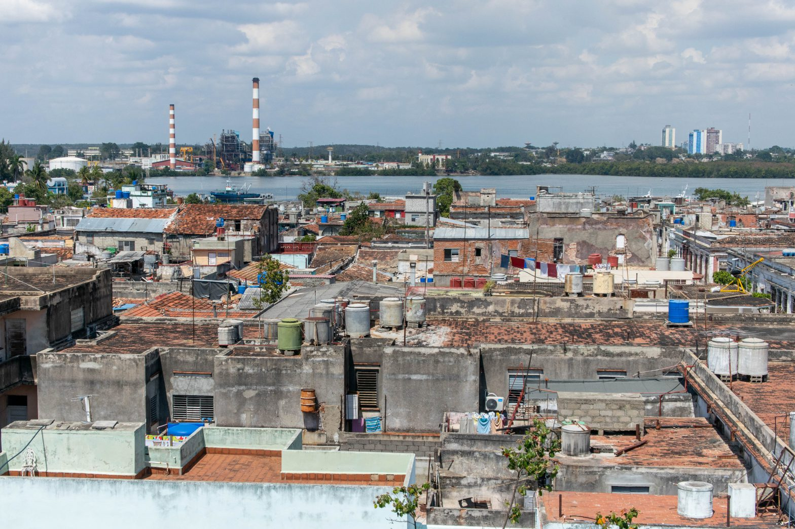

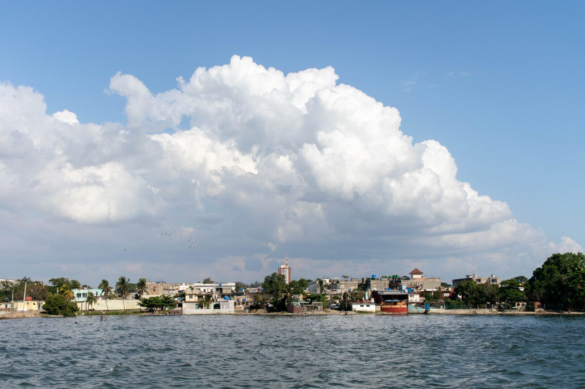

The road leading to Cienfuegos is lined with quotes glorifying the revolution, often alongside a picture of one of its leaders. Selection:

- _« Esta revolución de pueblo es invencible » (This people's revolution is invincible)_
- _« Hasta la victoria siempre » (Ever onward to victory)_
- _« Por siempre Fidel » (Fidel forever)_
- _« Historia, honor, compromiso » (History, honour, compromise)_

Walls of the city's streets are also full of revolutionary paintings, and a school close to our accommodation claims, in the middle of portraits of war heroes, welcoming _"the young pioneers of the socialist revolution" (los pioneros juntos a la revolución Socialista)_. Also, similarly to most of the visited cities, the greater part of museums are about the fight against crime or Castro's exploits in the 50s. The others tell a story that happened where they belong and that led to the revolution. Here, it is on September 5, 1957, when the navy tried to start an uprising against Batista, Cuban president under a strong American influence.

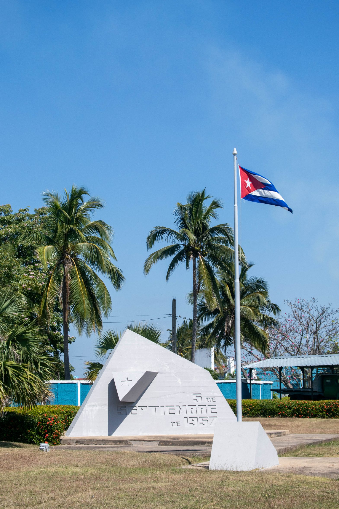

Just like everywhere, state-run shops sell food products. They are rationed and purchases recorded. For example, some of the shops provide milk and rice while others, _carnicerías_ (bouchers), sell meat - pork, most of the time. Beef meat is very scarce in Cuba: a law from the Special Period, in the last decade of the last century, punishes the murder of these animals of jail without a specific permit. One of the main ideas was to slow down cattle breeding, as it consumes a lot of resources, in the middle of a starvation era.

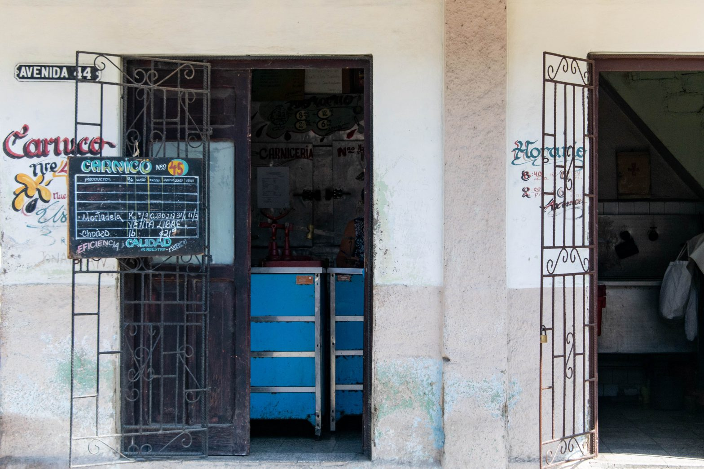

Apart from these convenience stores, some mobile salespeople take the roads on their bikes. If they often sell fruits, vegetables and flowers, they are sometimes innovative too. While we are watching the sun setting from _Punta Gorda_, one of them take a bottle, three-quarter full, out of his tray. He gives a cup to both of his new customers, seated one in front of the other. He finally pour a big amount of oysters, probably dead for several hours. On our side, we prefer carrying on with sipping our mojito.

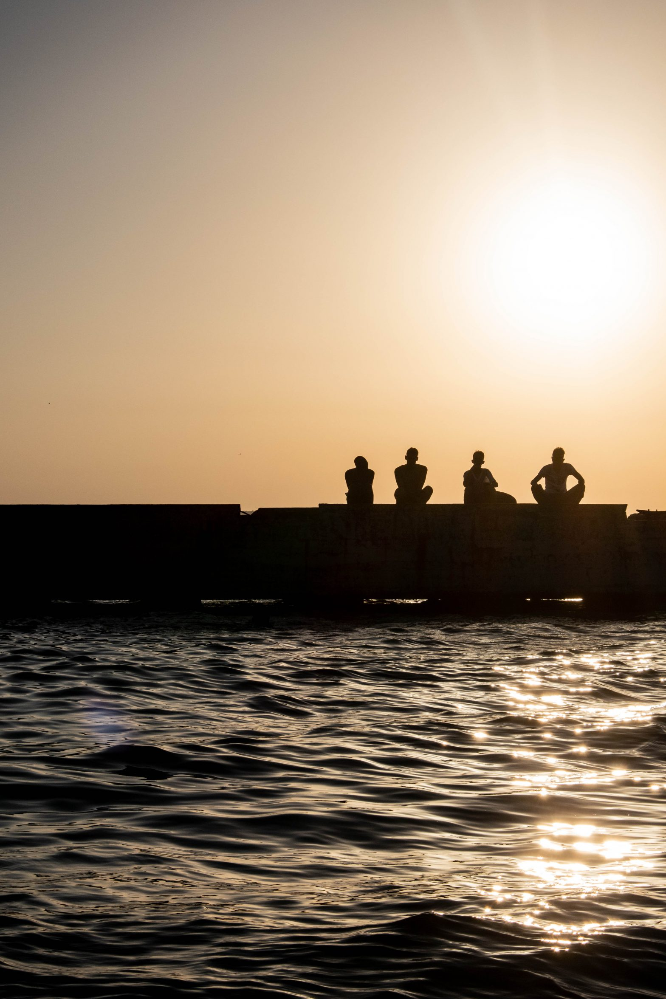

## El Nicho

Because the hour is going to change this night, I manually add one to my phone's clock before going to bed. The day after, we wake up and go down the stairs to have a breakfast at 7am, as we told our hosts. The noise we make wake them up. They tell us it is actually 6am, so we go back sleeping - disappointedly laughing. Later, our taxi will be one hour late after forgetting the needle jumped over a mark this night. Too bad...

Later or not, we head to Trinidad, with a stop in the waterfalls of El Nicho. The mountainous road leading there is sometimes very steep. The minibus carrying us is, as always, at least fifty years old, and it struggles a lot to reach our target. We have to stop several times to pour water on the engine to cool it down, just like if it had to drink after sweating too much. Yet, we would sometimes be faster walking than staying in the boiling body of this athlete from another era.

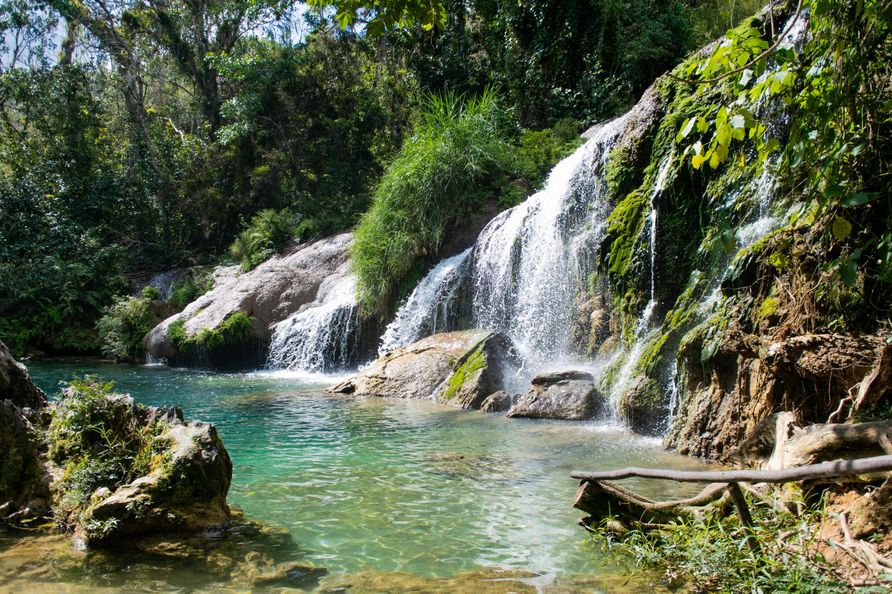

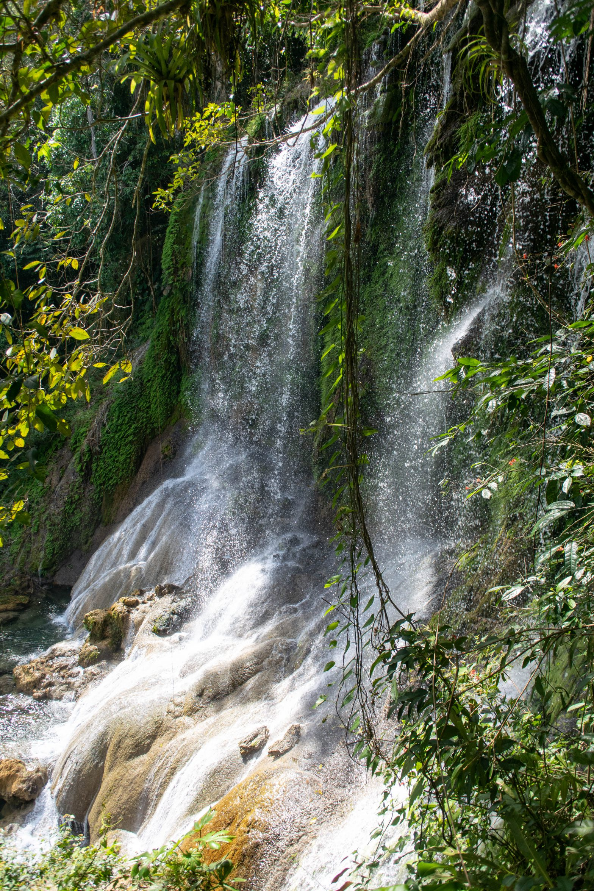

The way down to Trinidad is obviously easier, even if we have to stop once again: this time, one of the bags that are on top of the vehicle escaped and stayed about a hundred meters before. Anyway, after a chaotic beginning of day and two - as chaotic - trips around these few hours in the _Sierra del Escambray_, the trinitarios paving stones welcome us for a bit of rest.

## Trinidad

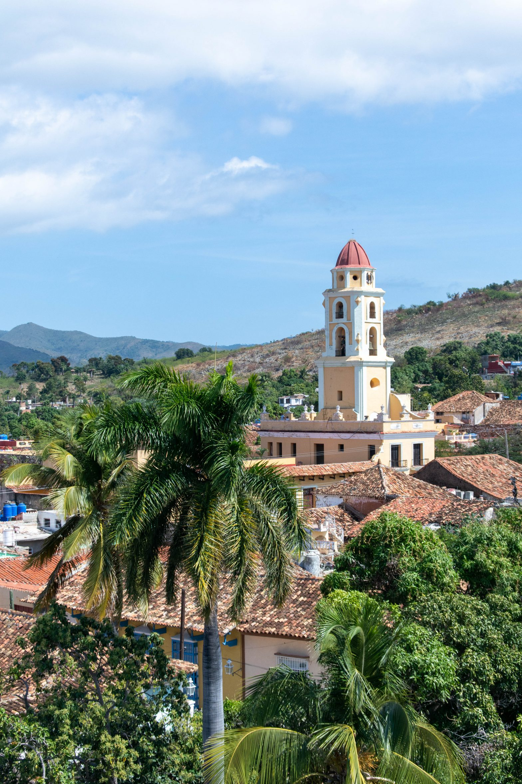

When we arrived in Cienfuegos, the accommodation we rented was actually not available - the landlord had lost his licence but did not remove the offer from Airbnb. Luckily, our taxi driver found another one very quickly for us. Then, the host of this house booked the rooms we are supposed to sleep in in Trinidad. Once there, the house turns out to have not enough space for us all. The woman we had to rent de rooms from brings us to another house, where I will have to spend a night on a stretcher, for lack of beds... Resting can always wait, I guess.

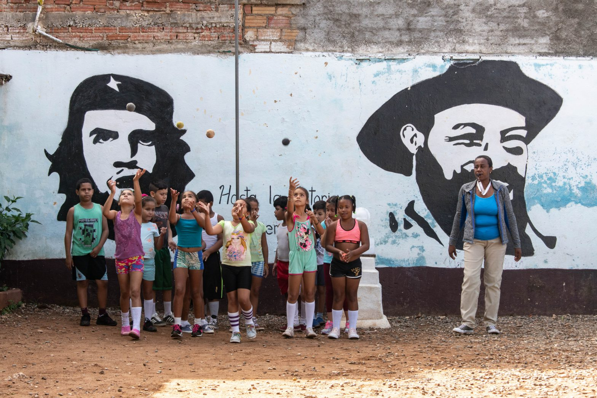

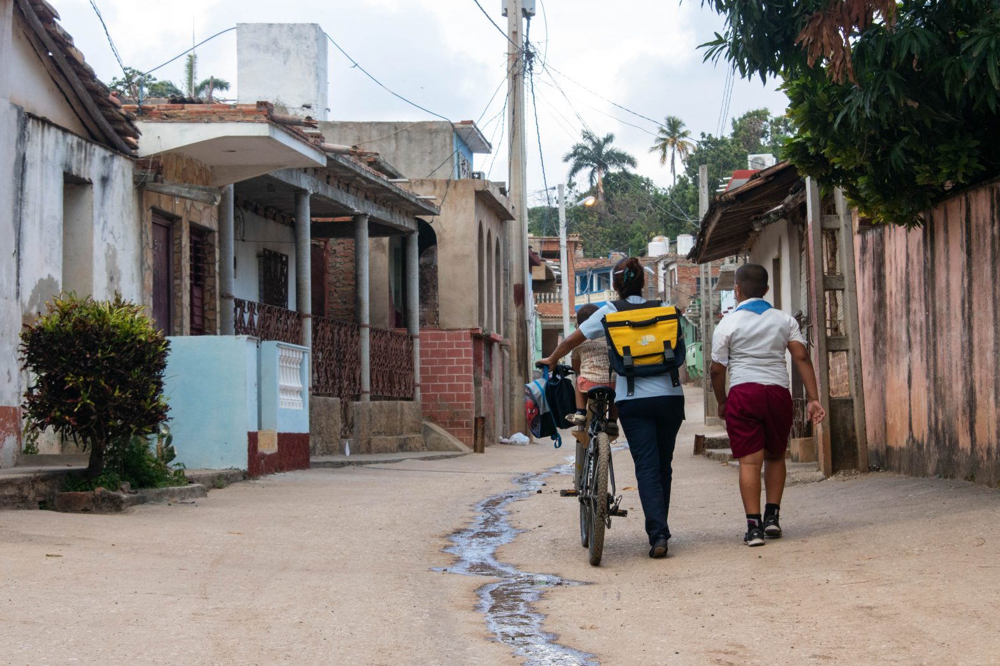

On the other hand, water is sometimes not working in the whole city. Build in the beginning of the sixteenth century, the city, which is a World Heritage site, seems stuck in the nineteenth century as it is so undeveloped. The big stones, separated by a one centimetre gap, make the flow quite tedious, and the non-existing sewerage system on the streets makes the situation worse. Once, although we had not had rain yet, a tropical thunderstorm struck the city. The heavy shower appeared in one second, creating water torrents in the hilly alleys going to our home.

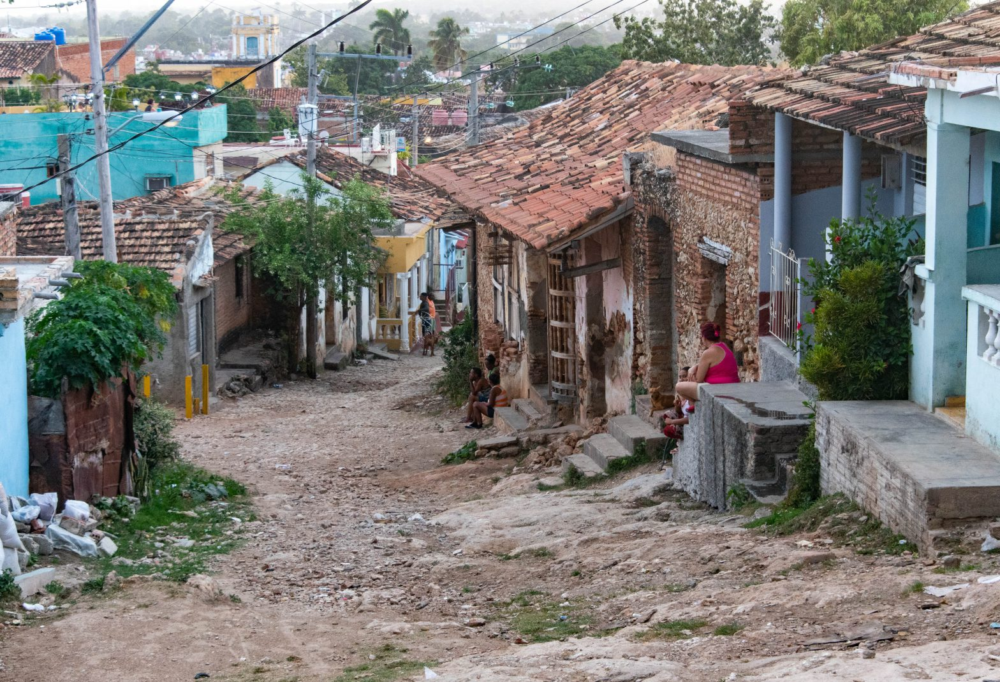

We are lucky to visit Cuba during the elections, and the lashing down rain from yesterday does not seem to affect anyone's motivation. Citizens have to elect their municipal and provincial representatives. They are the ones who will choose the new president, as Raúl Castro announced he would step down after his mandate, five years ago. In here as in France, some schools are turned into polling stations; but, more interestingly, the place who sold potatoes yesterday is, today, a polling station itself. Tomorrow, we will be on the road again: Santiago de Cuba is the next destination, after a quick stop in Camagüey.

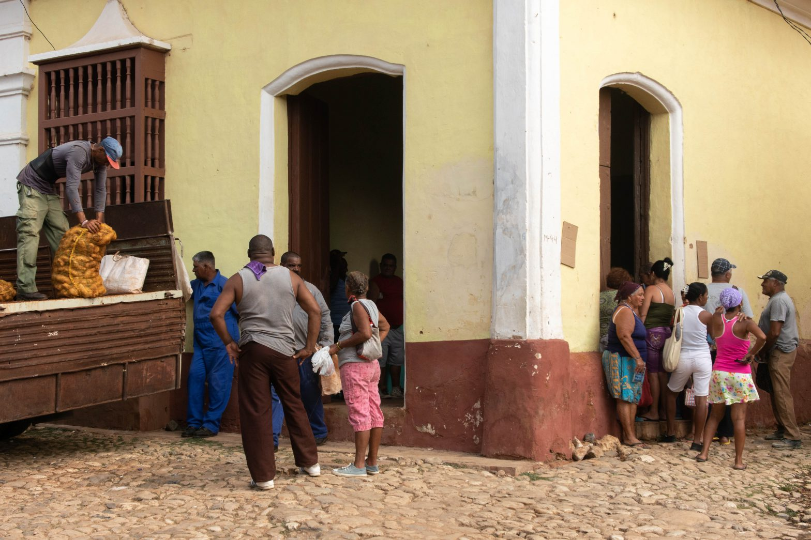

## Camagüey

Since we will leave after the lunch break only, we have about five hours to visit - or to skim through - the city. Generally out of the classic tourist itineraries, it looks like it is avoiding the mass tourism Trinidad suffers from. During our breakfast, we even meet a French couple who has just decided to shorten their stay here, thinking the architecture is decrepit and there are too few attractions. On the contrary, I think that Camagüey is a good way to live a different Cuba, chiller and different.

One of the main differences, compared with the other cities we visited, is quite surprising. Everywhere, dogs and strays wander indefinitely, with their instinct as their only master. Here, however, it is common to see them tamed: sometimes kept on a leash, they wait otherwise for the day to end behind the window bars, so typical of this country. Often, also, Camagueyanos can be seen there, looking outside and crossed by the shade of the bars that stand between them and the street.

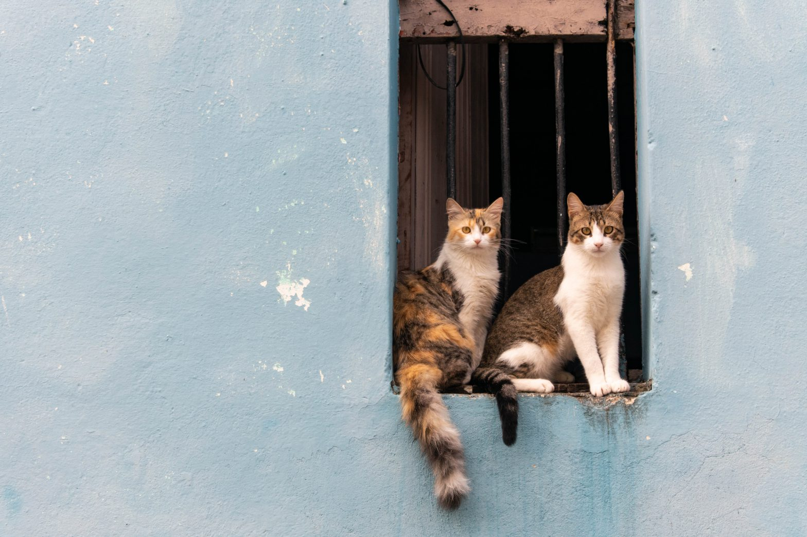

On another note, the atmosphere of the empty streets and the number of small galeries invite to interfere in the local life. The most famous indigenous artist, Matha Jiménez Pérez, created sculptures that can be found on the place facing her museum. Other independent artists have their own studio and warmly welcome visitors who are interested in their vision of art. The atmosphere is therefore relaxed and somewhat timeless. A sign on a shop door emphasises it: _"Open when we arrive, close when we leave."_

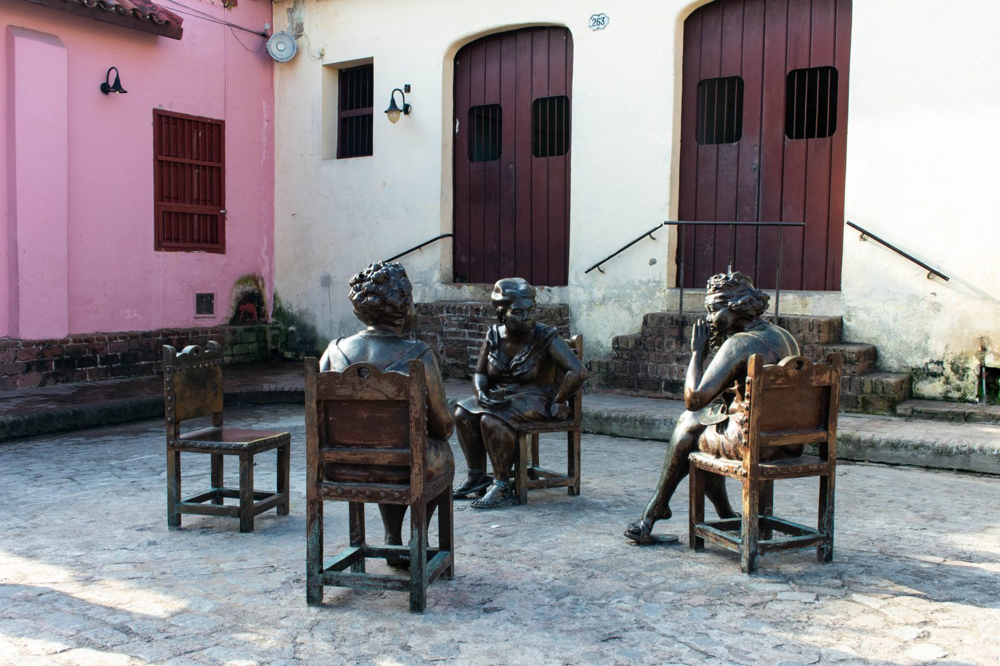

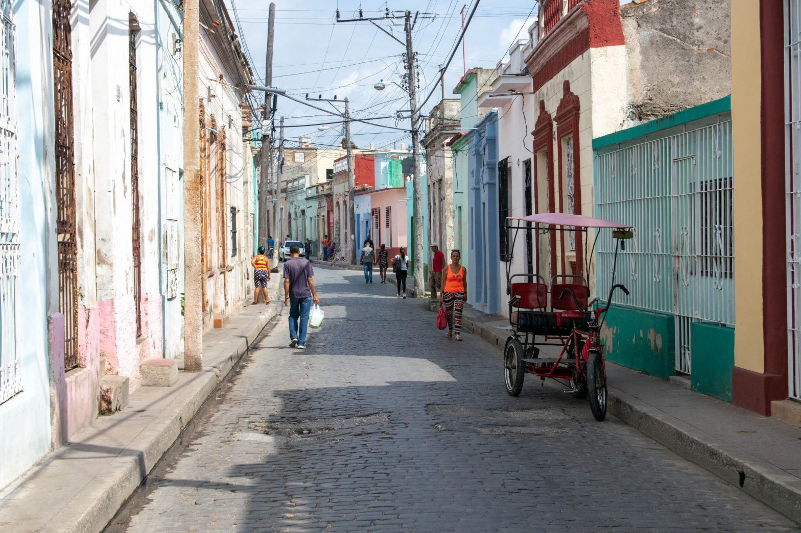

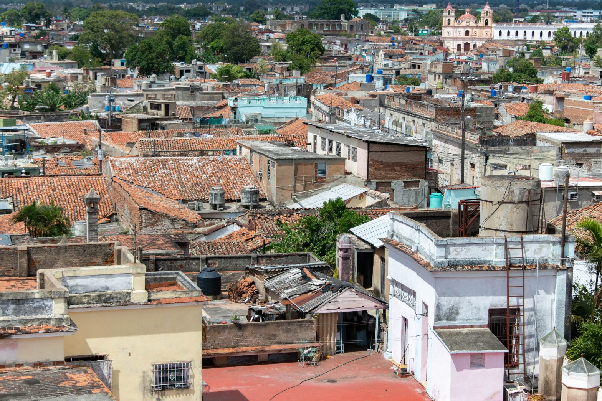
