Si [des routes cubaines](https://anothervyou.world/des-routes-cubaines/) fleurissent tant d'anecdotes, c'est qu'elles nous ont permis de traverser le pays dans toute sa longueur. Après des [heures de marche](https://anothervyou.world/dans-la-vallee-de-vinales/) suivies de [plages paradisiaques](https://anothervyou.world/journee-femme-baie-des-cochons/), nous nous dirigeons vers le sud du pays. Avant Santiago de Cuba, nous trouvons ainsi sur notre chemin Cienfuegos, El Nicho, Trinidad et Camagüey. Le mercure s'élève à mesure que notre latitude s'amoindrit ; les panneaux propagandistes, qui se substituent aux pubs caractéristiques de nos sociétés capitalistes, se font plus fréquents ; et l'accent espagnol devient de plus en plus difficile à saisir.

## Cienfuegos

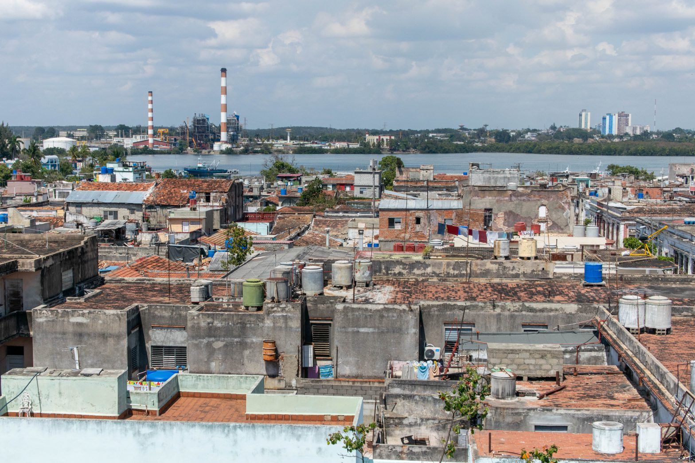

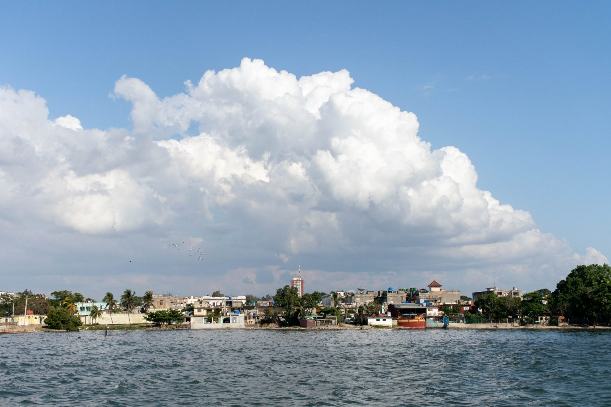

La route menant à Cienfuegos est bordée de citations à la gloire de la révolution, souvent accompagnées d'une photo de l'un de ses leaders. Florilège :

- _"Esta revolución de pueblo es invencible" (Cette révolution populaire est invincible)_
- _"Hasta la victoria siempre" (Toujours jusqu'à la victoire)_
- _"Por siempre Fidel" (Fidel pour toujours)_
- _"Historia, honor, compromiso" (Histoire, honneur, compromis)_

Les murs des rues de la ville arborent eux-aussi des peintures révolutionnaires, et une école à proximité de notre logement clame, au milieu de portraits des héros de guerre, accueillir _"les jeunes pionniers de la révolution socialiste" (los pioneros juntos a la revolución Socialista)_. D'autre part, de façon similaire à la plupart des villes visitées, la majorité des musées évoquent la lutte contre le banditisme ou les exploits de Castro et sa bande dans les années 1950. Les autres s'attachent à raconter un moment précis, une histoire marquante ayant mené à la révolution et s'étant déroulée sur place. Il s'agit ici du 5 septembre 1957, lorsque la base navale tente un soulèvement contre Batista, alors président cubain sous forte influence américaine.

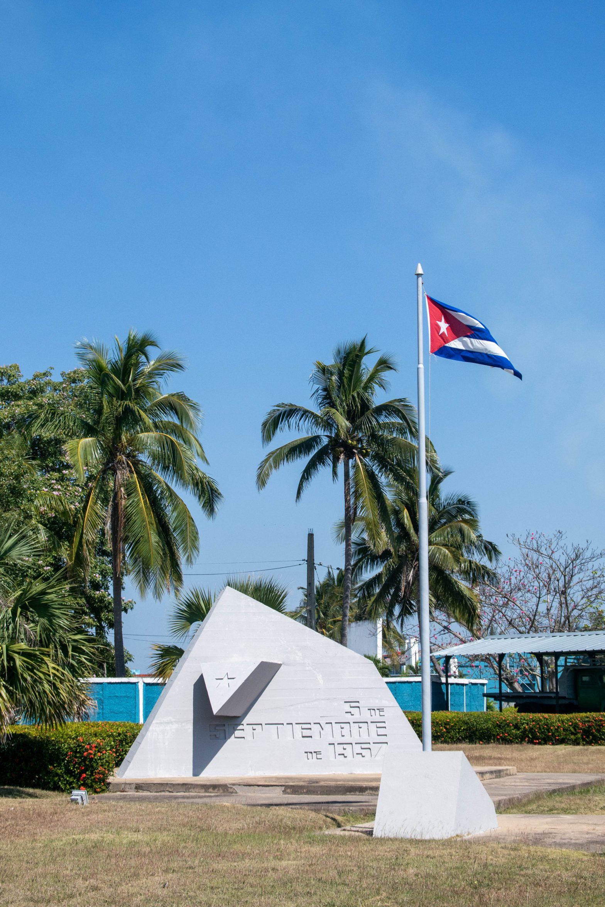

Comme partout, des magasins étatiques spécialisés s'occupent de vendre les produits alimentaires. La nourriture est rationnée et les achats consignés. Certains commerces fournissent par exemple du lait et du riz pendant que d'autres, les _carnicerías _(boucheries), délivrent de la viande - de porc, essentiellement. La viande de boeuf se fait très rare à Cuba : datant de la Période spéciale dans la dernière décennie du siècle dernier, une loi sanctionne de prison le meurtre de ces animaux sans l'obtention préalable d'un permis spécifique. L'une des idées fondatrices était de freiner l'élevage du bétail, vendus à prix d'or mais très coûteux en matière de ressources, au milieu d'une époque justement marquée par le manque de nourriture.

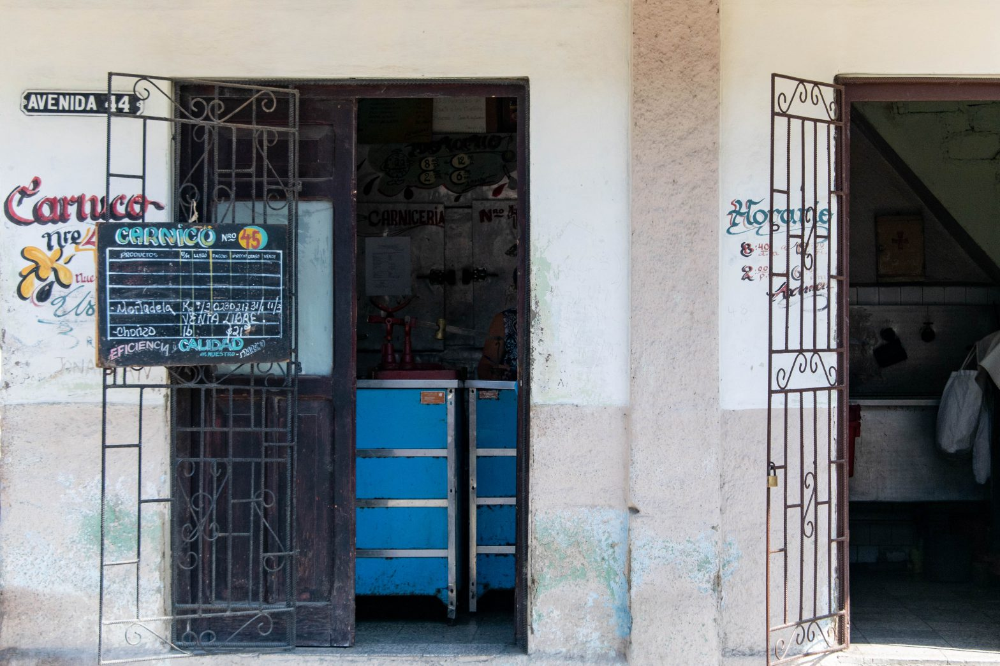

A ces commerces de proximité s'ajoutent des vendeurs ambulants, toujours à bicyclette, sinuant sur les chemins troués des villes. S'ils vendent bien souvent des fruits, des légumes ou des fleurs, ils savent aussi se montrer innovants. Alors que nous regardons le soleil se coucher depuis _Punta Gorda_, l'un d'entre eux sort de son bac une bouteille remplie aux trois quarts. Il donne un gobelet à chacun de ses deux nouveaux clients, assis face à face de part et d'autre d'une table. Il déverse finalement dans les deux verres une montagne d'huîtres, probablement mortes depuis plusieurs heures. Nous préférons quant à nous continuer à siroter notre mojito.

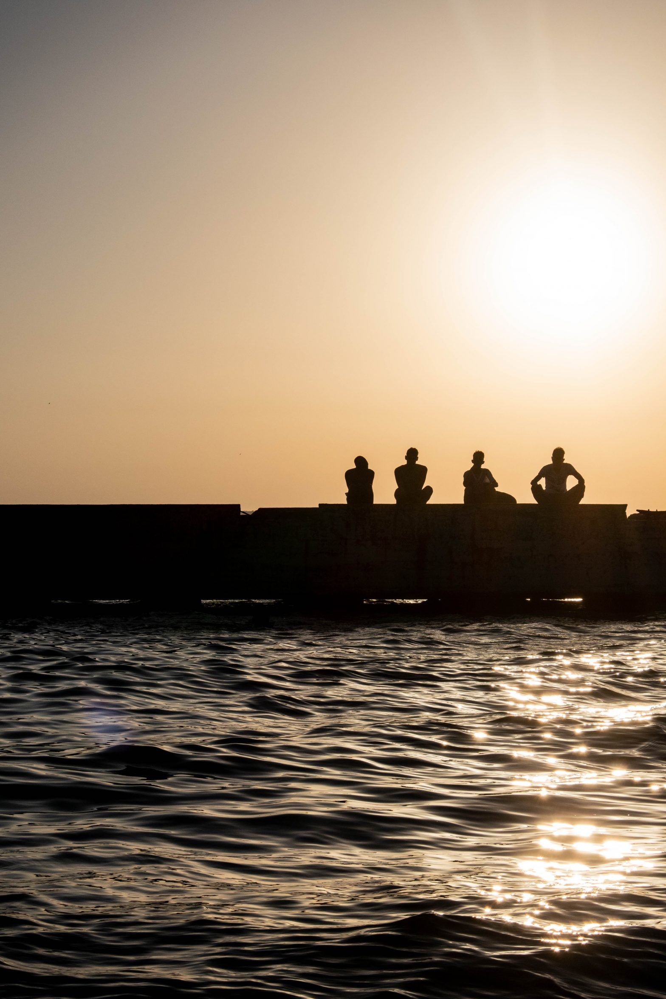

## El Nicho

En prévision du changement d'heure opéré au cours de cette nuit du 10 au 11 mars, je décide d'en ajouter une manuellement à l'horloge de mon téléphone avant de me coucher. Le lendemain, nous nous réveillons et descendons prendre le petit-déjeuner à sept heures, comme convenu avec nos hôtes. Le bruit que nous faisons les réveille. Ils nous apprennent qu'il n'est en fait encore que six heures, et nous retournons alors, déçus et rieurs à la fois, dormir un peu. Plus tard, notre taxi arrivera une heure en retard après avoir oublié que l'aiguille sautait une marque pendant la nuit. Décidément...

Retard ou pas, nous partons pour Trinidad, avec une escale dans les cascades d'El Nicho. La route montagneuse qui y mène est parfois très escarpée. Le minibus qui nous y porte est, comme toujours, vieux d'au moins cinquante ans, et il peine énormément à atteindre la destination. Nous devons nous arrêter plusieurs fois pour déverser de l'eau sur le moteur afin de le refroidir, comme s'il fallait abreuver le véhicule après qu'il a trop transpiré. Pourtant, nous irions parfois plus vite en marchant qu'en restant dans le corps bouillant de cet athlète d'un autre âge.

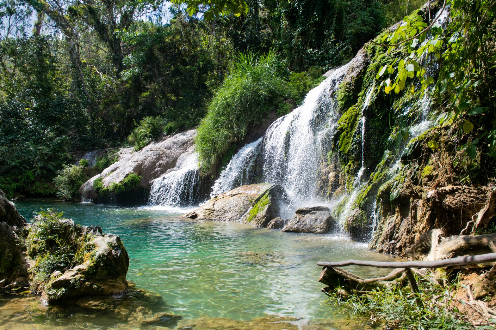

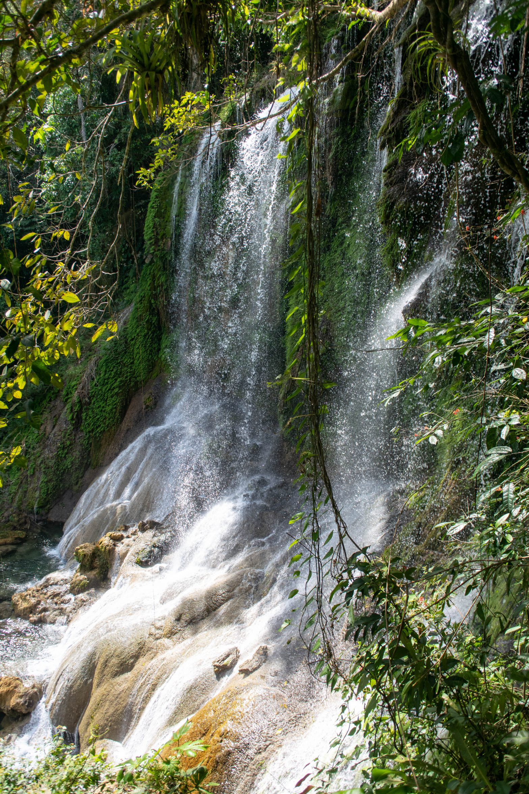

La descente vers Trinidad est évidemment plus simple, même si nous devons une nouvelle fois nous arrêter : cette fois-ci, c'est un des sacs positionnés sur le toit qui s'est échappé et qui est resté une centaine de mètres plus tôt. Malgré tout, et après un début de journée aussi chaotique que les trajets qui ont encadrés ces quelques heures dans la _Sierra del Escambray_, les pavés trinitarios nous accueillent enfin pour un peu de repos.

## Trinidad

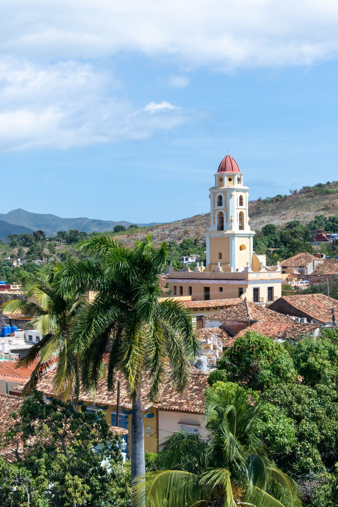

Arrivés à Cienfuegos, le logement que nous avions réservé n'était finalement plus en service - le propriétaire avait perdu la licence mais n'avait pas supprimé l'annonce de la plate-forme Airbnb. Le chauffeur de taxi nous en avait alors dégoté un autre en un rien de temps. C'est l'hôte de ce logement qui avait ensuite réservé, pour nous, celui dans lequel nous sommes censés passer deux nuits à Trinidad. Une fois sur place, il s'avère en fait qu'il n'y a pas assez de place pour nous tous. La dame qui devait nous accueillir nous renvoie alors vers une autre maison, dans laquelle je passerai la nuit sur un brancard de secours, faute d'un nombre suffisant de lits. Le repos attendra donc.

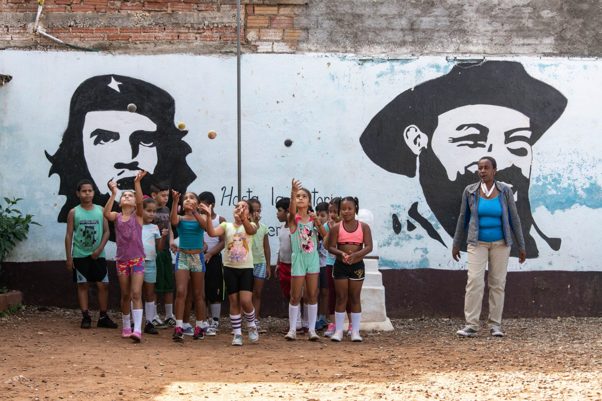

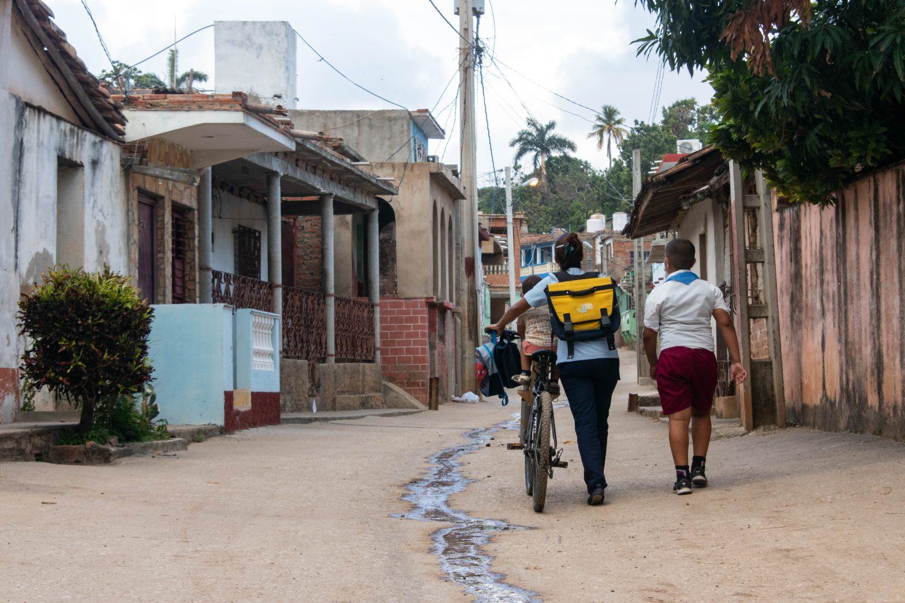

D'autre part, l'eau est parfois coupée dans toute la ville. Fondée au début du XVIᵉ siècle, la ville, classée au patrimoine mondiale de l'UNESCO, semble s'être figée au XIXᵉ tant elle est peu développée. Les grosses pierres - difficile d'employer le terme de "pavé" - écartées d'un centimètre rendent la circulation difficile, et le système d'évacuation d'eau inexistant oblige l'eau à se frayer un chemin entre elles, aggravant la situation. Un soir, alors que nous n'avions pas eu de pluie jusqu'à présent, un orage tropical s'est abattu sur la bourgade. L'averse est tombée en trombe en l'espace d'une seconde, créant - littéralement - des torrents d'eau dans les ruelles vallonnées rejoignant notre domicile.

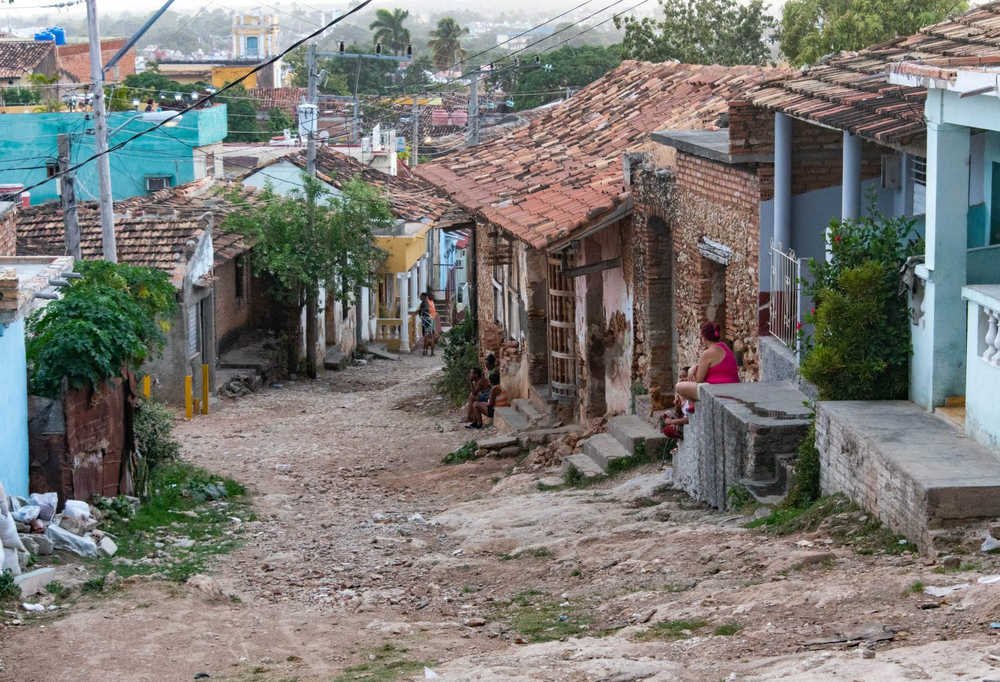

Nous avons la chance de visiter Cuba en pleine période électorale, et la pluie de la veille n'a l'air de démotiver personne. Les citoyens doivent élire leurs représentants municipaux et provinciaux. C'est eux qui désigneront le nouveau président, Raúl Castro ayant annoncé qu'il quitterait le pouvoir à l'issue de son mandat, cinq ans plus tôt. Comme en France, certaines écoles se transforment alors en bureau de vote et, plus étonnant, le local qui assurait la distribution de pommes de terre hier permet aujourd'hui, lui aussi, de glisser les précieux bulletins dans l'urne. Demain, nous serons quant à nous à nouveau sur la route : direction Santiago de Cuba, avec un arrêt express à Camagüey.

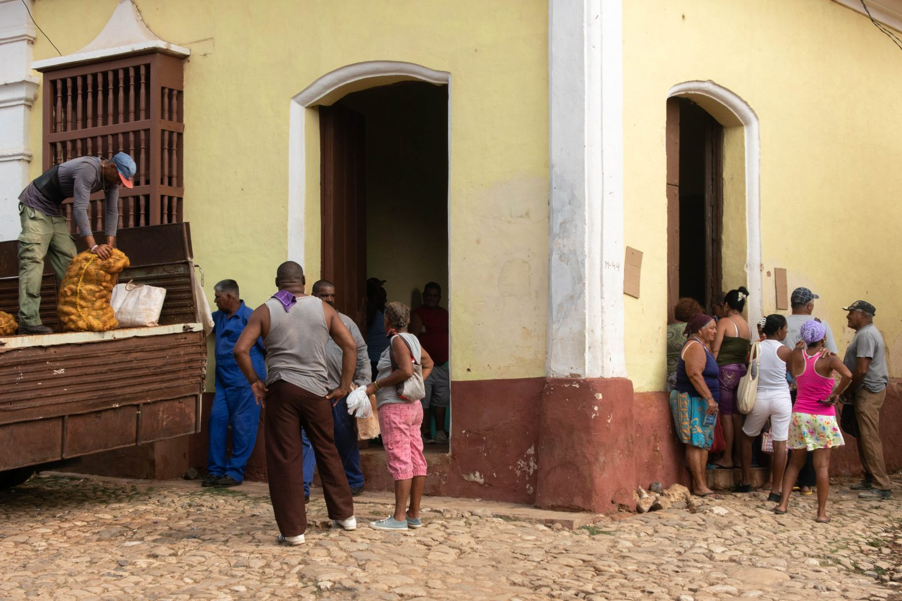

## Camagüey

Ne repartant qu'à la mi-journée, nous avons environ cinq heures pour visiter - ou plutôt survoler - la ville étape. Généralement hors des itinéraires classiques de ceux qui visitent l'île caribéenne, elle semble échapper au tourisme de masse qui frappe Trinidad. Alors que nous prenons le petit-déjeuner, nous rencontrons d'ailleurs un couple de français qui a décidé d'écourter son séjour ici, estimant l'architecture décrépite et les attractions trop peu nombreuses. Au contraire, mon avis est que Camagüey permet de vivre un autre Cuba, plus serein et différent.

L'une des différences majeures, au regard des autres villes par lesquelles nous sommes passés, est assez étonnante. Partout, des chiens et autres animaux errants semblent vagabonder à l'infini, n'ayant pour maître que leur instinct. Ici, au contraire, il n'est pas rare de les voir apprivoisés : occasionnellement en laisse, ils attendent sinon que la journée se termine derrière les barreaux des fenêtres, si caractéristiques du pays. Souvent, aussi, ce sont les Camagueyanos que nous entrapercevons par là-même, regardant dehors et rayés par l'ombre des barres de fer qui les séparent de la rue.

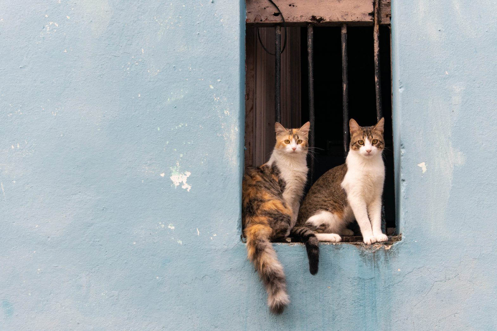

Par ailleurs, l'atmosphère qui se dégage des rues éparsement peuplées et le nombre de petites galeries d'art invitent à s'immiscer dans la vie locale. L'artiste indigène la plus connue, Martha Jiménez Pérez, a créé des sculptures que l'on peut retrouver sur la place faisant face au musée qui lui est dédié. D'autres artistes indépendants tiennent leur propre atelier et accueillent chaleureusement les visiteurs qui osent s'intéresser à leur vision de l'art. L'atmosphère y est ainsi décontractée et quelque peu hors du temps. Une pancarte sur la porte d'une boutique le souligne bien : _"Nous ouvrons quand nous arrivons, nous fermons quand nous partons."_

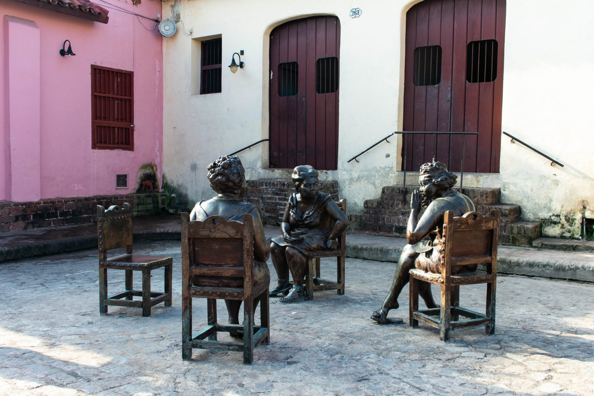

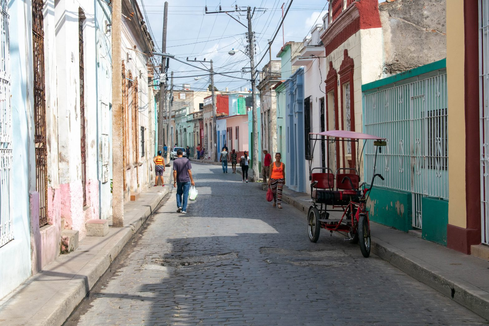

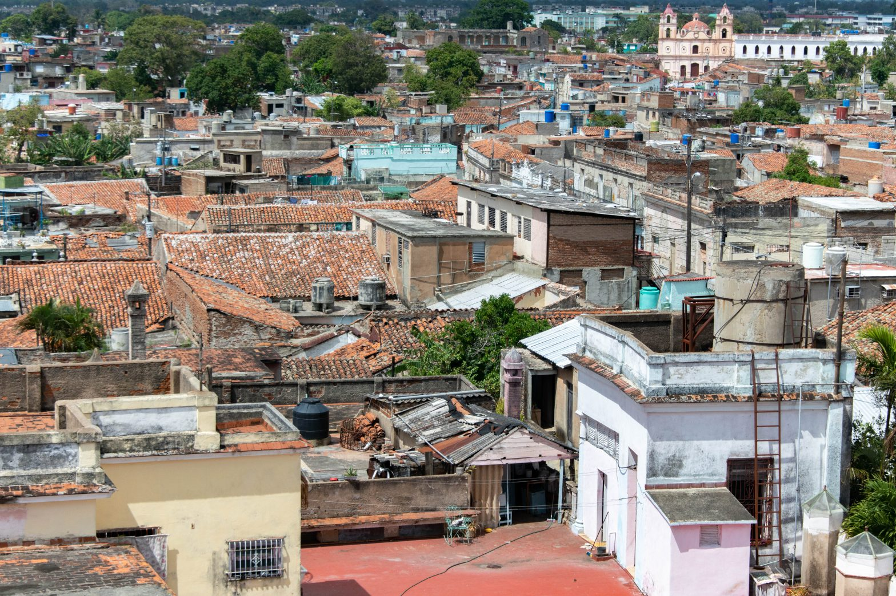
