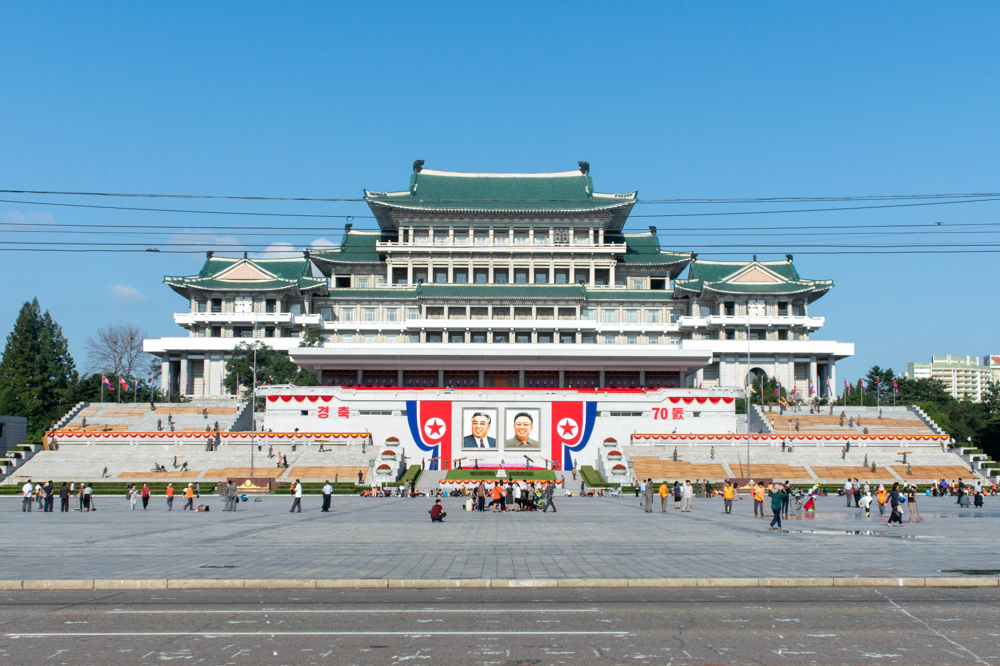
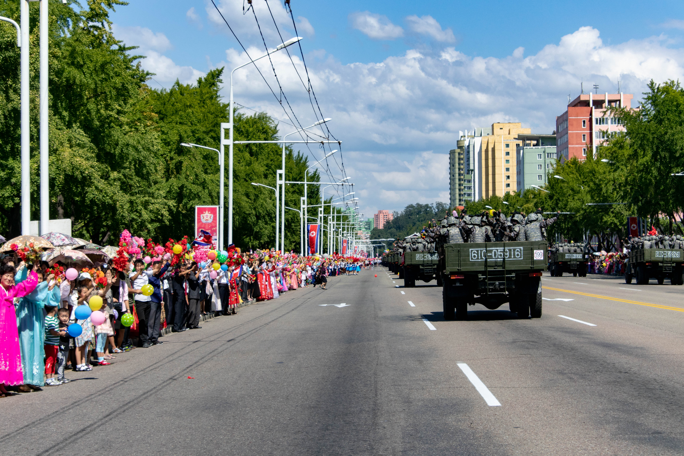
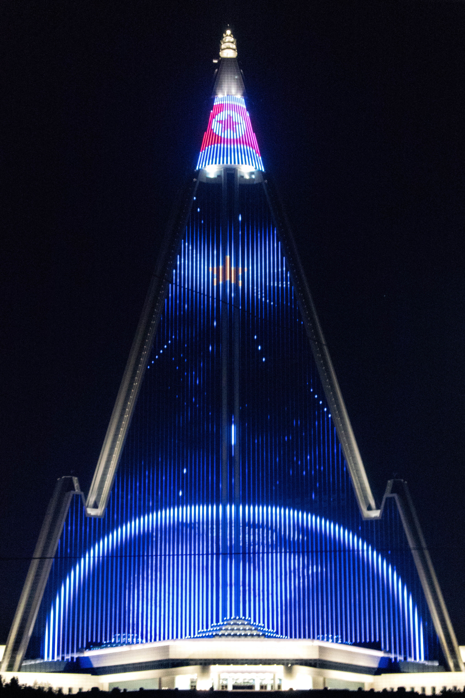
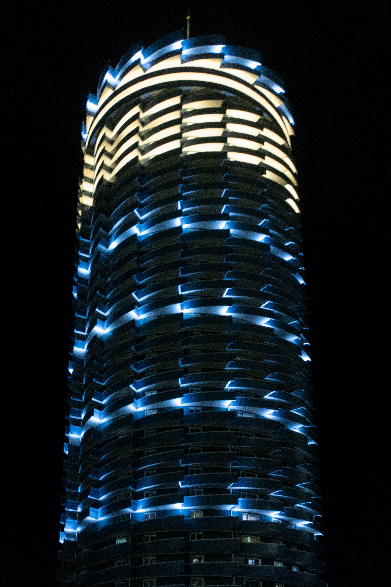
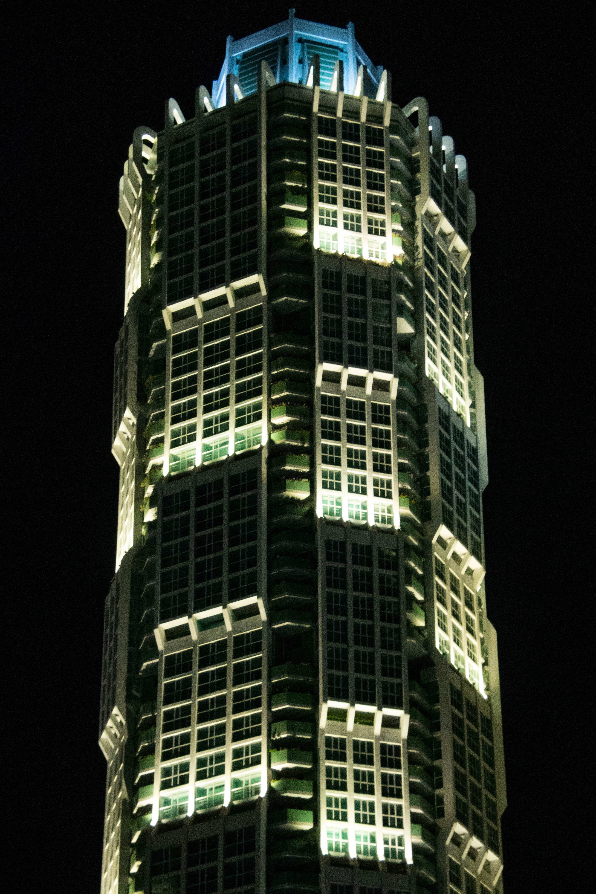

Vingt-quatre heures après avoir quitté Pékin, les gigantesques immeubles religieusement disposés dans le paysage ont laissé place à des bâtiments plus modestes, aux façades décrépies. Nous sommes à mi-chemin entre Sinuiju, ville par laquelle nous sommes entrés en République populaire démocratique de Corée (RPDC, nom officiel de la Corée du Nord), et Pyongyang, la capitale. Le train-couchettes, bringuebalant le long des routes désertées par les voitures, transporte environ soixante-dix voyageurs à son bord.

Arrivés en gare de destination, des groupes de vingt à trente curieux, déjà ravis de fouler le sol coréen, se forment. Ils sont chacun pris en charge par deux guides locaux, dont la présence aux côtés d'étrangers est impérative en dehors de leur hôtel de résidence. Sur le quai, les autochtones ne sont nullement surpris par cet afflux soudain. Le pays connaît un boom touristique sans précédent, d'autant qu'il fête en ce mois de septembre ses soixante-dix ans d'existence. Les festivités, auxquelles se joindront environ un millier de touristes, s'annoncent épiques : parade militaire, spectacle de masse impliquant près de 100 000 participants et feux d'artifice à la gloire du pays, fondé en 1948.

## Omniprésence des dirigeants

Pour la première fois, des voyageurs de loisir sont autorisés à séjourner au _Scientist Hotel_, construit en 2013 et normalement réservé aux scientifiques et délégations étrangères. La salle d'accueil est dominée par une large photographie de Kim Jong-un, leader suprême du pays, entouré d'officiels et quittant les lieux. Petit-fils de Kim Il-sung, fondateur de la Corée du Nord, il a été investi en 2012 et règne depuis lors sans partage sur l'un des derniers États communistes au monde. Il succédait alors à son père, Kim Jong-il, décédé un an plus tôt. D'un leader à l'autre, le culte de la personnalité est ardemment entretenu.

Kim Jong-un n'apparaît cependant pas sur les pin's que se doivent d'arborer les nord-coréens dès l'âge de treize ans. Distribués gratuitement par le gouvernement, les petits badges métalliques prennent tantôt une forme ronde, tantôt celle d'un drapeau flottant librement dans les airs. Le plus souvent sur un fond rouge, le visage de Kim Il-sung, décédé en 1994, est parfois joint à celui de son fils. Leurs portraits ornent également les gares, les salles de classe, les stations de métro, les places publiques et sans aucun doute les pensées d'un peuple dont tout rappelle la dynastie.

L'œuvre la plus impressionnante représentant les défunts dirigeants n'est, quant à elle, accessible qu'en acceptant de se plier à quelques règles. Du haut d'une colline plongeant dans le fleuve Taedong, deux statues de bronze hautes de vingt mètres font face au Monument à la fondation du Parti, spectaculaire ode au communisme coréen. Les visiteurs sont encouragés à déposer un bouquet de fleurs, qu'ils peuvent acheter auparavant pour cinq euros, à leurs pieds. Après s'être inévitablement prosternés, ils sont autorisés à remettre lunettes de soleil et chapeaux, proscrits pendant la brève cérémonie. Autres formalités : interdiction d'imiter la posture adoptée par les leaders ; obligation de montrer les statues entièrement sur les photographies - les couper serait un signe d'irrespect.

Ces restrictions mineures ne sont rien comparées à celles, draconiennes, mises en place pour s'aventurer dans le Palais du Soleil Kumsusan. L'ancien palais présidentiel abrite à présent les dépouilles de Kim Il-sung et Kim Jong-il, faisant ainsi partie des lieux les plus sacrés de la Corée du Nord. Si même les jeans sont à éviter, les shorts et les sandales sont évidemment rédhibitoires. D'autre part, absolument aucun objet ne doit entrer dans le mausolée : à l'entrée, un vestiaire permet de vider ses poches. S'ensuivent de longues minutes pendant lesquelles les pèlerins, deux par deux, restent immobiles sur les tapis roulants successifs menant aux pièces d'intérêt.

## Une image bien soignée

La première d'entre elles est dominée par deux statues, devant lesquelles il est évidemment tenu de se prosterner à nouveau. Le parcours vers la salle suivante, dans laquelle repose le père fondateur de la RPDC, est bordé de soldats aux traits sérieux. Cette fois-ci quatre par quatre, les visiteurs se prosternent trois fois : à ses pieds, sur sa droite puis sur sa gauche. Son corps, exposé et éclairé dans un cercueil de verre, semble être la seule source lumineuse dans une grande pièce obscure dont le plafond est soutenu par de hautes colonnes. La pièce est trait pour trait identique à celle dans laquelle repose son fils, pour lequel nous devrons nous prosterner trois fois encore.

Au gré des pérégrinations dans l'opulence des lieux, grandioses, marbrés et parés de dorures, le parallèle avec la démesure des édifices construits pendant l'âge d'or des monarchies européennes est tout trouvé. L'extension, en 2014, du Musée de la guerre victorieuse - bâtiment gargantuesque semblant ne digérer qu'une poignée de touristes de temps à autre - tient pour autre exemple de l'importance accordée par le gouvernement au pouvoir symbolique des lieux "sacrés". Leur splendeur traduit aussi bien qu'elle appuie la force idéologique de l'appareil d'État.

Les larges avenues de Pyongyang sont le théâtre d'autres efforts permettant de soigner l'image d'un pays plutôt malmené sur le plan international. Tels des coiffeurs, des dizaines de personnes coupent, ciseaux à la main, les pelouses qui séparent occasionnellement la chaussée des trottoirs. Sur la fameuse place Kim Il-sung, ce sont des centaines de citoyens qui s'affairent à frotter le sol à la main ou au balai. Les marques blanches, indélébile quadrillage couvrant les soixante-quinze mille mètres carrés environnant, ne s'effacent en revanche pas et seront de première utilité demain. Elles permettent aux soldats de se positionner correctement lors des grandiloquents défilés militaires, à l'image de celui que le soixante-dixième anniversaire du pays promet d'offrir.

De façon générale, la propreté de la ville, partagée entre trois millions d'habitants, ferait pâlir bon nombre d'agglomérations occidentales. Calme mais vivante même le soir, profitant d'un temps clément après la saison des typhons, la capitale retrouve un rythme de vie agréable. Le ballet des piétons et des cyclistes, entremêlés sur les trottoirs, étonne. Nombreux sont ceux qui discutent dans les parcs ou devant les petites échoppes, vendant la plupart du temps des boissons et de la nourriture à consommer sur place. Comme en Europe, les lieux publics se remplissent lorsque la journée de travail - généralement de huit heures, sauf le dimanche, et coupée par une pause déjeuner d'une heure - se termine.

Abstraction faite de l'obscurité nocturne sur les routes et de la faible population de voitures privées, les seize stations de métro et les bus bondés finissent de donner à Pyongyang ses allures de ville développée standard. Aussi, malgré leur architecture soviétique, les tours d'habitations se révèlent nettement moins mornes que leurs contemporaines européennes : leurs couleurs vives et leurs balcons fleuris égayent le paysage urbain, appréciable depuis la rue.

## Démonstration de force

En ce 9 septembre, point d'orgue d'un séjour d'ores-et-déjà hors du commun, les boulevards sont particulièrement encombrés. Les camions militaires, pour la plupart datant de l'époque de la guerre froide, paradent sur des avenues autrement vides. En ordre de bataille, ils sont évidemment immensément moins impressionnants que les défilés, synchronisés et presque mécaniques, qui ont eu lieu un peu plus tôt sous les yeux du maréchal Kim Jong-un. Malheureusement, interdiction formelle était faite aux touristes d'y assister. Si nous n'étions pas non plus censés prendre part à la parade, un coup de fil de dernière minute reçu par notre guide sonne l'alarme : les visiteurs étrangers sont finalement les bienvenus. Après avoir quitté précipitamment - en courant, littéralement - le restaurant au beau milieu du déjeuner, nous arrivons alors que les festivités sont déjà bien entamées.

Sur deux rangées, les véhicules kakis transportent des soldats regroupés selon leur grade. Parfois très jeunes, d'autres fois encagoulés, de temps en temps armés, la seule constante est leur sourire. La joie de l'écrasante majorité des spectateurs, bordant la route et agitant des drapeaux rouges, des fleurs et des ballons aux couleurs vives, souligne l'importance de l'armée dans la société. Les quelques visages livides et stoïques apparaissant ci et là se noient dans une masse en fête, bruyante et elle aussi souriante. Plusieurs fois, des coréennes en _joseon-ot_, habit traditionnel, se détachent de la foule et courent tendre l'une de leurs fleurs à un militaire au hasard, saluant le public depuis l'arrière de son camion. Elles semblent imiter les observateurs étrangers, invraisemblablement livrés à eux-mêmes et laissés pour compte par leurs guides, divaguant en toute liberté sur la chaussée. Au cœur d'un voyage si contrôlé, être en capacité de taper dans la main de militaires paraît hallucinant. Au même titre, alors que les photographies de soldats sont normalement proscrites, elles sont pour un instant tolérées, voire appréciées.

Réservistes inclus - 9,5 millions, auxquels s'ajoutent 1,1 million de forces actives -, près de la moitié des 25 millions de nord-coréens est enrôlée dans l'armée. Ce chiffre, bien que considérable et frappant, est à relativiser, puisque les soldats s'occupent aussi bien de la sécurité dans les aéroports que de la construction et de la rénovation des bâtiments. Ils logent alors tous ensemble sous des toits bleus, caractéristiques des camps construits préalablement au pied de leurs ouvrages. Ce soir, une partie d'entre eux assistera à la suite de la démonstration de force de ce soixante-dixième anniversaire : les _mass games_, ou spectacles de masse.

## Glorieux pays

Contre la modique somme de 100 euros, les globe-trotters auront également la chance d'être de la partie. Mais patience est de rigueur avant d'espérer s'asseoir dans l'un des 150 000 sièges du Stade du Premier-Mai, le plus grand au monde. La cérémonie d'ouverture est effectivement très strictement encadrée, d'autant que telle représentation n'a pas eu lieu depuis 2013. En début d'après-midi, l'intégralité des touristes présents dans la ville sont ainsi reconduits dans leurs hôtels respectifs et doivent attendre sagement pendant deux heures.

Avec un groupe de trois personnes, nous en profitons pour nous balader, sans guide, aux alentours directs de notre hôtel. Après cinq petites minutes d'errements, nous remarquons être suivis : la personne, en costume malgré le soleil ardent de milieu de journée, s'arrête en même temps que nous. Elle finit par raccrocher son téléphone et se diriger vers nous, consciente d'avoir été repérée. Il s'agit du manager de _Korea International Travel Company_ (KITC), entreprise gouvernementale par laquelle tous les voyages sont organisés ici - directement ou indirectement, occasionnellement via d'autres sociétés qui s'y rapportent. Même si notre guide nous avait donné l'autorisation de ne pas trop s'éloigner, il s'avère qu'il nous est interdit de marcher seuls, même dans les parages.

Comme à l'intérieur du mausolée, aucun objet ne doit être entrer dans le stade. Les images seront donc gravées dans les mémoires, à défaut d'être numérisées. À quatre heures de l'après-midi, les poches vides, sans eau ni collation, de nouveaux groupes se forment et embarquent dans des bus numérotés. Une heure plus tard, les dizaines de véhicules se rangent en ordre sur le parking d'un musée. Ils sont vidés de leur chair humaine, cuisant sur le bitume brûlant pour une autre heure, afin d'être fouillés et inspectés par des soldats. Avant de remonter, les passagers sont eux-aussi contrôlés. En arrivant, une nouvelle heure après, le chaos apparent est en réalité maîtrisé aux abords du stade : les autocars sont à nouveau garés dans l'ordre, laissant entre eux tout juste assez de place pour circuler à pied. Après avoir joué des coudes pour pénétrer dans l'immense enceinte, il se sera finalement écoulé sept heures depuis le retour à l'hôtel.

Les mesures de sécurité se comprennent lorsque les cent mille spectateurs se lèvent et se tournent vers la tribune présidentielle, où Kim Jong-un fait son apparition. L'ovation est à la hauteur de l'événement : le maréchal, comme il est appelé par les Coréens, ne se montre presque jamais en public. Il assistera alors à un spectacle millimétré, nommé _"Glorious country"_ (glorieux pays), pendant lequel se succèdent des milliers de gymnastes, danseurs, acrobates, musiciens et chanteurs, s'exécutant toujours de façon synchronisée. Derrière eux, une tribune entière est réservée à des étudiants, panneaux de couleur sur les genoux, dépeignant des tableaux dynamiques comme nulle part ailleurs sur la planète. [Ces images](https://www.youtube.com/watch?v=9-e3jTVooPw) des différentes chorégraphies, même si elles ne montrent qu'une partie des feux d'artifice et n'ont pas capturé la danse elle aussi synchronisée des drones lumineux dans le ciel du stade, valent le coup d'œil et permettent d'apprécier l'ampleur de la production.

## Réunification

La performance aura lieu tous les jours, pour une durée indéterminée. Même si les locaux payent, eux, 2 000 wons, soit 25 centimes d'euros, le stade ne sera jamais aussi rempli que lors de la soirée d'ouverture. Parmi les cinq actes qui composent le spectacle, ils pourront se rafraîchir la mémoire quant à leur histoire : guerre de Corée, fondation du pays, nouveaux enjeux - autour de la science, de l'agriculture et du développement - et réunification sont notamment au programme. Le dernier point est particulièrement important actuellement, les rencontres entre le dirigeant nord-coréen et Moon Jae-in, président sud-coréen, se multipliant. Aux dires de nos guides successifs, la réunification est un sujet crucial. Le gouvernement veut apparaître comme se donnant tous les moyens pour qu'elle survienne. Notons que souvent, sur les cartes, la Corée est représentée comme une seule nation - c'est par exemple le cas sur le dépliant annonçant le programme de ces _mass games_.

Le président Kim Il-sung a disserté sur le sujet et proposé que le pays réunifié prenne le nom de République populaire démocratique de Koryo, Koryo étant le nom originel de la Corée. Il souhaitait que deux systèmes politiques coexistent : l'un socialiste, l'autre capitaliste. En 2001, l'arche de la Réunification a été bâtie en l'honneur de ces écrits - le nom officiel, "monument à la Charte des Trois-Points pour la Réunification nationale", le montre bien. Haute de 30 mètres, elle constitue la porte d'entrée de l'autoroute menant à Kaesong, ville frontalière de la Corée du Sud. Seules les rares voitures peuvent l'emprunter, les poids lourds n'étant pas autorisés à passer en dessous et devant dévier légèrement sur une route qui l'évite. C'est ainsi que l'asphalte reste parfaitement propre, idéal pour l'image.

En définitive, à l'instar de l'hôtel Ryugyong, coquille vide haute de 330 mètres dont la construction a pourtant commencé en 1987, Pyongyang a des allures de vitrine que l'arrière-boutique finit par trahir. La suite du périple, dans la région de l'Hamgyong du Nord, confirmera ces observations. L'avion des années soixante dans lequel nous embarquons donne le ton. L'aéroport militaire d'arrivée, situé à Orang, et la qualité des routes menant à Chongjin, capitale de la province, permettent également de se rendre compte que les efforts du gouvernement pour faire bonne figure sont presque essentiellement dirigés vers Pyongyang, vitrine rêvée pour la Corée du Nord.

-----

## Bonus photos

En bonus, voici quelques photographies supplémentaires prises à Pyongyang (passez la souris au dessus des images pour avoir plus d'information, ou cliquez dessus si vous êtes sur mobile) :

