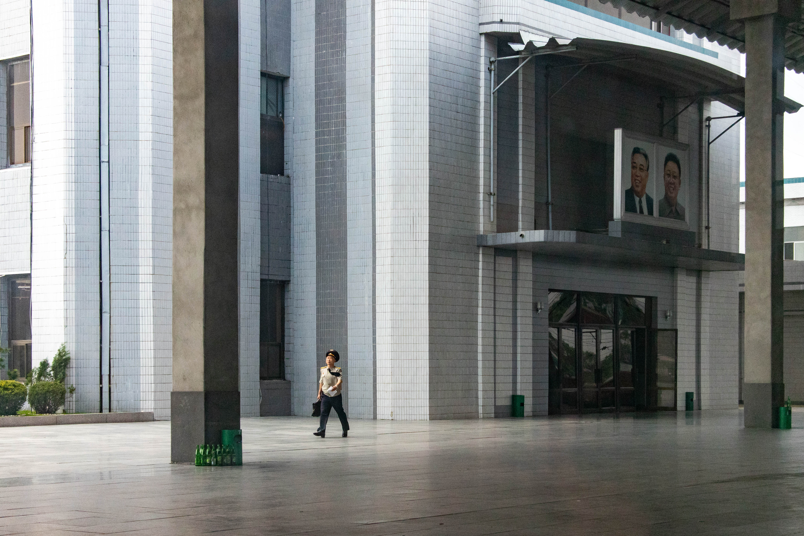
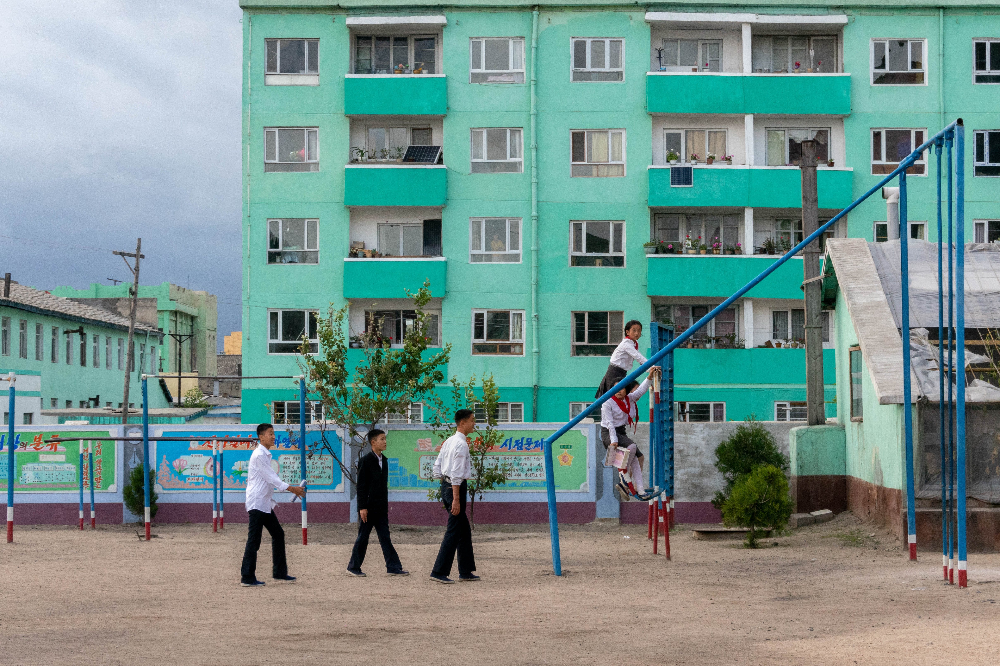
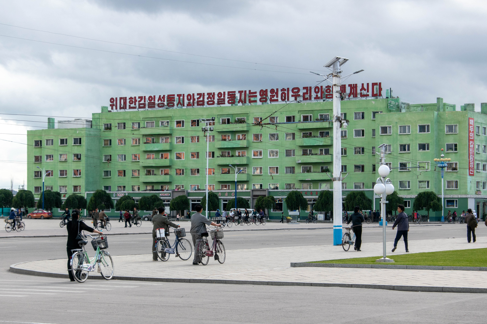

When the aircraft takes off from the North Korean capital, tourists have this guilty excitement appearing in slightly dangerous situations. The plane, which flew for the first time in the sixties, certainly does not comply with the international security rules. Maybe oxygen masks and life vests stayed in Russia, the country it is from, with the Siberian air the ventilation usually blows. On another hand, safety instructions are almost inaudible: the aircraft's deafening noise covers the few crackling decibels escaping from the ancient speakers. We are on board in one of the two domestic flights planned from Pyongyang today. One is going to Uiju and the other, to Orang, brings us to the North-East of the country in no more than one hour.

## Picture restrictions

Despite the very few flights today, all of them will be delayed because of the departure of a Chinese delegation. Stuck in the airport, travellers can watch the show made for the third most important figure of the neighbour state. And receiving representatives from the first economic ally can only be done in a very demonstrative way. The ceremony is quite similar as the one the military parade offered last week-end (read [Pyongyang or a North Korean showcase](https://anothervyou.world/en/pyongyang-or-a-north-korean-showcase/)). The wide boulevards are replaced by a narrow red carpet and the army trucks by officials wearing suits. Koreans with their colourful traditional clothes, waving flowers and flags, seem identically replicated.

The airport of arrival actually looks older than the plane itself. The travel gave a pretty accurate glimpse of the experiences to come in the North Korean countryside. As it was during the flight, taking pictures is forbidden here. The ones who are caught using their camera are once again requested to delete the digital souvenir. It is for sure related to the fact that the area, visited by only eighty people last year, is far from the - relative - mass tourism affecting the capital and is therefore not used to welcome a lot of travellers.

And so the list of prohibited actions already in place in Pyongyang keeps growing. In order to prevent unwanted images from spreading, neither is it possible to take pictures from the bus. The fast-growing aspect of the country's biggest city seems far now: here, roads are highly damaged and made out of soil and gravel; facades lost their vivid colours and look sullen; and the broken windows are often patched up with wooden or plastic sheets. Constantly repeated by the two local guides during the trip, the pictures blacklist will be repeated a very last time just before the end.

## Alone against all

Shooting street scenes will be almost impossible anyway, as urban walks are not really planned for the next days. Only a few hours will be spent in the only visited city, during a surreal afternoon. Chongjin, 600,000 inhabitants and capital of North Hamyong province, first offers a chaotic industrial landscape. The metallurgical plants, doing nothing in silence, vegetate and rust more than is reasonable. Invisible from the way through this iron skyline, a single plant keeps working irreducibly, nested in the middle of its dismissed companions. North Korean scientists created a process to work with and melt metal thanks to lignite, a type of coal surrounding soils are overflown with. Whereas the abandoned plants need to use black coal, more efficient but only imported, the one and only inflexible worker produces "Juche iron (1)", entirely local. The international sanctions against North Korea force them to innovate.

Tourism is for sure one of the best ways to avoid blockades. More than just a propaganda tool, it allows currencies to enter the country. However, euros and dollars, which can be widely used in very touristic places, are hardly accepted in this remote rural area. The Chinese yuan is the main currency travellers have to use, as the local one - the won (2) - can only be used by natives - to be precise, tourists can pay with it in one shopping mall in Pyongyang. The exchange rate fluctuates from an article to another, from a shop to another, from a hotel to another. Here, 50 yuans are equivalent to 5 euros; here, to 7 euros. Of course, as withdrawing cash is impossible, paying by card is not an option. And not giving the right money can lead to surprising situations: change can be given in other currencies, or replaced by biscuits or chewing-gums if the seller misses a few cents.

The dirt road to Chongjin reminds that the money is not the only symptom of the embargo punishing the politic of North Korea. Their economic struggles can be seen in the road infrastructures the rain season gives a rough ride to every year. Now it is over, roads are repaired by hundreds of hands. Inhabitants get back the gravel which escaped in the channels or break big rocks into pieces, make heaps by the side of the trail and spread them right in the middle of the track. They clean the borders, where they made the heaps, to let bicycles ride on an even surface. They then throw water on the road, so the gravel mix with the soil and they avoid breathing the dust that cars send up - cars which, by the way, absolutely never brake, constantly honk and dangerously wait for the pedestrians to get out of their way. The additional water and pebbles are sometimes brought from an adjacent waterway by scrawny cattle, whose bones are ready to pierce the skin. Tedious and insane, this work is done under a blazing sun by men and women of all ages, along every single untarred road we will follow.

## A tourism for tourists

After about fifteen more minutes on the road, the industrial dystopia is replaced by a more common urban landscape, although depraved. Parked near the city's biggest square, inevitably dominated by two bronze statues of the former leaders, the bus had to force its way through pedestrians and cyclists, crossing together. The thin electric wires, hanging almost imperceptibly in front of Kim Jong-un's father and grandfather, are enough to forbid pictures: the leaders already had to be shot entirely; now, on top of that, the view must be clear. However, pictures are allowed in the electronic library lining the square.

Out of two hundred computers in the main room, only ten percents seem working. The building looks like a bad cinema studio. Everything seems fake, even the two kids upstairs who are barely surprised when they see thirty tourists entering the place while they pretend reading. Only one machine has access to the national Internet network; the others only give error pages. Finally, dusty books in foreign languages are proudly exposed on metallic shelves, kept by a woman behind a high counter. Beyond the official speech, is it really more than another touristic showcase?

This attraction represents the vision North Korea has for tourism, a vision contacts with local life suffer from. Like the seaside resort being built between Orang and Chongjin, it is axed on activities confining locals and travellers into their respective roles. The day before, after the - overcrowded - excursion in the Korean Demilitarised Zone (DMZ), the reaction of Jong-im to a request for more involvement in the local life perfectly illustrates the phenomenon. The experienced guide sincerely wondered why one would want to wander in the streets of Kaesong instead of overlooking them from a hill. With a bit of kind mockery after this - to her - incongruous wish, she asked: _"But why? There is nothing to do there." _Alright, let's go to the next monument then...

## A different learning environment

This nordic trip is not different. After the fake library, steps are more than organised: art gallery to the glory of the leaders and the province; show of kids mastering typical instruments such as changgo and gayageum (percussion and air instruments) in a kindergarten; quick stop on a revolutionary site that has actually nothing of revolutionary; and, to finish this long day before a once again over-hearty meal, discussions with students from the Foreign Language Institute. The opportunity to exchange with them and to observe the environment in which they study.

In the classroom, students face Kim Jong-il and Kim Il-sung, whose portraits are above the blackboard. Officially to avoid cheating, a security camera as London and Beijing are full of is in one of the top angles of the room. Three days ago, in Pyongsong, in the South of Pyongyang, classrooms had the same features. Two of them are devoted to each of the leaders and are used to teach history about their respective lives. Earlier today, the kindergarten where the show took place had a model of the place the first North Korean leader was raised. The rooms where murals were dedicated to the Kims' lives is added to the pictures blacklist, as well as this reconstruction. Having actually visited the place, the model is clearly idealised - if not wrong...

Even though their speech is polished, talking with students is a way to know more about their daily life. For example, one of the four state-run TV channels, dedicated to sport, told them France won the football world cup. On Sundays, when Chongjin's cinema opens and screens movies for only five wons, they rather play together. They use their bicycles but are happy that commuting is very cheap: just like the cinema, a ticket costs five wons, countrywide. Besides, in the institute, they can learn international geography. They know where the Alps are, Paris and the Eiffel tower. It is interesting that, as their South Korean neighbours, they call the Sea of Japan "East sea", their common past with Japan being quite turbulent.

## Revolutionary?

Eventually, the discussion ends on their professional future. In the euphoric hubbub of the room, the two students I had the chance to talk with assure they want to serve their country and join the army. Their yearning is different from another student's, in Pyongsong, who wants to _"become scientist."_ The government's will to put science to the foreground in their latest five-year plan, unveiled in 2016 (3), is certainly part of the explanation. Juche iron, nuclear development and, in Pyongyang, the Future Scientist Avenue, are some remarkable examples of this focus.

In the countryside as in the cities, propaganda slogans spread in the nature ask everyone to _"escort the party by carrying out the five-year strategic goal of national economic development."_ When the Internet and knowledge access is that controlled, when there are hundreds of people tirelessly repairing dirt roads, when farmers have almost no machinery to work in the fields, it seems unreal to ask the people to carry out a strategy centred on technologies. The huge lack in electricity and the fact hot water is not a thing here show the way North Korea has to go for its extra-nuclear development. But, fortunately, all the slogans are not about science. Painted alongside characters on posters replacing the invading advertisements of our urban landscapes, some rather put the emphasis on the importance of culture, or the need to support the production of food and goods (4).

If propaganda posters are rarer here, it is not the case for the so-called Towers of Immortality. Built even in the smallest towns, they outnumber the famous bronze statues. Inhabitants can read a kind of performative discourse on them: _"Great Leader Kim Il-sung and the Dear Leader Kim Jong-il will always be with us." _Both the omnipresence and the importance of the leaders can be seen in the "revolutionary" naming too, given even though one of them only passed by once. It is the case for the Yombun site, where rocky mountains dive into the Sea of Japan's blue water, as it is for the Jipsam site, from where Chongjin can be nicely gazed at. In Cuba, revolutionary places are only where blood flowed: a perfect example of the difference in the use of words around the globe.

The next days will show more North Korean paradoxes. Even if religious books were confiscated at the border with China, since they are banned by the government, we will visit a buddhist temple where a dozen monks live and are apparently free to practice their religion. The long-awaited homestay will actually be like the other nights spent in hotels, the fact families will not take part in dinners and the language barrier drastically reducing the interactions. Other than that, unlike the volleyball match with the villagers, the Mount Chilbo trek and the beach that will seemingly be reserved to us will not present any interest to appreciate the local life.

In the end, Pyongyang offers an idyllic vision the North, poorer, counterbalances. Exploring this remote and so little visited region is an excellent way to discover another North Korea, stuck in the past and preserved from tourism. When we arrived, a teenager ran behind a sign to hide from our bus; when we left, smiles spontaneously appeared on dozens of women's face, happy and pleased to see us. Symbol of the diversity of a country that the high media exposure of the centralised dictatorial power could - wrongfully - make appear completely uniform.

-----

## Bonus

Here are some more pictures shot in Chongjin (hover them to have more details, or click them if you are on your phone):

-----

(1) Named after the philosophy North Korean life has been based on since it was created by Kim Il-sung, the Juche iron has been produced for a few months in another plant, near Pyongyang ([source](https://www.upi.com/North-Korea-says-self-reliant-iron-facility-will-begin-production/5411538413159/)).

(2) During the trip, 1 euro was worth more than 8,000 wons. You can know more about this currency by reading its [Wikipedia](https://en.wikipedia.org/wiki/North_Korean_won) page.

(3) For the first time in forty years, North Korea announced, in 2016, a new five-year plan ([source](https://www.washingtonpost.com/world/north-korea-announces-economic-plan-after-unprecedentedly-grim-struggle/2016/05/08/c84088e2-1214-11e6-a9b5-bf703a5a7191_story.html?utm_term=.089b892bcf9f)).

(4) "Let's escort the party by carrying out the five-year strategic goal of national economic development" ([source](http://www.koreatimes.co.kr/www/nation/2018/09/103_255561.html)).
