Two days in the bustle of Ho Chi Minh City are enough to get its main features. Previously named Saigon, it was renamed in 1975 as a tribute to the revolutionary leader, whose pseudonym means "bringer of light". On the road and in the streets, the atmosphere is as chaotic as it gets: eight million scooters invade even the sidewalks, however barred by concrete blocks. Stepping in a bus is like navigating in an ocean of two-wheelers brushing dangerously the liner, moving forward in the swell. And the ocean is not of water but of lava, as the sun burns when it finds its way through the clouds. Maybe, then, is it to escape its destiny that the bus does not completely stop when new passengers are boarding or others going back to the turbulent waters. The craziness of this road traffic is exacerbated in the most crowded city of Vietnam - but rural zones have nothing to envy.

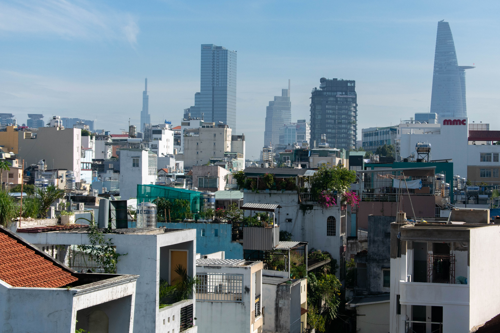

## Bến Tre

Bến Tre, first step in the Mekong mouth, is a good example: scooters invade even the city's covered market. They wander in the middle of pig carcasses and beef pieces, hung on hooks and illuminated by a pallid light, fighting with the darkness of the dilapidated warehouse. The motorised vehicles smoke spreads on meat, fruits, vegetables and into every single lung. It is however unsure that they reach the sellers' dreams, hidden behind their products and, for most of them, asleep. The market is quite empty anyway - locals probably already came earlier, and tourists rather go to the picturesque floating markets of Mỹ Tho and Cần Thơ.

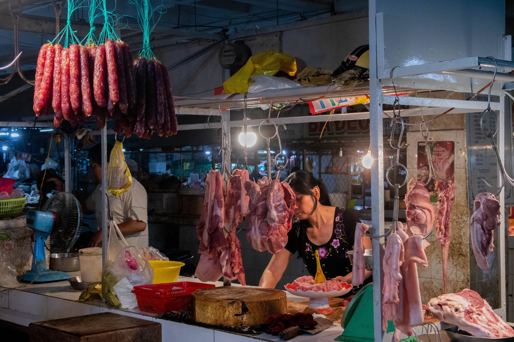

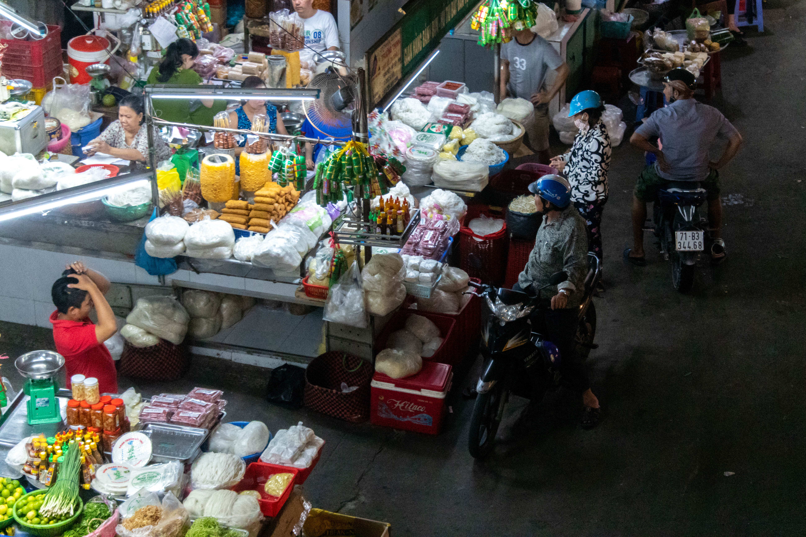

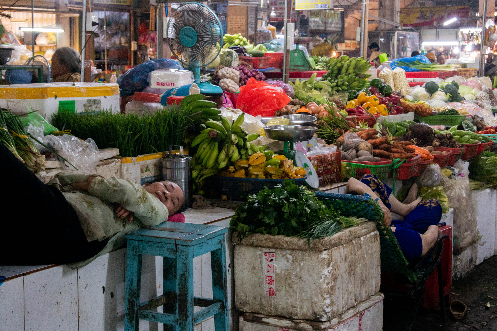

The other covered market of Bến Tre is not more popular. In Vietnam, commercial centres are replaced by two kinds of market: one sells foodstuffs; while the other, often flooded with plastic, sells clothes and other material goods. But the province's capital is rather known for its canals, explorable with a canoe. Lush vegetation borders these thousands of forks and bifurcations, making it easy to lose even the best sailors. Coconut candy factories help reckoning the location: the city is known for its sweets too, whose packs sold throughout the country show the enigmatic picture of an old woman.

Lodges are also hidden in the middle of this jungle. To go there, the only choice is to hop on the back of a tuk-tuk, hitting soaked branches and shaking its passengers in a euphoric din. The darkness, blurred by the big drops sneaking through the thickness of the numerous layers of leaves, only increases this feeling of floating towards the unknown. When coming from the former Saigon, the trip actually starts three hours earlier, in the middle of rice bags and passengers who are dropped literally anywhere by the driver.

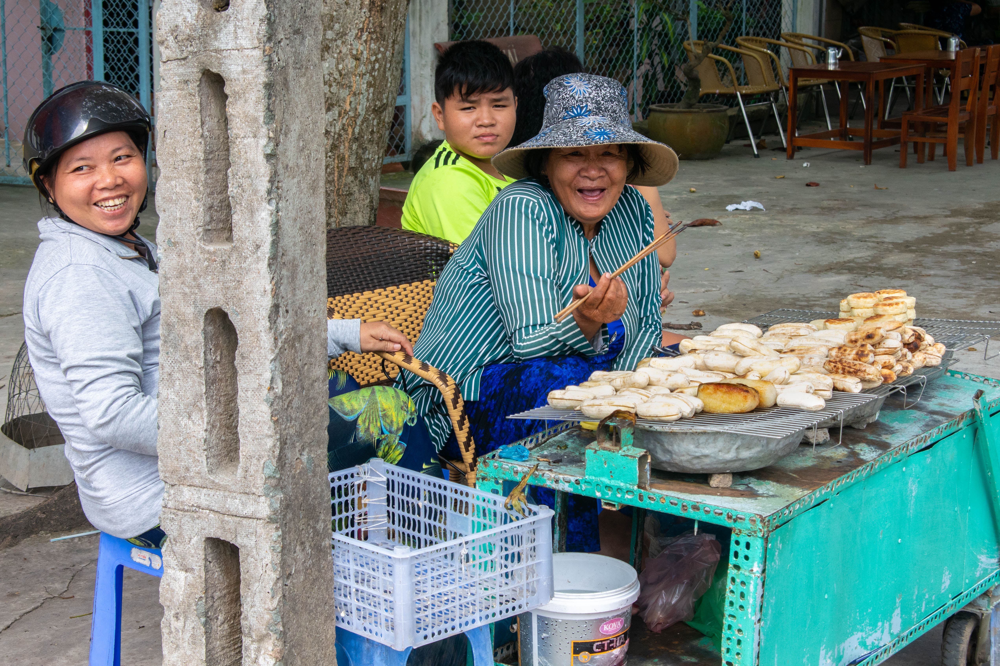

The transport system is really good between cities of the delta. Tourists and natives take the same buses, removing a border that sometimes exist between them. On the road to Bến Tre, just like when going to Cần Thơ, the hours crossing the hundreds of bridges and dodging scooters are exclusively spent with Vietnamese people. The first trip, in which they were worried about our destination and helped us talking to the driver, underlines their kindness; the latter, in the middle of luggages and cartons from where roosters were singing and cats miaowing, is a final step in a folklore far from our Westerner codes. During a short break, the _đá cầu_ (1) game we share with teenagers from the town is another pleasing example.

## Cần Thơ

With its million and a half inhabitants, Cần Thơ seems way more urban. Thanks to its infamous floating markets, it is also more visited. Cities on the Mekong delta have no choice but to adapt with the surrounding water. At dawn - six in the morning -, on the river, resellers from the entire region come and buy fruits and vegetables from the wholesalers. Then, they go back to their town in order to sell what they just got. On the sellers' bows, where eyes are painted to repel crocodiles, there is always a long stick at the end of which the products they sell are hung. They act as landmarks in this anthill tourism makes even more chaotic.

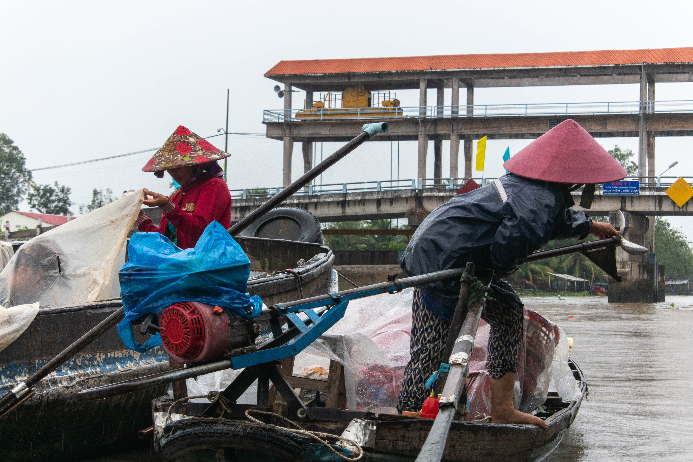

On the outskirts of the city is the delta's largest monastery, called _Trúc Lâm Phương Nam Zen_ - Vietnamese uses our alphabet, dressed with weird and complicated accents. Inaugurated in 2014, the endless rows of benches painted with ads and the parts still under construction kill the special vibe most of taoist temples have, full of incense smoke and overloaded with decorations. Another temple, seeming abandoned on the side of a small road back to Cần Thơ, ends up being extraordinarily more fascinating. When wandering in its just finished foundations - orange bricks, concrete ground and visible rusted iron rods -, this building with no closing walls unveils several altars and hides, behind, a small monastery. One of the two monks recite a procession, while regularly hitting a gong with a mallet, adding to the mystical vibe of the place. The construction of _Tịnh Thất Hoa Nghiêm _("serious peace") started in 2016 (2) but apparently stalled, which does not prevent it from working and magnify its sacred nature.

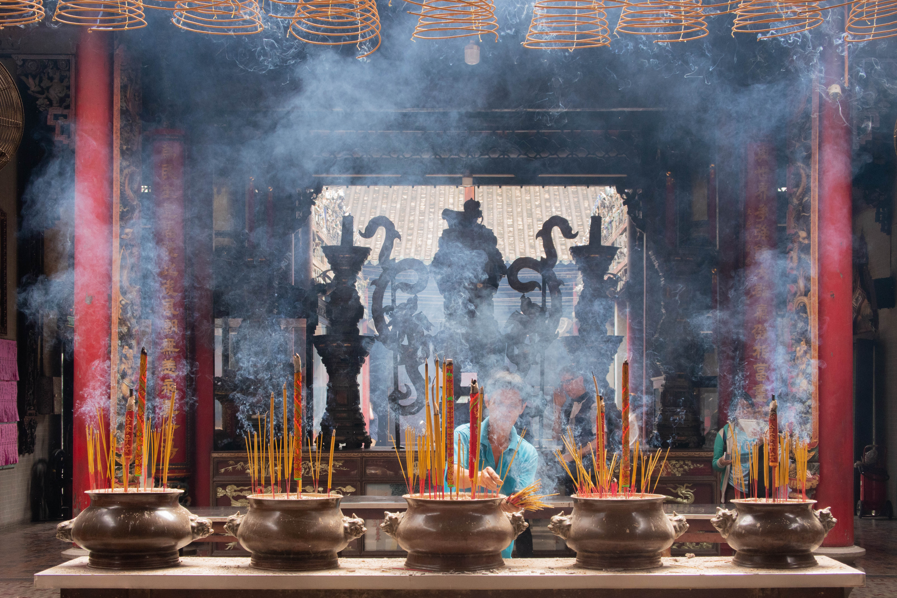

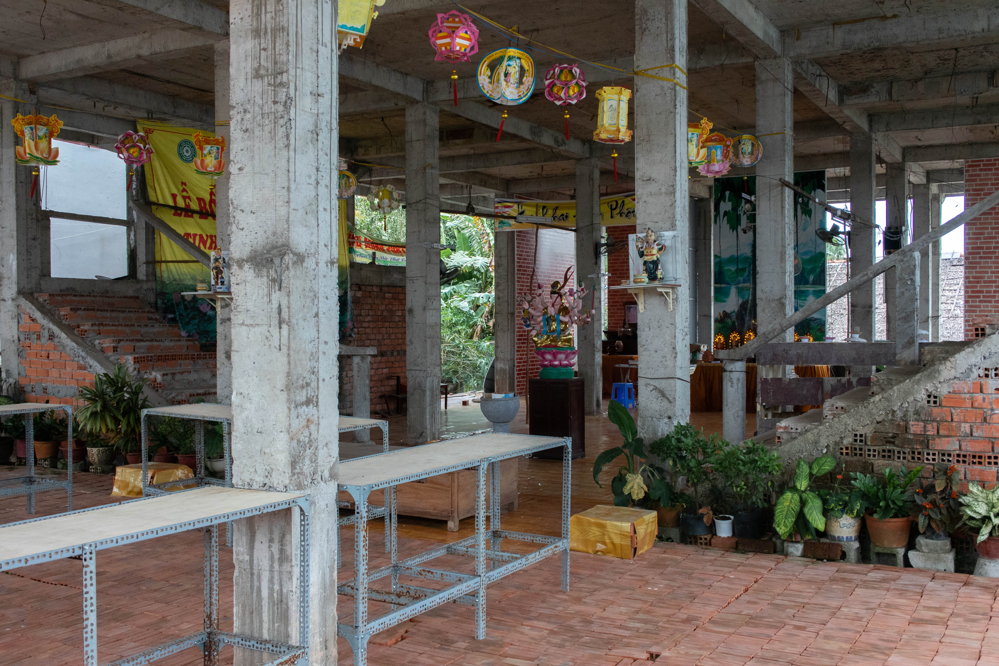

A bit earlier, along the Cần Thơ river, a loud singing coming out a clipping speaker caught our attention. The five - dead drunk - men responsible for this din did not need more to call and invite us at their table, under which a mountain of empty beer cans lied. Vietnamese people have an uninhibited passion for karaoke, that everybody can enjoy - mostly to their detriment. Whether the night is dark or the sun is shining, whether they are very downtown or far from everything, the amateur singers do not hesitate to cover their favorite songs with their voice - while keeping their doors and windows wide open.

On top of a hotel overlooking the city, a silent dusk is on its way. The impressive building, of which a side faces the sun when it sets, is the ideal place for the end of clear sky days. A breath of wind before going back down, where the air is so heavy it strengthen gravity. The delicious Vietnamese pizzas of the night market will end these three days astride the new year, and will act as our celebration for want of anything better - the lunar new year is far more popular here.

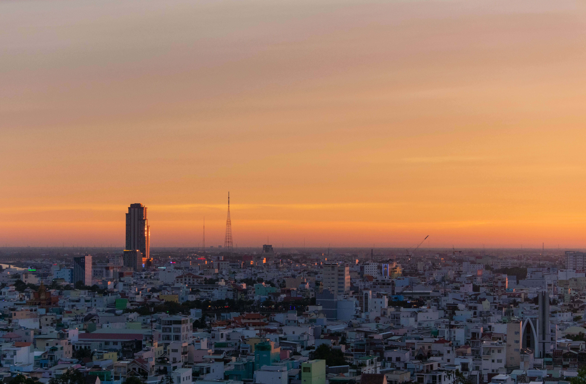

## Châu Đốc

After a while in the heart of the Mekong delta, we are heading upstream, straight towards the Cambodian border. Châu Đốc is an example of harmony, as buddhists (Kinh and Khmers) and muslims (Chams) have lived in total peace for decades. The floating houses are more surprising than the tall and narrow buildings of Cần Thơ, built this way to reduce the cost - the ground surface being reduced. The market is more picturesque: living, colorful and not crowded. Outside of the city, in the middle of the infinite lowland stretching on both sides of the invisible border, the top of a sacred hill gives a superb view. It is easy, here, to forget the two countries' past setbacks...

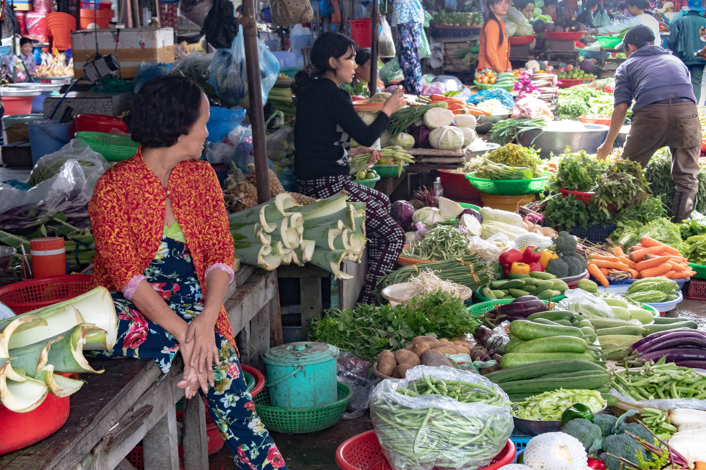

On the Bassac river, houses are perched on stilts or surrounded with water. They remind the importance of the thousands of ways the Mekong takes before flowing into the ocean a few hundred kilometres East. Behind the tourist attractions, the floating markets are crucial to the local life, impacted by climate change. And our presence obviously does not help...

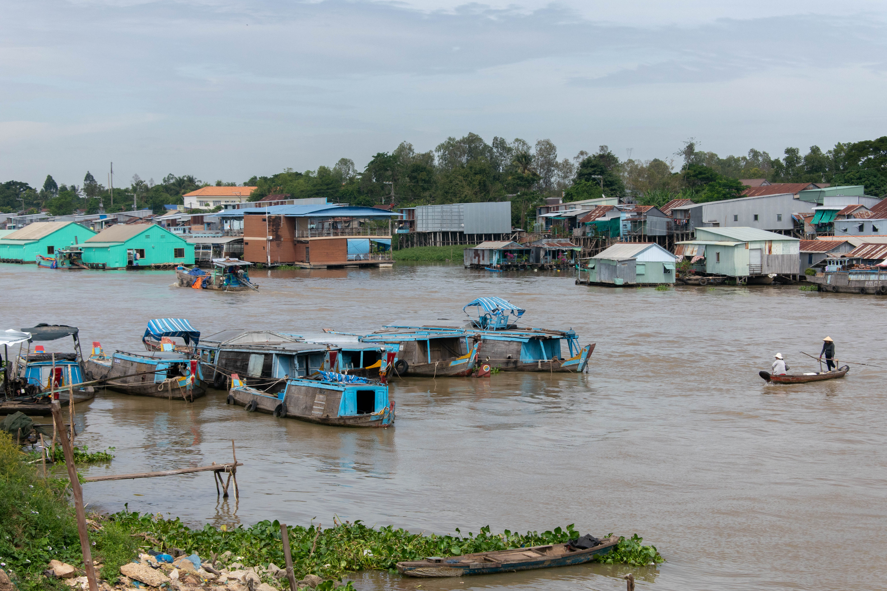

A simple wooden boat - fortunately covered, not for the rain but rather for the blazing sun - is enough to appreciate the peculiarity of the place. When mooring to the deck and going back to the land, it is possible to have a glance at the local muslim culture. The mosques are simple or superb, and witness the villagers gathering after the muezzin has called for the prayer is a unique experience here. Pretty different from the immense buddhist complex built halfway between the city and the sacred hill, looking fake, incredible but lacking in visitors.

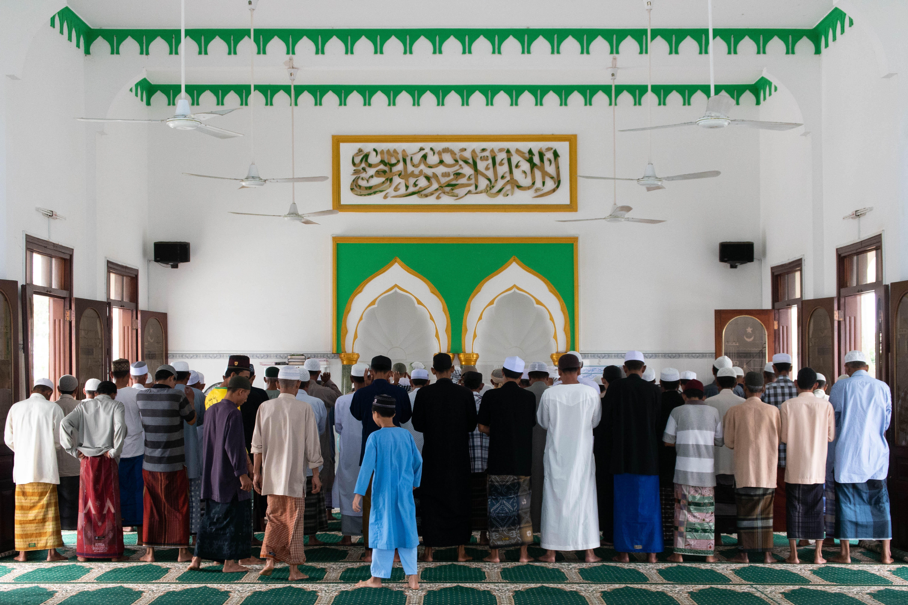

## Phú Quốc

South, along the Cambodian border, Hà Tiên is a coastal city from where it is possible to go to Phú Quốc, by ferry or catamaran. Because of the storm that has happened for a few days, we will struggle reaching it. We leave Châu Đốc at dawn and know about the situation: no boats have gone to the island for two days, and it should be the same today. When arriving in Hà Tiên, several agencies confirm the information and assess it would be possible to sail only the day after. We book a hotel, eat, visit and spend the day in the city and, just for the sake of trying, decide to head to the industrial harbour from where large ferries leave. Against all odds, we will be admitted on board, among buses, trucks and cars, tossing for more than three hours at the rhythm of a swell made heavier by far gusts of wind.

Phú Quốc is bipolar - heavenly and appalling, virgin and ravaged. The North of the island is not busy and is home of an impenetrable protected forest; the South is overcrowded and subject to mass tourism. What is usually behind the scene is here in the foreground: people tan in the middle of plastic pieces the sea does not want anymore. This material is an absolute curse in Vietnam. While tourists buy perfect bamboo straws to bring back in their country, locals drink with plastic straws, in plastic cups with a plastic lid, carried in plastic bags. And properly throwing away these pieces of single use plastic does not mean you will not swim with it the day after...

## Mũi Né

This dystopian description actually concerns just a few beaches, most of them being apparently untouched. Only one of them offers a spectacle as distressing as it is alarming: the fishing village beach, in Mũi Né. Three hours by boat and about twelve hours by bus - with a stop in Hô Chi Minh City before the sunrise - are necessary to get to this seaside town. The Russian influence is as strong as on the island, as the translations written in the Cyrillic alphabet always come before the English ones. In Phú Quốc, even the music festival we attended was organised by a Russian organisation.

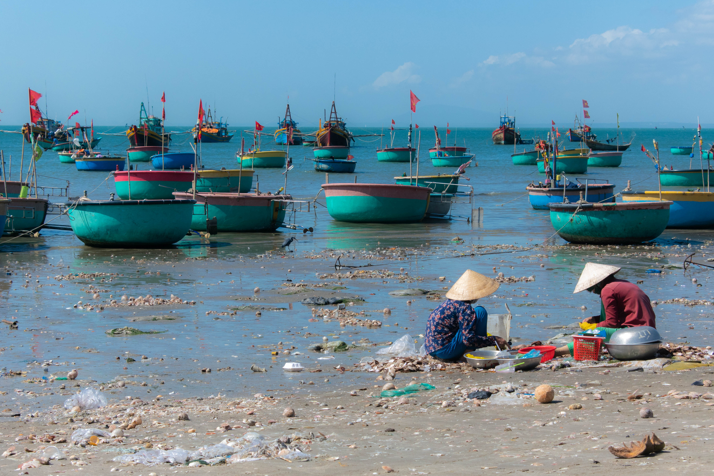

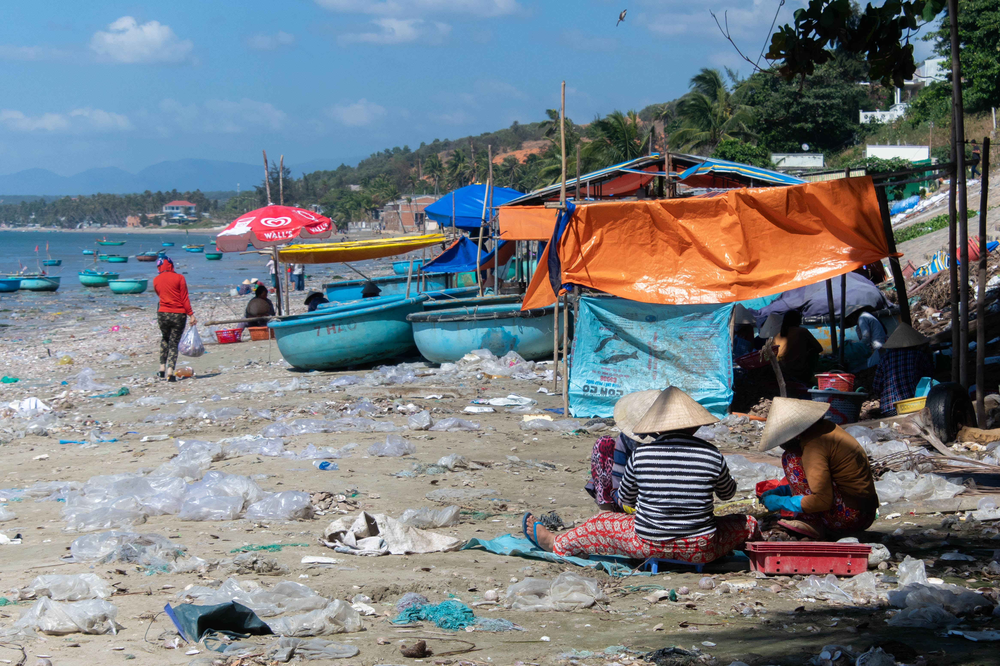

Mũi Né has some spectacular sand dunes. The red color of the first one (_đồi cát hồng_) is warmed up by the setting sun; the white color of the other one (_đồi cát trắng_) awakes the sleepy eyes when they just got off the bed. When coming back from the hilly stretch of white sand, unfinished and abandoned resorts mark out the road. A few dozens of meters after the last of them, the prophecy fulfils: as told here and there, we are going to have to bribe the police.

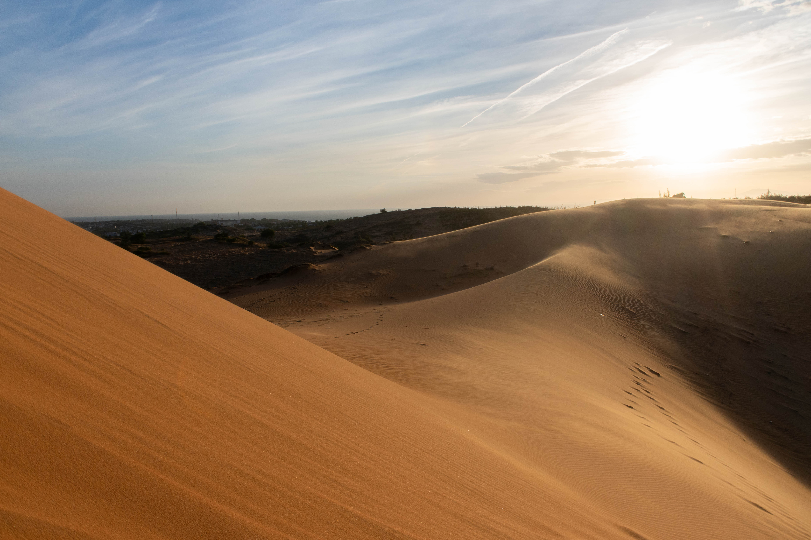

Driving a scooter without an international license is widely tolerated in the country, except here. The policeman brings us behind his car, so we are hidden from the road. We sit on plastic chairs, so low they seem to be for children, around a table with the same features - this kind of furniture is really common in cafés and restaurants. He shows us an old file with dog-eared pages on which law passages - real or fake - are printed in several languages: our scooter has to stay here for a week, and we must pay 1,200,000 dongs (46 euros) right now.

In anticipation of this situation, we prepared a wallet with only 100,000 dongs (4 euros), that we show to the officer. Not enough for him, he asks us to find and go together the closest ATM. When at our two-wheeler, I take 700,000 dongs (27 euros) out of the boot. He makes a sign so I hide the money, parks his motorbike and removes his helmet. I let part of the spoils in the bag before joining him again behind the car. After receiving about 500,000 dongs (20 euros), the policeman shakes our hand with a large smile on his face, tells us to say we already paid him if we get arrested again later, and wishes us a great trip!

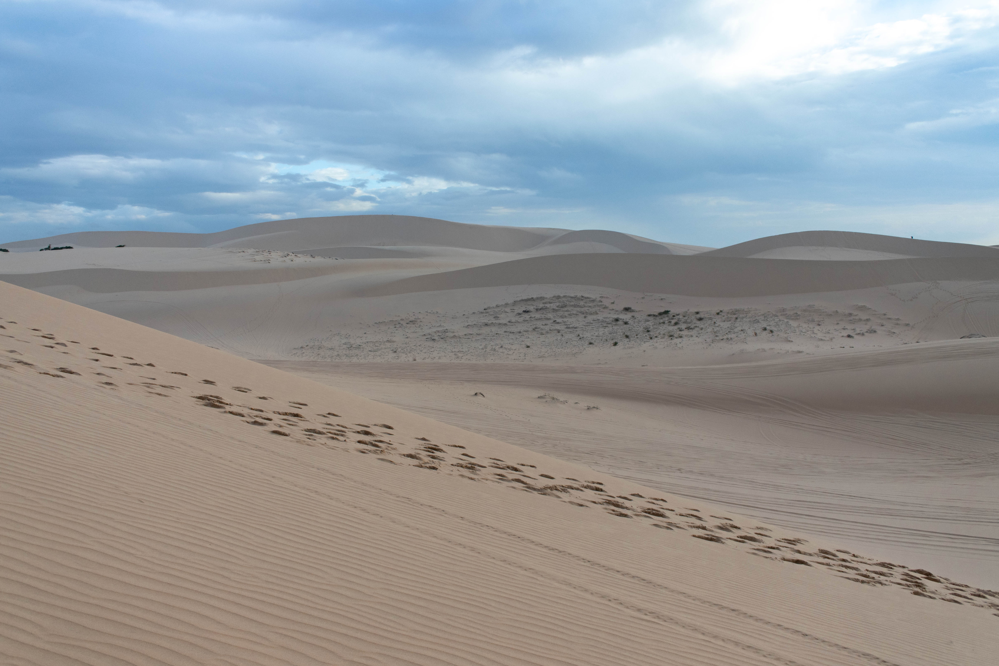

Back to Hô Chi Minh City, public transport are cheap - 20 cents for a ride - and make renting a motor vehicle useless. They are an efficient mean of commuting between far places in this atypical metropolis, where hairdressers practice on the pavement, where workers take naps in hammocks - which could well be a national sport - they fasten to their construction trucks, where pétanque and French pool are a legacy from a long colonial past. Traffic is too extreme anyway...

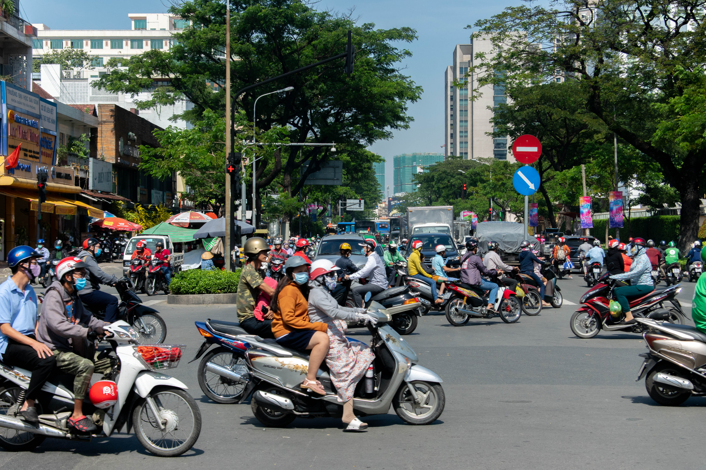

(1) Jianzi is a Chinese game in which players have to pass a kind of shuttlecock using their feet.

(2) See when [this photo](https://www.google.com/maps/uv?hl=en&pb=!1s0x31a089cc737e4f4b%3A0x7afba24e1d796b9c!2m22!2m2!1i80!2i80!3m1!2i20!16m16!1b1!2m2!1m1!1e1!2m2!1m1!1e3!2m2!1m1!1e5!2m2!1m1!1e4!2m2!1m1!1e6!3m1!7e115!4shttps%3A%2F%2Flh5.googleusercontent.com%2Fp%2FAF1QipPiHg1T5LnKYnv5F9WXxFbDq5YBR3OWtnsKFlDQ%3Dw482-h320-k-no!5zdOG7i25oIHRo4bqldCBow7JhIG5naGnDqm0gY2FuIHRobyAtIEdvb2dsZSBTZWFyY2g!15sCAQ&imagekey=!1e10!2sAF1QipOGrfYWKJCMOWzQWHX_lBCUkorshaA1NyTOmbDg&sa=X&ved=2ahUKEwimnIbI4eXgAhXHKlAKHRlrBgIQoiowE3oECAYQBg) was shared, as well as [this video](https://www.youtube.com/watch?v=Olpj9_PIFqs) to see how the construction went a year later.

(3) https://www.theguardian.com/world/2019/jan/04/thailand-braces-amid-fears-tropical-storm-pabuk-could-be-worst-in-a-generation
