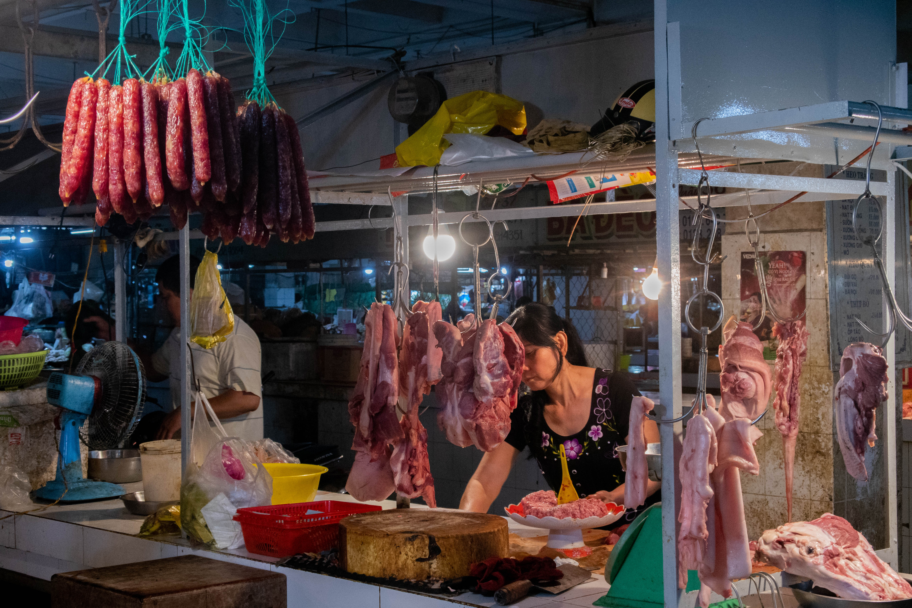
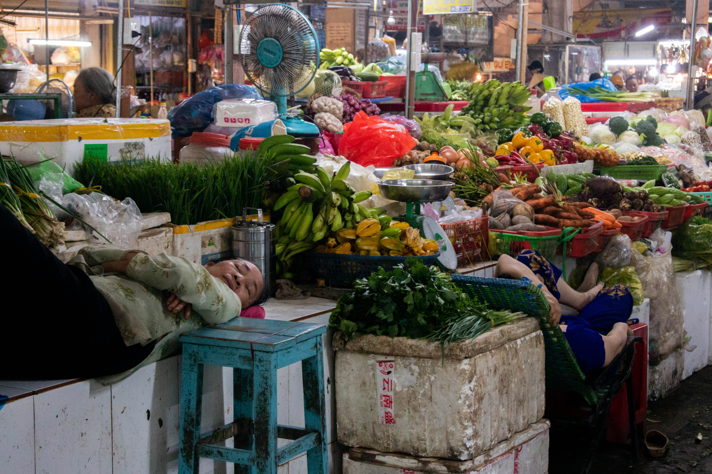
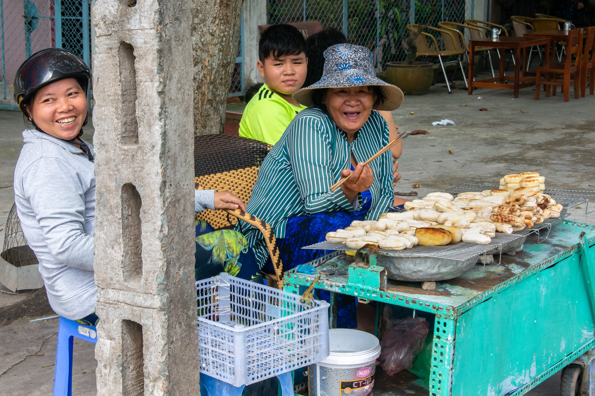
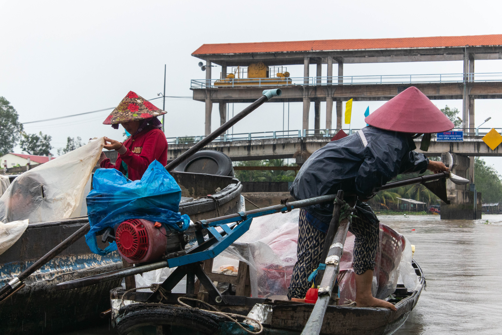
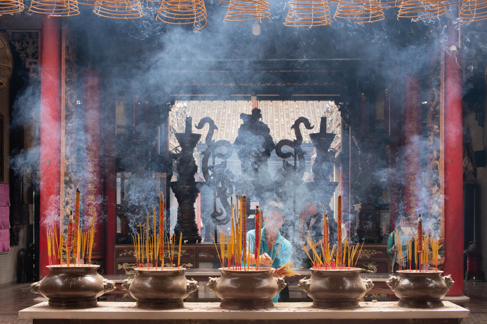
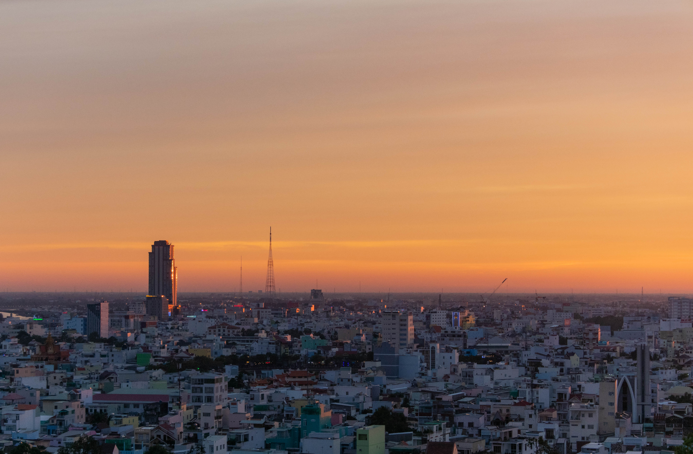
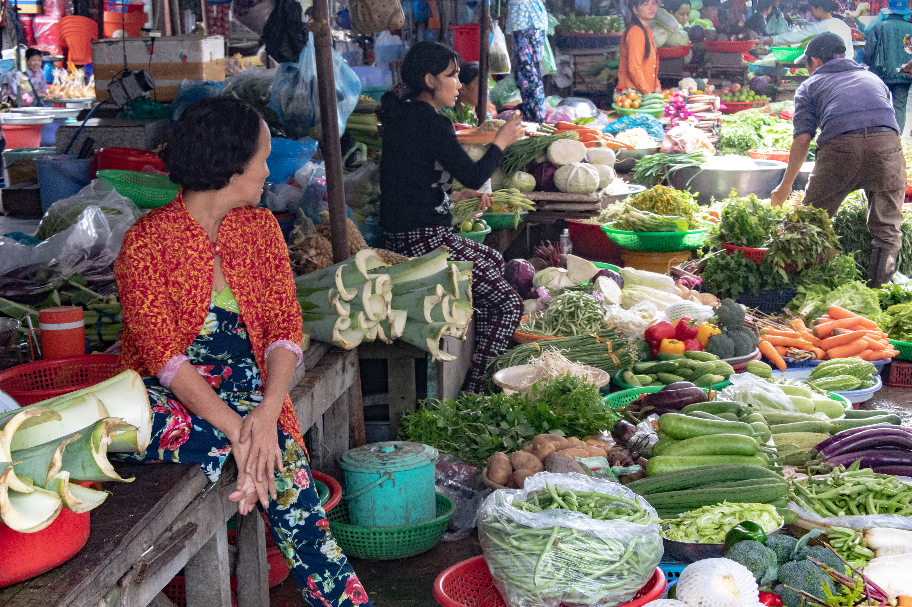
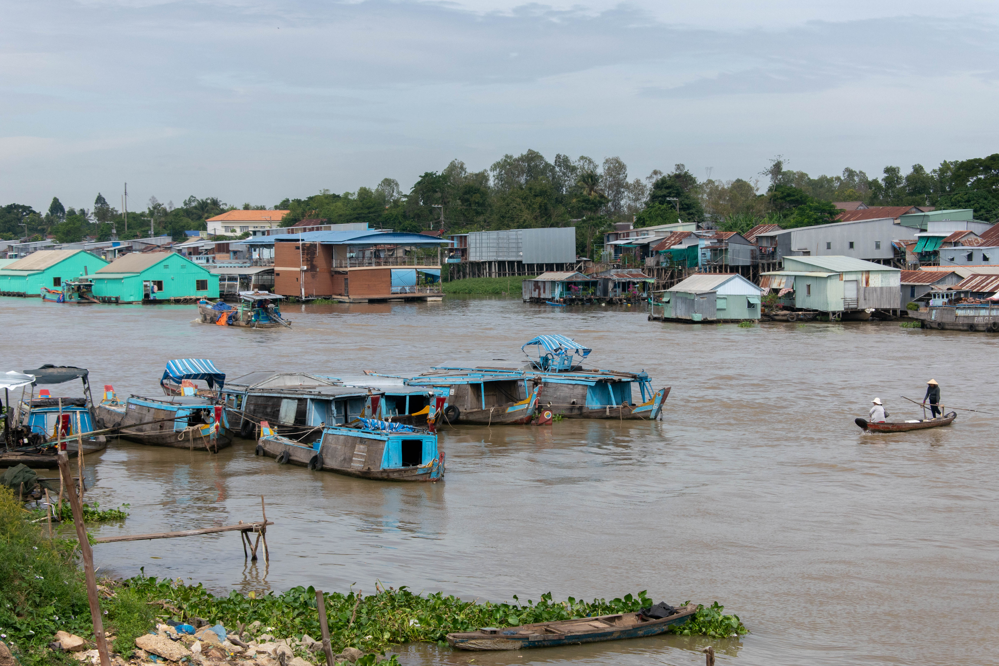
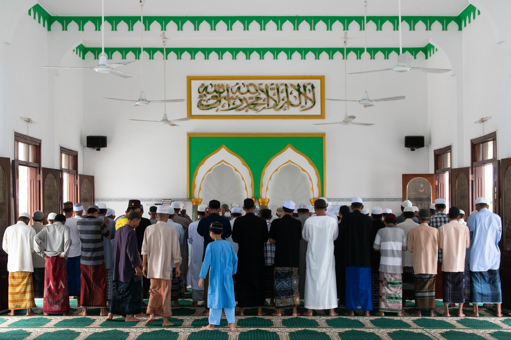
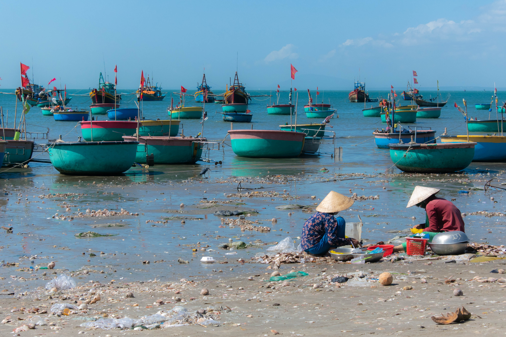

Deux jours dans la frénésie de Hô Chi Minh Ville permettent d'en cerner les caractéristiques principales. Précédemment nommée Saïgon, elle est rebaptisée en 1975 en hommage au leader indépendantiste victorieux trente ans plus tôt, dont le pseudonyme signifie "porteur de lumière". Sur la route et dans les rues, l'ambiance y est tout à fait chaotique : les huit millions de scooters envahissent jusqu'aux trottoirs, pourtant régulièrement barrés de blocs de bétons. Se nicher dans un bus donne l'impression de naviguer dans un océan de deux roues frôlant dangereusement le paquebot qui fend la houle. Et l'océan n'est certainement pas d'eau mais de lave, tant le soleil brûle lorsqu'il perce les nuages. Peut-être, alors, est-ce pour échapper à son destin qu'il ne marque pas d'arrêt complet quand de nouveaux passagers grimpent à bord ou que d'autres repartent en eaux troubles. La folie de cette circulation hallucinée est exacerbée dans la ville la plus peuplée du Vietnam - mais le trafic en zones rurales n'a rien à lui envier.

## Bến Tre

Bến Tre, première étape dans l'embouchure du Mékong, le démontre : les deux roues motorisés conquièrent même le marché intérieur de la ville. Ils se baladent au milieu de carcasses de porc et de pièces de bœuf, pendus au bout de crochets et éclairés par une lumière blafarde qui contraste l'obscurité de l'entrepôt délabré. Les fumées d'échappement s'épandent sans gêne sur la viande nue, les fruits, les légumes et dans les poumons des passants. Pas certain, en revanche, qu'elles atteignent les rêves des commerçants, nichés derrière leur étale et dormant pour la plupart. Il faut dire que le marché est assez peu fréquenté. Les locaux semblent vaquer à d'autres occupations, quand les touristes préfèrent les marchés flottants pittoresques de Mỹ Tho ou de Cần Thơ au charme authentique de cette petite ville.

L'autre marché couvert de Bến Tre n'est pas beaucoup plus populaire. Au Vietnam, les centres commerciaux sont communément remplacés par deux types de marché : l'un, comme le premier, dédié aux denrées alimentaires ; l'autre, submergé par des quantités affolantes de plastique, aux vêtements et autres biens matériels. Mais la capitale éponyme de la province est plutôt réputée pour ses dédales de canaux et de rivières, qu'il est possible d'arpenter en canoë. Bordés de végétation luxuriante, les milliers d'embranchements et de bifurcations pourraient perdre les navigateurs les plus aguerris. Les fabriques de _coconut candy _(bonbons à la noix de coco) permettent ci-et-là de se repérer : la ville est autrement connue pour ses sucreries, dont les paquets vendus à travers le pays arborent la photographie énigmatique d'une vieille femme.

Des gîtes se cachent aussi au milieu de cette jungle. Pour les rallier, pas d'autre choix que de monter à l'arrière d'un tuk-tuk, frappant les branches détrempées par la pluie diluvienne et remuant violemment ses passagers dans un vacarme euphorisant. L'obscurité, floutée par les grosses gouttes qui se frayent un chemin dans l'épaisseur des couches successives de feuilles, accentue cette impression de flottement vers l'inconnu. En partant de l'ancienne Saïgon, le voyage commence même trois heures plus tôt, au milieu de sacs de riz et de passagers que le chauffeur dépose aux quatre coins des villages traversés.

Le réseau de transports est particulièrement bien rodé entre les villes du delta. Touristes et autochtones se retrouvent dans les mêmes bus, brisant une barrière qui peut parfois se dresser entre eux. Sur la route de Bến Tre, comme en rejoignant Cần Thơ, les heures passées à franchir les centaines de ponts et à éviter les scooters le seront dans des bus empruntés exclusivement par des Vietnamiens. Le premier trajet, pendant lequel ils s'inquiétaient de notre destination et en notifiaient alors le conducteur, soulignait leur amabilité ; le second, au milieu de bagages et de cartons percés par des cris de coq et des miaulements, achève l'immersion dans un folklore loin des carcans de nos pays d'Europe de l'Ouest. Le temps d'une courte pause, la partie de _đá cầu_ (plumfoot, jeu de passes asiatique avec une sorte de volant qu'il faut garder en l'air) partagée avec des adolescents du coin en est un autre exemple réjouissant.

## Cần Thơ

Cần Thơ, un million et demi d'habitants, paraît bien plus urbaine que sa voisine d'une centaine de kilomètres. Grâce à ses marchés flottants emblématiques, elle est aussi bien plus visitée. Les villes qui se sont développées sur le delta du Mékong n'ont d'autre choix que de composer avec l'eau qui les entoure. Dès le lever du soleil, sur les coups de six heures, des revendeurs de toute la région viennent acheter fruits et légumes aux grossistes présents sur les rivières. Ils repartent ensuite dans leur village, pour revendre à leur tour ce qu'ils viennent tout juste d'acquérir. Sur les proues des commerçants, peintes d'yeux afin de repousser les crocodiles, un grand bâton au bout duquel se trouve un exemplaire de chaque produit vendu est planté. Ils servent ainsi de repère dans cette fourmilière de bateaux que le tourisme rend encore un peu plus chaotique.

En périphérie de la ville se trouve le plus grand monastère du delta, appelé _Trúc Lâm Phương Nam Zen _\- le Vietnamien utilise notre alphabet, habillé d'accents alambiqués. Ouvert en 2014, les interminables rangées de bancs publicitaires et les parties encore en construction brisent le charme que les temples taoïstes, enfumés d'encens et à la décoration surchargée, dégagent quant à eux. Un autre temple, semblant abandonné au bord d'une petite route dérobée rejoignant Cần Thơ, s'avère lui aussi extraordinairement plus fascinant. En s'aventurant dans ses fondations à peine terminées - briques oranges, sol bétonné et tiges de fer rouillées apparents -, la bâtisse sans murs dévoile plusieurs autels et cache, derrière, un petit monastère. L'un des deux moines récite une procession, régulièrement coupée d'un coup de mailloche sur un gong, participant à l'atmosphère mystique du lieu. La construction de _Tịnh Thất Hoa Nghiêm _("paix sérieuse") a commencé en 2016 (1) mais a apparemment marqué le pas, n'empêchant pas son fonctionnement et sublimant son caractère sacré.

[

Un peu plus tôt, le long de la rivière Cần Thơ, un chant criard relayé par un micro saturé attirait notre œil. Il n'en fallait pas plus aux cinq hommes responsables de ce vacarme - ivres au possible - pour nous interpeller et nous inviter autour de leur table, couvrant une montagne de cadavres de bière. Les Vietnamiens entretiennent une passion décomplexée pour le karaoké, que tout un chacun peut apprécier, bien souvent à son détriment. Que la nuit soit noire ou que le soleil brille derrière les nuages, qu'ils soient en pleine ville ou qu'ils soient loin de tout, les chanteurs amateurs n'hésitent pas à couvrir leurs musiques favorites de leur voix - en prenant soin de garder portes et fenêtres grandes ouvertes.

Au sommet d'un hôtel dominant la ville, c'est un crépuscule plus silencieux qui se profile. L'imposant bâtiment, dont un côté fait face au soleil lorsqu'il se couche, indique l'endroit idéal des fins de journées au ciel clair. Une bouffée d'oxygène avant de retourner en bas, où l'air est lourd à augmenter la gravité. Les délicieuses pizzas vietnamiennes du marché de nuit clôtureront ces trois jours à cheval sur la nouvelle année, et serviront de célébration à défaut de mieux - le nouvel an lunaire est ici bien plus populaire.

## Châu Đốc

Après quelques temps au cœur du delta du Mékong, nous nous dirigeons en amont, droit vers la frontière cambodgienne. Châu Đốc est un exemple d'harmonie, bouddhistes (Kinh et Khmers) et musulmans (Chams) vivant en paix totale depuis des décennies. Les maisons flottantes y sont bien plus étonnantes que les habitations hautes et étroites de Cần Thơ, fabriquées de la sorte pour en réduire le coût - la surface au sol étant moindre. Le marché est quant à lui le plus pittoresque : vivant, coloré et peu fréquenté. En dehors de la ville, au milieu de l'interminable plaine qui s'étend de part et d'autre de la frontière invisible, la vue offerte au sommet d'une colline sacrée fait oublier les déboires récents des deux pays.

Sur la rivière Bassac, les maisons sont perchées sur pilotis ou bordées d'eau tout autour. Elles rappellent l'importance des milliers de chemins que prend le Mékong avant de se déverser quelques centaines de kilomètres plus à l'Est. Derrière les attractions touristiques, les marchés flottants sont essentiels à l'organisation de la vie locale, fragilisée par le changement climatique. Et notre présence y contribue évidemment...

Une barque de fortune - heureusement tout de même couverte, non pour la pluie mais plutôt pour le soleil ardent - suffit à apprécier la singularité des lieux. En s'amarrant aux ponts de bois pour retrouver la terre ferme, il est possible de toucher du doigt la culture musulmane locale. Les mosquées sont simples ou superbes, et assister au regroupement de tout un village après que le muezzin a appelé à la prière est une expérience unique dans cette région. Voilà qui change de l'immense complexe bouddhiste construit à mi-chemin entre la ville et la colline sacrée, aux allures fausses, incroyable mais dénué de visiteurs.

## Phú Quốc

En longeant la frontière cambodgienne vers le Sud se trouve Hà Tiên, d'où ferries et catamarans permettent de rejoindre l'île de Phú Quốc. Du fait de la tempête qui sévit depuis plusieurs jours (2), nous y parviendrons non sans mal. Nous quittons Châu Đốc aux aurores en connaissance de cause : aucun bateau n'a fait le trajet depuis deux jours, et il en sera de même aujourd'hui. Arrivés à Hà Tiên, plusieurs agences assurent qu'il ne sera possible de naviguer que le lendemain. Nous prenons alors une chambre d'hôtel, mangeons, visitons la ville toute la journée, puis, dans un dernier élan de désespoir, nous dirigeons vers le port industriel d'où partent de trapus ferrys. Contre toute attente, nous serons admis à bord, au milieu de bus, camions et voitures, ballotant pendant plus de trois heures au rythme de la houle agitée par les bourrasques lointaines.

Phú Quốc est bipolaire - paradisiaque et désolante, vierge et ravagée. Le Nord de l'île est peu fréquenté et abrite une forêt protégée impénétrable ; le Sud est bondé et en prise au tourisme de masse. L'envers du décor est ici sur l'endroit : les flâneurs bronzent au milieu des morceaux de plastique que la mer régurgite. Ce matériau est un fléau absolument majeur au Vietnam. Pendant que les touristes achètent de parfaites pailles en bambou à ramener dans leurs pays respectifs, les locaux boivent leurs boissons avec des pailles en plastique, dans des gobelets en plastique fermés par des couvercles en plastique, et emballés dans des sacs en plastique. Et jeter à la poubelle ces morceaux de plastique à usage unique n'assure en rien de ne pas se retrouver à nager avec le lendemain...

## Mũi Né

Ce tableau dystopique vaut cependant pour une minorité de plages, beaucoup étant en apparence épargnées. Seule l'une d'entre elle offre un spectacle aussi affligeant qu'alarmant : la plage des pêcheurs, à Mũi Né. Trois nouvelles heures de bateau et une douzaine d'heures de bus - avec escale à Hô Chi Minh Ville avant le lever du soleil - sont nécessaires pour rejoindre la station balnéaire. L'influence russe y est ici aussi prégnante que sur l'île, les traductions à la graphie cyrillique précédant presque toujours l'Anglais. À Phú Quốc, même le festival de musique auquel nous avons assisté était organisé par un collectif russe.

Mũi Né propose de spectaculaires dunes de sable. La couleur rouge de l'une (_đ__ồi cát hồng_) est réchauffée par le coucher du soleil ; la couleur blanche de l'autre (_đ__ồi cát trắng_) réveille les yeux endormis lorsqu'il sort de son lit. En revenant d'étendue vallonée de sable blanc, des complexes hôteliers inachevés et abandonnés jalonnent la route. Un peu après le dernier d'entre eux, la prophétie se réalise : comme raconté ci et là, il va nous falloir corrompre la police.

[

Conduire un scooter sans permis international est toléré sur tout le territoire, sauf ici. Le policier nous emmène derrière sa voiture, de façon à ce que nous soyons cachés. Nous nous asseyons sur des chaises en plastique, basses à tel point qu'elles paraissent être pour enfant, autour d'une table aux caractéristiques similaires - ce type de mobilier est très répandu dans les cafés et restaurants. Il nous montre un vieux classeur aux feuilles plastifiées écornées sur lesquelles sont imprimées des extraits - véritables ou non - de loi, traduits en langues étrangères : notre scooter doit être immobilisé une semaine, et nous devons payer 1 200 000 dongs (46 euros) sur le champ.

En prévision de cette situation, nous avions préparé un portefeuille avec seulement 100 000 dongs (4 euros), que nous montrons à l'officier. Insuffisant à ses yeux, il nous enjoint de trouver le distributeur le plus proche à ses côtés. Arrivé à notre deux roues, je sors du coffre 700 000 dongs (27 euros) supplémentaires. Il me fait signe de cacher l'argent, se gare, descend de sa moto et enlève son casque. Je laisse une partie de ce butin dans le sac avant de le rejoindre à nouveau derrière la voiture, garée sur le bas-côté. Après avoir reçu environ 500 000 dongs (20 euros), le policier nous serre la main, un grand sourire au visage, nous prévient de dire que nous l'avons déjà payé lui si nous nous faisons arrêter à nouveau, puis nous souhaite une excellente fin de voyage !

[

De retour à Hô Chi Minh Ville, les transports en commun à vingt centimes éloignent la nécessité de louer un véhicule à moteur. Ils sont un moyen efficace d'effectuer de longues distances dans cette métropole atypique, où les coiffeurs exercent à même la rue, où les ouvriers font la sieste dans des hamacs - véritable sport national - qu'ils accrochent à leurs camions de chantier, où la pétanque et le billard français témoignent d'un long passé colonial. Le traffic y est de toute façon bien trop extrême...

-----

(1) Voir la date de partage de [cette photo](https://www.google.com/maps/uv?hl=en&pb=!1s0x31a089cc737e4f4b%3A0x7afba24e1d796b9c!2m22!2m2!1i80!2i80!3m1!2i20!16m16!1b1!2m2!1m1!1e1!2m2!1m1!1e3!2m2!1m1!1e5!2m2!1m1!1e4!2m2!1m1!1e6!3m1!7e115!4shttps%3A%2F%2Flh5.googleusercontent.com%2Fp%2FAF1QipPiHg1T5LnKYnv5F9WXxFbDq5YBR3OWtnsKFlDQ%3Dw482-h320-k-no!5st%E1%BB%8Bnh%20th%E1%BA%A5t%20h%C3%B2a%20nghi%C3%AAm%20can%20tho%20-%20Google%20Search&imagekey=!1e10!2sAF1QipOGrfYWKJCMOWzQWHX_lBCUkorshaA1NyTOmbDg&sa=X&ved=2ahUKEwimnIbI4eXgAhXHKlAKHRlrBgIQoiowE3oECAYQBg), ainsi que [cette vidéo](https://www.youtube.com/watch?v=Olpj9_PIFqs) pour apprécier la progression des travaux un an plus tard.

(2) https://www.lemonde.fr/climat/article/2019/01/03/des-dizaines-de-milliers-de-touristes-fuient-des-iles-de-thailande-a-l-approche-de-la-tempete-pabuk\_5404851\_1652612.html
