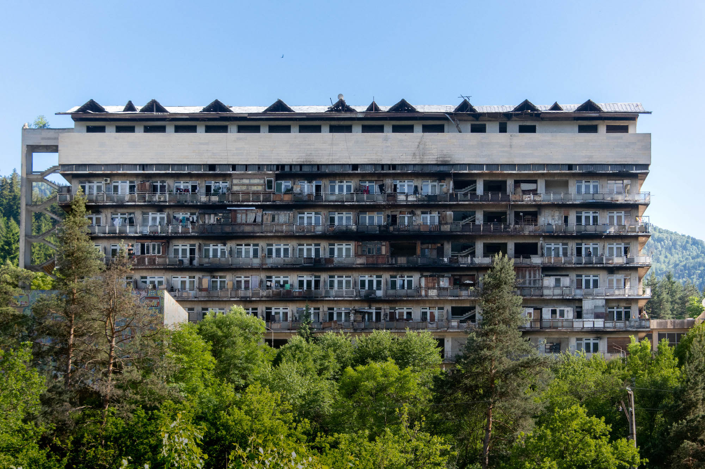
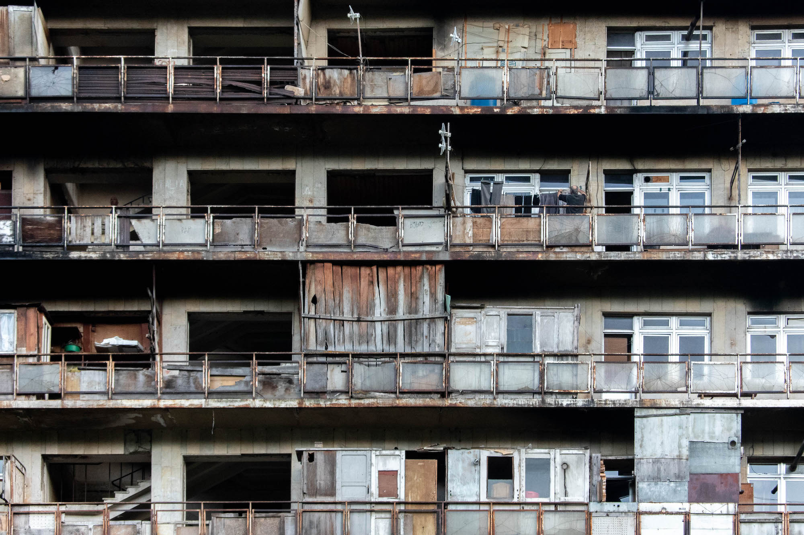
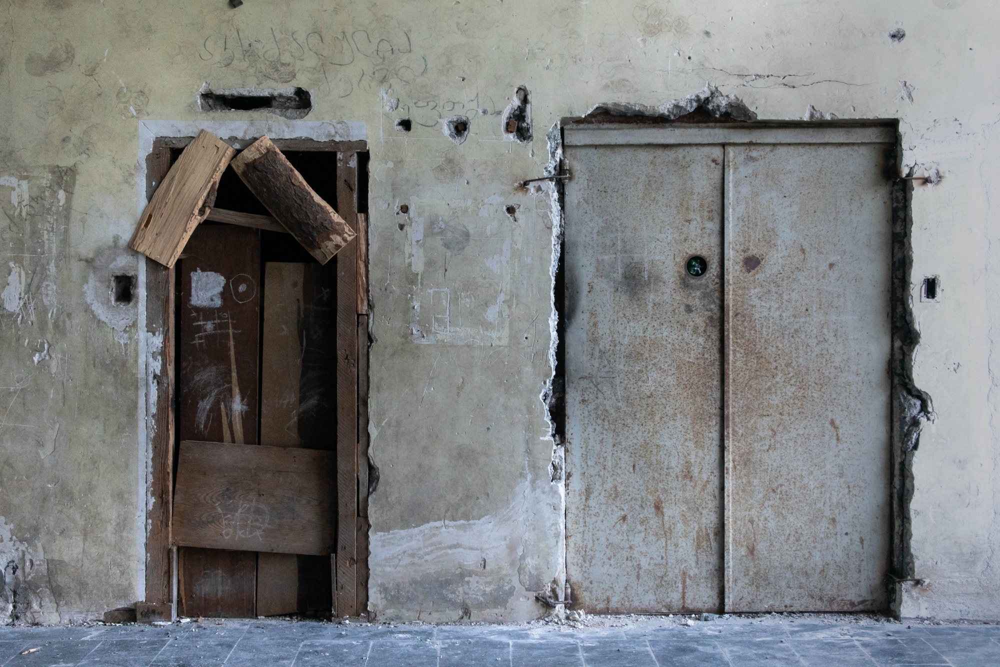
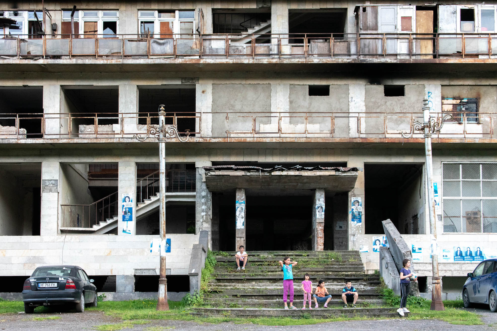
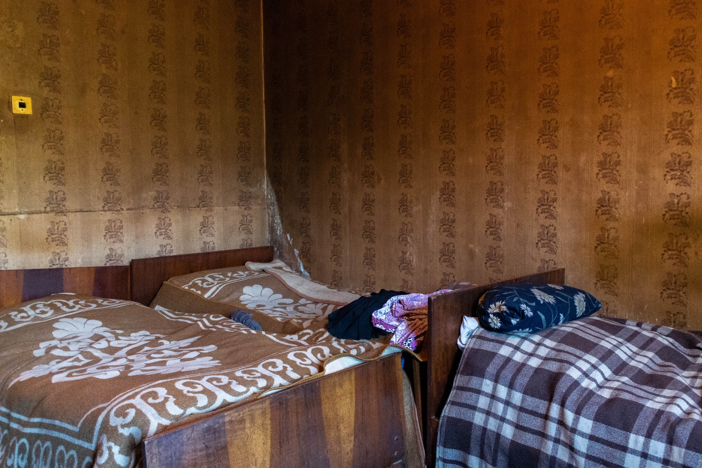
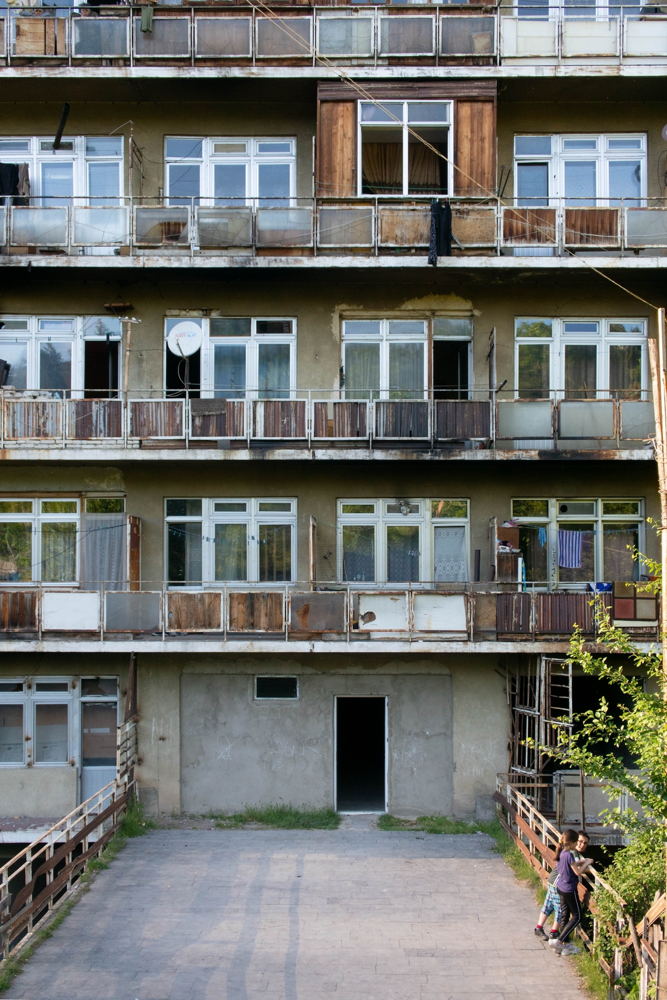

Ces clichés ont été pris dans la vallée de Borjomi (Géorgie), en mai 2019. Leur histoire est contée dans l'article intitulé "[En Géorgie abandonnée](https://anothervyou.world/fr/en-georgie-abandonnee/)".

