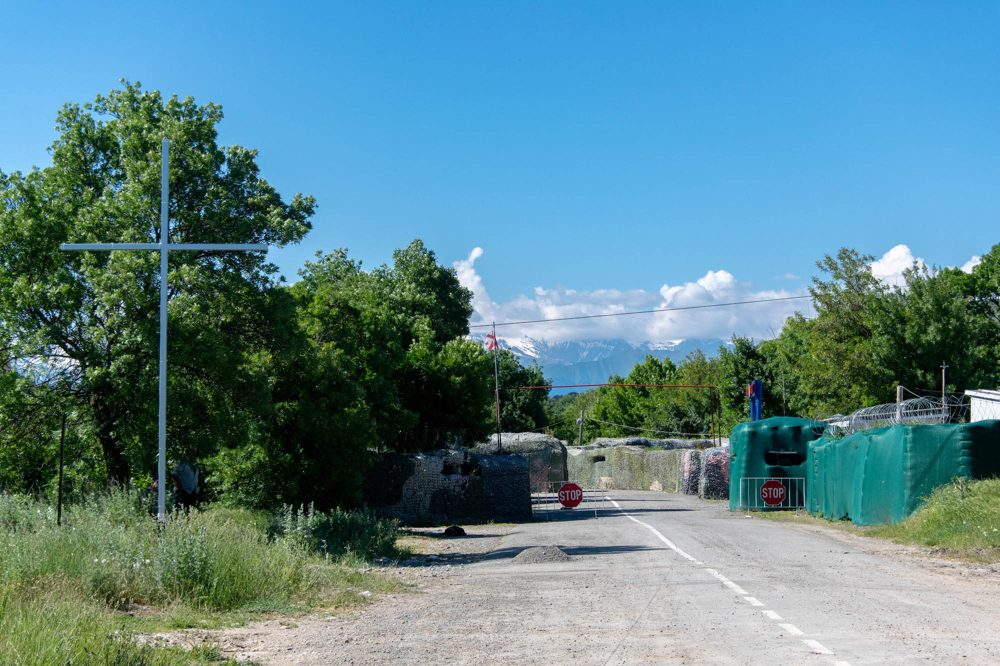
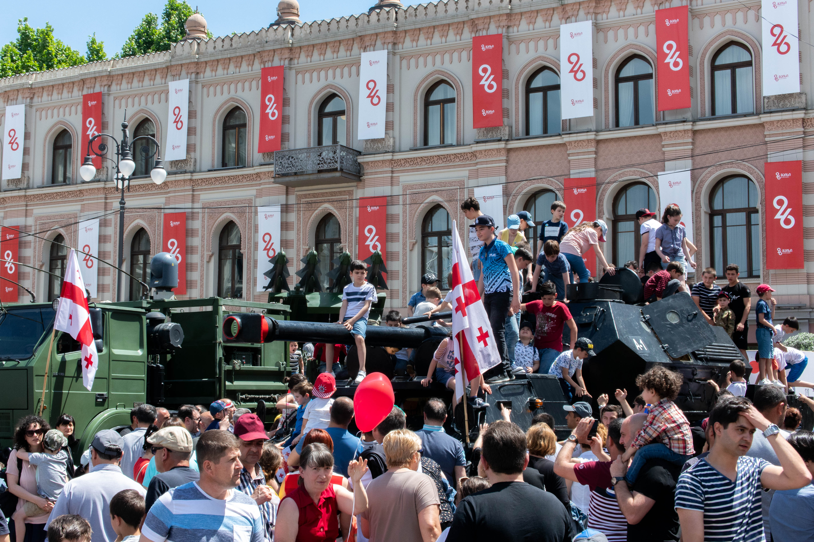
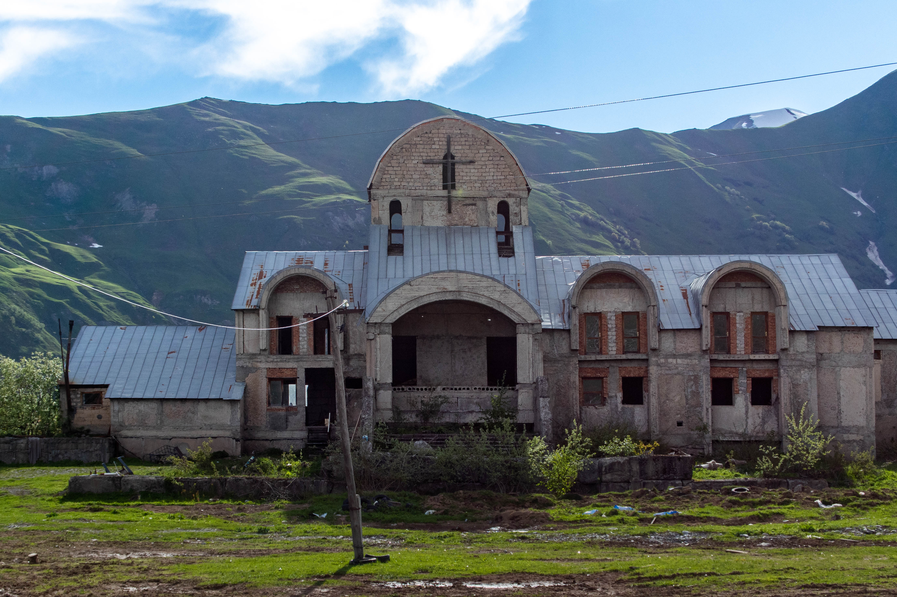
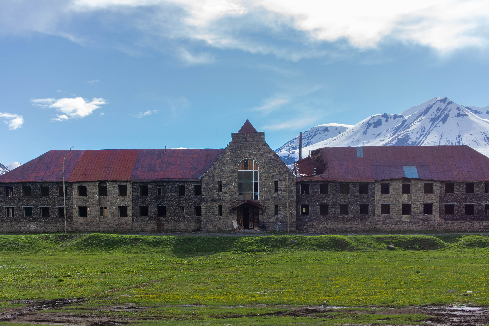
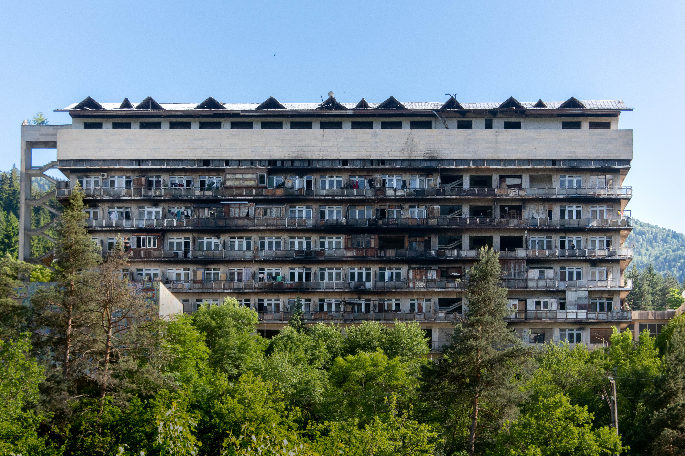

Depuis les airs, la campagne géorgienne paraît désolée, abandonnée. Des ruines parsèment les plaines et, au loin, les collines dominant Tbilisi. La capitale, qui concentre près d’un tiers de la population, est elle aussi touchée par la vétusté de ses infrastructures. Étonnamment charmante, Tbilisi sert également de base pour des excursions dans les superbes décors caucasiens. Les effets de la chute du bloc soviétique y sont toujours palpables et, si Staline est né à quelques heures de là, impossible de s’y méprendre : la Géorgie est aujourd’hui résolument pro-européenne.

Presque trente ans après la dislocation de l’URSS, le pays a perdu près d’un cinquième de sa population, tombée à 3,7 millions. La figure est d’autant plus importante si l’on considère la perte des territoires sécessionnistes de l’Abkhazie, à l’ouest, et de l’Ossétie du Sud, enclavée entre la Russie et la Géorgie. Pourtant séparé de l’Europe par une mer de plus de mille kilomètres de large, le pays vit ainsi au rythme de revendications pro-européennes (1) et d’incidents diplomatiques avec son voisin russe (2). Contrôlés militairement par la Russie depuis 2008, les deux territoires séparatistes sont symptomatiques des relations compliquées qu’entretiennent les deux États.

## Jour de fête nationale

Le 26 mai, jour de fête nationale célébrant l’indépendance, l’ambiance est bon enfant et le soleil impardonnable. Avant leur entrée sur la place Pushkin, les militaires et les forces spéciales se prêtent volontiers au jeu et prennent des clichés avec petits et grands. Un peu plus tard, lorsque la cérémonie sera terminée, les chars disposés face à la tribune présidentielle seront pris d’assaut par une horde d’enfants et offriront une scène oxymorique : un joyeux chaos sur du matériel de guerre destructeur.

Devant le parlement, en remontant l’avenue Shota Rustaveli, des panneaux gardés de drapeaux européens qualifient la Russie d’envahisseur. Les drapeaux bleus floqués d’étoiles jaunes sont monnaie courante à travers le pays. Malgré la distance, la Géorgie entretient par exemple d’étroites relations diplomatiques avec la France : sa présidente, Salomé Zourabichvili, a la nationalité française et a officié en tant qu’ambassadrice de France en Géorgie sous la présidence de Jacques Chirac. Les Géorgiens y sont par ailleurs parmi les tous premiers demandeurs d’asile (3). 

La présence policière est vraisemblablement renforcée pour ce 91ème anniversaire. Les forces de l’ordre sont partout et patrouillent tous azimuts. La veille, traverser la large avenue, sur laquelle l’austère musée des beaux arts fait face au parlement, valait d’être arrêté sur le bas côté. Et de se voir infliger une amende de 10 laris (3 euros). Il faut dire que, en dépit de la rareté des passages sous-terrains, traverser en surface peut s’avérer dangereux au vu du traffic et de l’étendue des voies, même au cœur de la ville. Finalement, les documents d’identité étrangers dissuadèrent les policiers. Ils ne délivrèrent qu’à quelques locaux l’amende en forme de ticket de caisse, dont ils doivent s’acquitter sur l’une des bornes oranges qui semblent servir à à peu près tout – paiement des transports, des abonnements téléphonique, des contraventions… 

## Exploration urbaine

Le long de la Route militaire géorgienne, qui rejoint au nord la Russie, le traffic est autrement plus calme. Comme à Tbilisi, les véhicules ont le volant tantôt à gauche, tantôt à droite. Comme à Tbilisi, certaines automobiles n’ont pas de pare-choc avant, pas de pare-choc arrière, ou pas de pare-choc du tout – voilà les bien-nommées “voitures géorgiennes”. Si l’état de la voirie est acceptable, certaines portions n’en restent pas moins étonnantes. Certains tunnels à flanc de montagne sont bouchés par la glace et déviés d’une route en plein air les longeant ; d’autres sont toujours en service, mais habités d’un noir absolu et n’ayant mieux à offrir que leur bitume défoncé. Il n’en reste pas moins que les paysages qui défilent par la fenêtre sont à couper le souffle, et plus époustouflants à mesure que Stephantsminda se rapproche.

Hors saison hivernale, la station de ski de Gudauri, à une petite heure de notre destination, a des allures de ville fantôme. Les hôtels dépareillés semblent sortis de nulle part, formant un patchwork dont certaines pièces ne seront jamais terminées. Perchés à plus de deux mille mètres d’altitude, quelques édifices avortés, à l’atmosphère aussi glacée qu’au dehors, servent – malgré eux – aux explorateurs urbains. Plus loin, près d’un carrefour où s’aventurer à quitter l’artère principale mène sur un chemin de pierres et de trous, un téléphérique permet de rejoindre les pistes. Ou plutôt permettait : en suivant les câbles de l’œil, sur les hauteurs d’une autre montagne, le terrain s’est dérobé. Les pilonnes intermédiaires ont glissé avec lui et, même s’ils tiennent toujours debout, leur équilibre laisse songeur.

Si ses stations de ski sont connues, la Géorgie est également réputée pour sa scène techno underground. En mai 2018, les forces de l’ordre avaient violemment pénétré Bassiani, club phare de la capitale se logeant sous le stade national. S’en étaient suivi des messages de soutien du monde entier ainsi qu’une manifestation massive – une rave, pour être précis – devant le parlement (4). Par essence politique et résistante, la techno reste aujourd’hui un terrain fertile pour les combats contemporains : droits des minorités, liberté… Nombre de touristes trouvent donc leur bonheur en s’oubliant, la nuit, à Bassiani, Khidi, Drama, Art-Café, ou, pour une expérience différente, en festival. Le 4GB prend par exemple place dans une base de recherche spatiale désaffectée, à trois quarts d’heure de Tbilisi, au terme d’une route tout à fait chaotique.

## Dans les villages

Entre Stephantsminda et la frontière russe, à peine séparés par une dizaine de kilomètres, un petit village du nom de Tsdo se blottit sur les hauteurs. Les derniers kilomètres menant au festival étaient fait de graviers et de nids de poule ; la montée vers le hameau n’est que de terre et de montagnes. Autant de logements en pierres y sont en ruine que de grandes demeures encore conservées. De rares quatre-quatre sont postés devant certaines des vétustes bâtisses encore habitables. Une chose est sûre, aucune de ces maisons n’aurait pu choisir plus paisible cadre de vie. Les dernières lueurs du soleil effleurent le sommet de l’immense montagne qui nous fait face et sonnent alors le glas de cette journée.

La vieille cité soviétique nichée au creux de la gorge de Borjomi, au beau milieu du pays, accueille probablement plus d’habitants que l’intégralité de Tsdo. La ville est connue pour son eau minérale gazeuse et l’impeccable parc habillant sa source. Ainsi demeurent toujours, dans ses bourgades satellitaires, des sanatoriums soviétiques maintenant désuets. La barre d’habitations, noircie par les fumées s’échappant des balcons, domine l’un d’entre eux. Ses mosaïques colorées sont merveilleusement conservées ; les appartements, en revanche, un peu moins. Si certains étages sont déserts, d’autres sont bel et bien en service : du haut du cinquième étage, une très vieille dame, qui habitait en Abkhazie du temps de l’URSS, nous propose de monter.

Le rez-de-chaussée, qui ne sera probablement jamais terminé, est ouvert sur l’extérieur et couvert de poussière blanche. Avant de trouver une trace de vie, des niveaux privés de lumière et figés au temps de leur construction se succèdent. Après nous avoir accueillis sur le palier de l’escalier, d’où elle nous avait harangués, la grand-mère nous invite chez elle. Dans la seule pièce de vie sont disposés trois lits, deux chaises et une table, sur laquelle se trouve une bouilloire. Après qu’elle a glissé quelques billets dans la main de son voisin, celui-ci s’empresse de monter un certain nombre d’étages pour nous acheter du café soluble et des gaufrettes au chocolat. Pendant ce temps, l’eau bout et la grand-mère rit entre deux histoires incompréhensibles, puisque contées en russe. L’appartement est à présent un moulin dans lequel petits et grands viennent essayer de communiquer avec nous – sourires et gestes valent parfois mieux que la parole. En partant, une dizaine de gamins de la cité nous retiennent pour jouer avec eux : d’une courte escale s’étireront finalement plusieurs heures dans une euphorie enfantine.

De nouveau sur la route, la liberté qu’offre la location d’une voiture permet de découvrir de nouveaux joyaux abandonnés. Stations services, églises ou fermes, une partie des bâtiments est parfois toujours en service. C’est le cas d’une école, près de Gori, dont la façade à la démarcation nette entre béton et peinture rose trahit une double vie. À quelques kilomètres se trouve Ouplistsikhé, impressionnant site troglodyte que les chrétiens se sont réappropriés ; plus au nord, à la frontière avec la séparatiste Ossétie du Sud, une étrange procession religieuse prendra place lorsque nous nous y rendrons. De quoi disserter le temps d’un futur récit…

-----

(1) https://www.euractiv.com/section/eastern-europe/news/georgia-suggest-taking-an-unconventional-path-to-eu-accession/

(2) https://www.bbc.com/news/world-europe-48710042

(3) https://www.nouvelobs.com/societe/20191004.AFP5982/etrangers-demandeurs-d-asile-expulses-l-immigration-en-chiffres.html

(4) https://www.20minutes.fr/high-tech/2270147-20180513-georgie-rave-party-improvisee-devant-parlement-protester-contre-repression-clubs-tbilissi