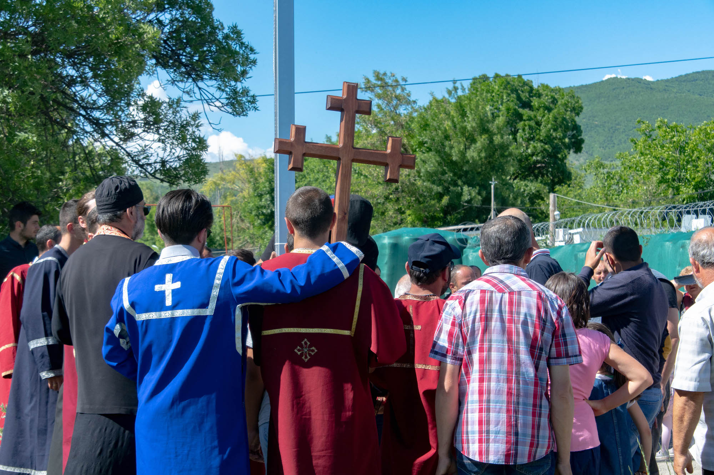
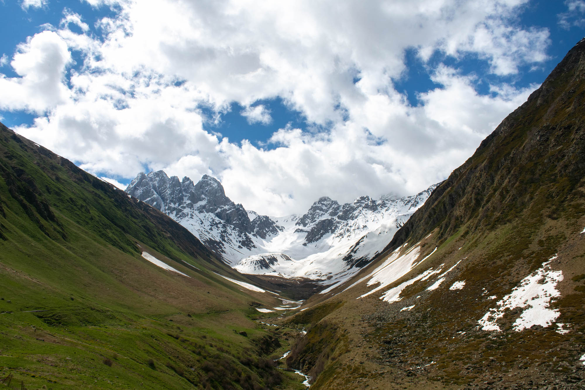
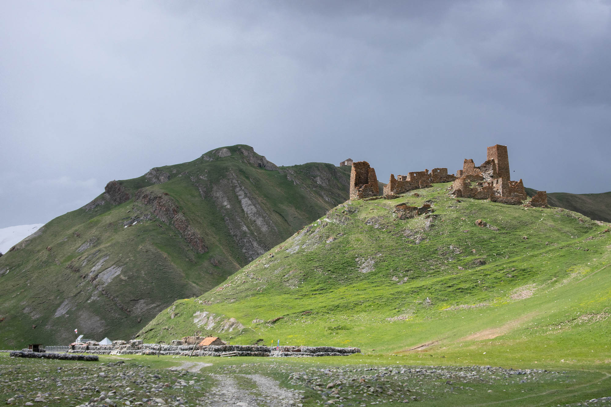
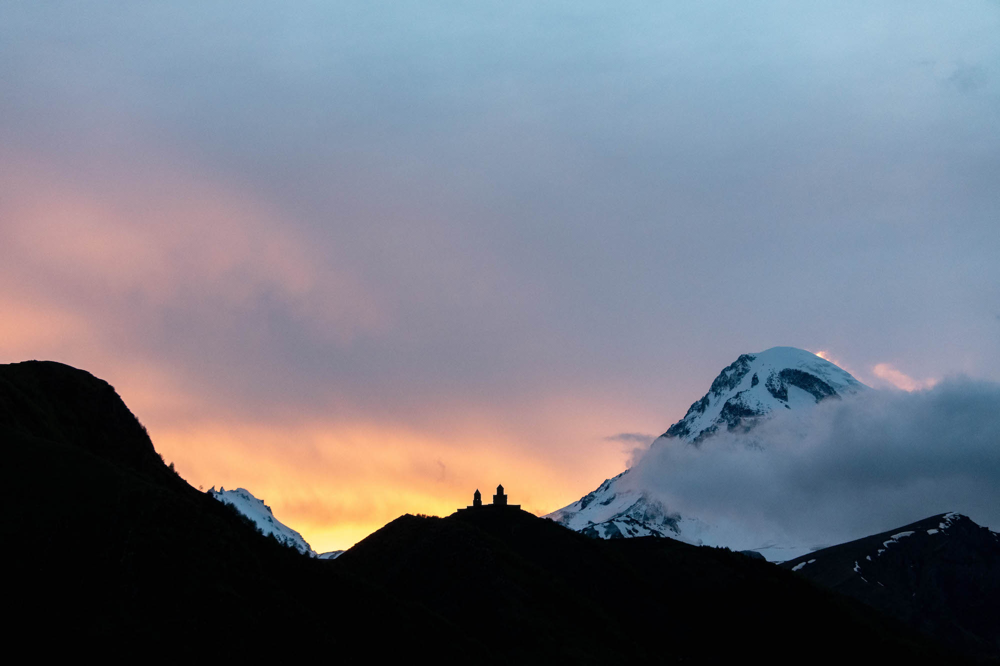

Forty minutes from Gori, Stalin's hometown, the border with South Ossetia is 
guarded by fences and barbed wire. The region seceded from Georgia in 1992 
and is still the scene of tensions today. No sooner had the car parked on the 
roadside, a few dozen metres from the road blocked by Russian soldiers, than 
thirty or so people burst in from a hidden road downstream. Priests, dressed 
in their toga, precede faithfuls who carry a large cross on their 
shoulders. They sing, pass us and stop between the hired four-wheel drive 
and the green tarpaulins, hiding the no man's land which separates the two 
territories. They erect the cross in front of the border, chant another ten 
minutes, and disappear from where they appeared. We are then invited to leave 
the place, which we now share only with the armed guards.

## An age-old faith

This episode is characteristic of how important religion is in Georgia. Around 
85% of the population declares itself to be Orthodox, and many relics of the 
past bear witness to an age-old faith. The beautiful Caucasian mountains 
provide the backdrop for the picturesque stone churches and monasteries. The 
most impressive church, that of the Trinity of Gergeti, dates from the 14th 
century. Near the capital city of Tbilisi, a monastery was built as far as in 
the 7th century. Both buildings are perched on mountain tops and respectively
overlook Stepantsminda, close to the Russian border, and Mtskheta.

Visiting these centuries-old buildings is always free of charge, as it is for
getting lost along the ridges formed by the long working of the tectonic plates. 
Twenty kilometers south of Stepantsminda, Juta is, as an example, the starting 
point for magnificent hikes punctuated by lakes. Driving an all-terrain vehicle 
makes sense here: when we head for the Georgian Military Road, the main artery 
connecting Russia to the capital, the bumpy road will be blocked by a gravel 
embankment. After tried to drive over it and jammed the car at its barycentre, 
we will decide to - not without difficulty - go backwards. And to take a path...
who will narrowly fail to put us upside down in the gutter...

## At the end of the world

But this route was not much compared to the one leading to the ruins of the 
Zakagori fortress. Nestled in the Tuso Valley, it is ten kilometres off the main 
road. The path leading to it seems to be mostly used by hikers rather than cars. 
It crosses rivers, mud and rocky ground, challenging the most trained vehicles 
and the concentration of its passengers. An hour of chaotic travel later, sowed 
with doubts as to the possibility of continuing, we reach the end. Bad news: 
we will have to go back on our steps to find the firm asphalt... But good news: 
a monastery in renovation is serving lunch.

The presence of a monastery there is a surprise in itself. It took several 
abandoned villages in ruins and a lot of resilience to reach it. That said, a 
nun sets up a table outside, before returning about twenty minutes later. When 
we hadn't ordered anything, she brought back a tomato salad, _sulguni_ - a 
Georgian cheese -, and bread. When the meal is over, she refuses to give the 
price, kindly embarrassed by the question and pointing out that monastic services 
are always free.

In the end, what was important was not the fortress itself, but the journey 
leading to it. The hill on which its ruins are perched is guarded by 
soldiers, urging visitors to hurry. This is certainly the last post before the 
borders of South Ossetia, Russia and Georgia meet: no further travel is 
permitted. On the way back, a priest will stop our car and ask us to take two 
men with us. They work in the second monastery in the area and normally walk 
the ten tedious kilometres. Fortuitous was our presence...

## Troglodytic cities

Back around Gori. Uplistsikhe, built during the first millennium B.C., is a 
troglodytic city composed of caves dug into the rock. A church was built there, 
above ground, in the 10th century. Although impressive, this complex of up to 
seven hundred caves does not equal the site of Vardzia, much further south. The 
latter was made up of three thousand caves, and its location is all the more 
breathtaking. The rooms are excavated on the side of a high cliff and sink 
further underground. The monastic complex was built, here, in the 12th century, 
but carved out of stone rather than built out of the ground. The church, more 
than nine metres high, has preserved its wall paintings to the present day (1).

Other such monasteries, such as that of David Gareji on the border with 
Azerbaijan, are scattered throughout the country. And other ancient fortresses, 
such as that of Akhaltsikhe, near Turkey, still have a chance to observe the 
passage of time. Georgia's past is as rich as its cuisine: khatchapouri, lobio, 
khinkali and lobiani are all examples of typical dishes from this part of the 
world. [A surprising region](/en/abandoned-georgia), still little visited.

