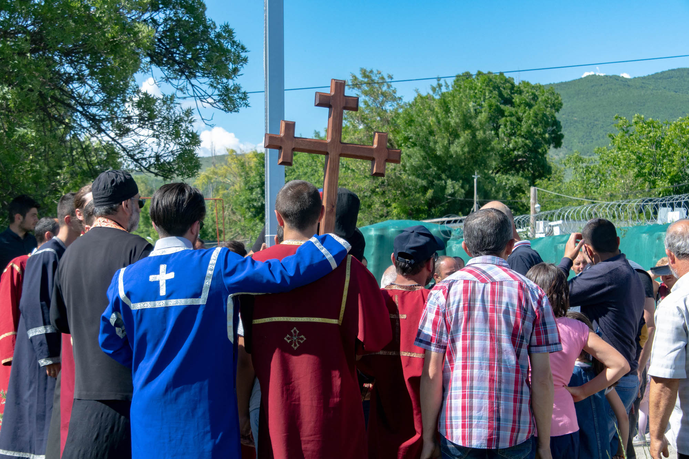
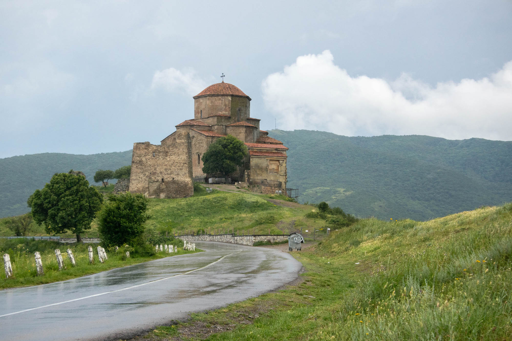
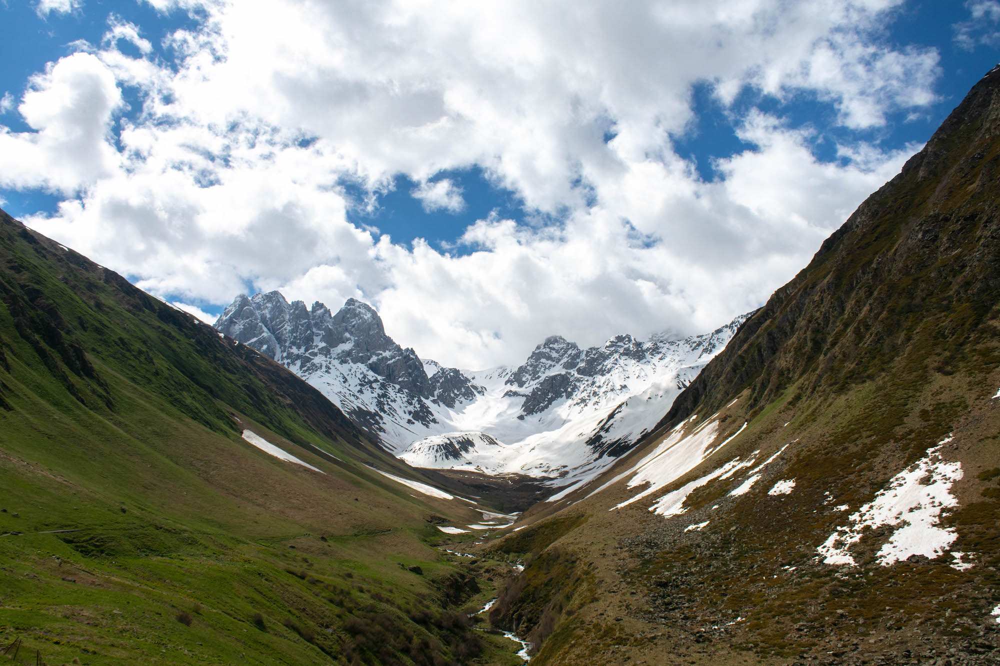
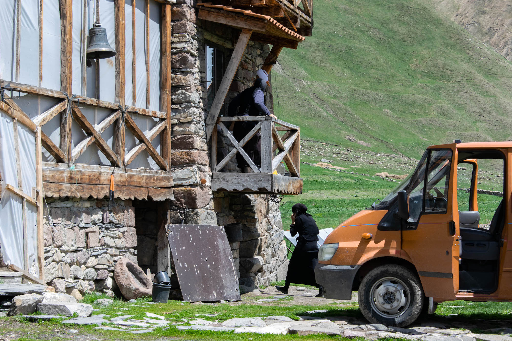
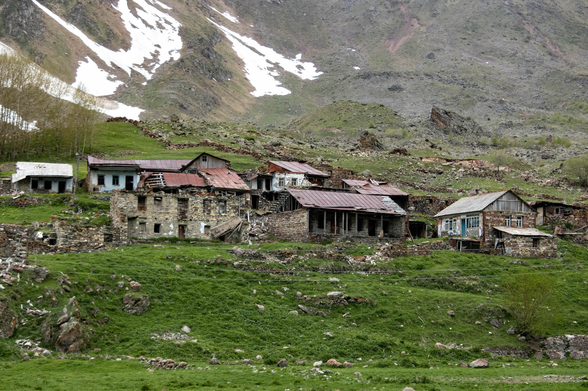
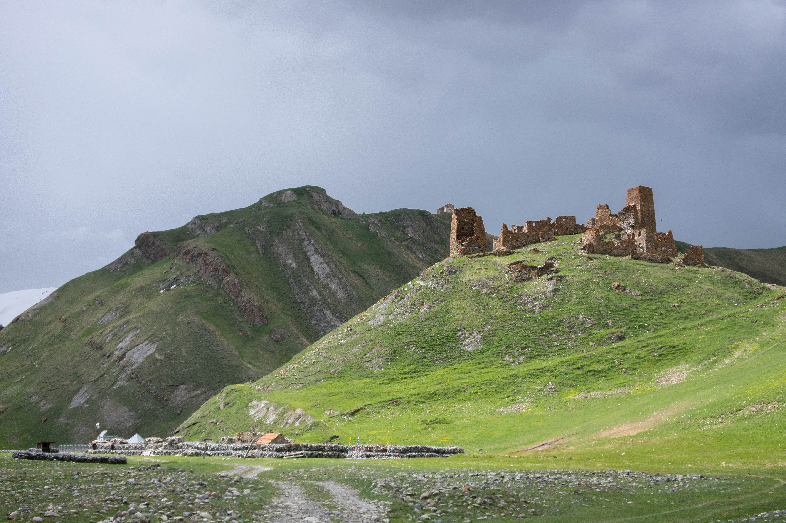
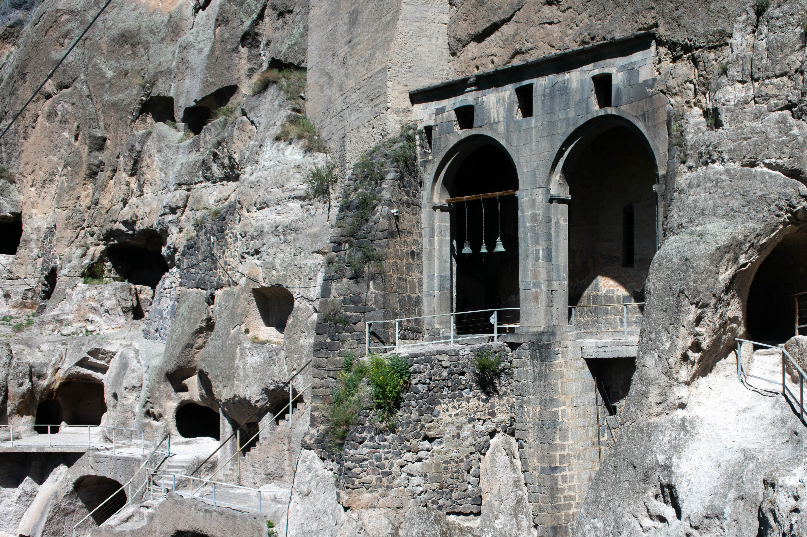
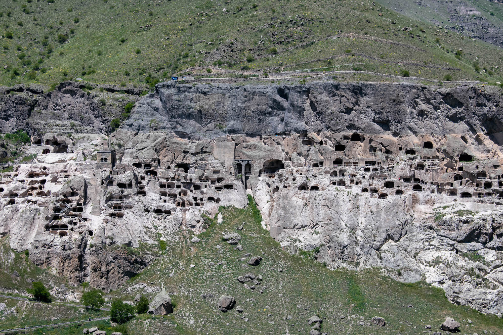
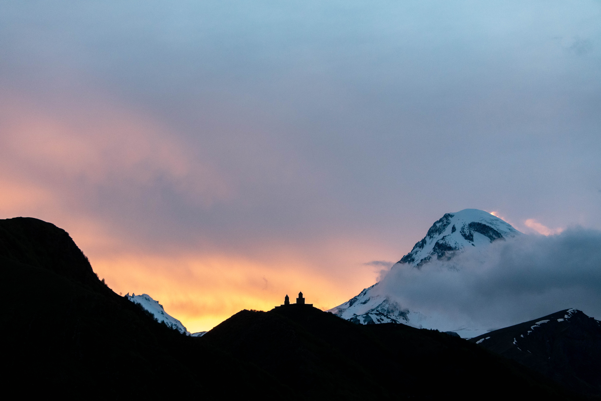

À quarante de minutes de Gori, ville natale de Staline, la
frontière avec l'Ossétie du Sud est gardée de grillages et de barbelés. La
région a fait sécession de la Géorgie en 1992 et reste encore aujourd'hui
le théâtre de tensions. À peine la voiture garée sur le bas-côté, à quelques 
dizaines de mètres de la route barrée par des militaires russes, une trentaine 
de personnes font irruption d'un chemin aval dérobé. Parés de leur toge, 
des prêtres précèdent des fidèles qui portent sur leurs épaules une grande croix.
Ils chantent, nous dépassent et s'arrêtent entre le quatre-quatre de location
et les bâches vertes, cachant le _no man's land_ qui sépare les deux territoires. 
Ils érigent la croix face à la frontière, psalmodent encore dix minutes et 
disparaissent d'où ils étaient apparus. Nous sommes alors invités à quitter 
les lieux, que nous ne partageons plus qu'avec les gardes armés.

## Une foi millénaire

Cet épisode est caractéristique de l'engagement religieux en Géorgie. Autour de 
85% de la population se déclare orthodoxe, et nombreuses sont les reliques du passé
témoignant d'une foi millénaire. Les superbes montagnes caucasiennes servent
de décor aux pittoresques églises et monastères en pierre. L'église la plus
impressionnante, celle de la Trinité de Gergeti, date du XIVème siècle. Près de 
Tbilisi, la capitale, un monastère a quant à lui été construit au
VIIème siècle. Les deux bâtisses sont perchées au sommet de montagnes et
dominent respectivement Stephantsminda, proche de la frontière russe, et
Mtskheta.

Visiter ces édifices vieux de plusieurs siècles est toujours gratuit, au même
titre que se perdre le long des crêtes formées par le long travail des plaques 
tectoniques. À vingt kilomètres au sud de Stephantsminda, Juta est par
exemple le point de départ de magnifiques randonnées ponctués de lacs. Conduire un
véhicule tout terrain prend ici tout son sens : lorsque nous rejoindrons à
nouveau la Route militaire géorgienne, principale artère reliant la Russie à
la capitale, le chemin cahoteux sera barré d'une digue de graviers. Après
avoir essayé de passer par-dessus et bloqué la voiture en son barycentre, nous
déciderons de faire - non sans mal - marche arrière. Et de prendre une piste 
dérobée qui manquera de peu de nous retourner dans le caniveau...

## Au bout du monde

Mais ce trajet n'était pas grand chose en comparaison à celui qui mène aux ruines 
de la forteresse de Zakagori. Nichée dans la vallée de Tuso, elle est excentrée
de dix kilomètres par rapport à la route principale. Le chemin y menant semble
être emprunté, le plus souvent, par des randonneurs plutôt que des automobiles. 
Il traverse rivières, bourbes et sols rocheux, mettant à mal les véhicules les
plus entraînés et la concentration de ses passagers. Une heure de trajet
chaotique plus tard, semé de doutes quant à la possibilité de continuer et de
presque-demi-tours, nous arrivons au bout. Mauvaise nouvelle : il faudra
revenir sur nos pas pour retrouver l'asphalte ferme... Mais bonne nouvelle : un 
monastère en renovation affiche servir le déjeuner.

La présence d'un monastère à cet endroit est une surprise en soi. Il aura fallu 
passer plusieurs villages abandonnés en ruine et beaucoup de résilience pour
l'atteindre. Une nonne installe alors une table à l'extérieur, avant de revenir
une vingtaine de minutes plus tard. Alors que nous n'avons rien commandé, elle 
ramène avec elle une salade de tomates, du _soulgouni_ - un fromage géorgien -, 
et du pain. Une fois le repas terminé, elle refusera d'en donner le prix, 
aimablement gênée par la question et précisant que les services monastiques 
sont toujours gratuits.

L'important n'était finalement pas la forteresse en elle-même, mais le voyage
y menant. La colline sur laquelle ses ruines se juchent est par ailleurs gardée
par des militiares, exhortant les visiteurs à se dépêcher. Il s'agit 
certainement du dernier poste avant que les frontières de l'Ossétie du Sud, de
la Russie et de la Géorgie ne se rejoignent : interdiction, donc, d'aller plus
loin. Sur le retour, un prêtre arrêtera notre voiture et nous demandera
d'emmener avec nous deux hommes. Ils travaillent dans le second monastère 
des environs et effectuent normalement les dix fastidieux kilomètres à pied.
Fortuite était notre présence...

## Des cités troglodytiques

Retour aux alentours de Gori. Ouplistsikhé, bâtie pendant le premier
millénaire avant Jésus-Christ, est une cité troglodytique composée de caves
creusées dans la roche. Une église y a été construite, hors sol, au Xème siècle.
S'il est impressionnant, ce complexe qui comportait jusqu'à sept cents grottes
n'égale pas le site de Vardzia, beaucoup plus au sud. Celui-ci était constitué
de trois mille grottes, et sa localisation est d'autant plus époustouflante.
Les pièces sont excavées sur le flanc d'une haute falaise et s'enfoncent plus loin
sous terre. L'ensemble monastique y a ici été construit au XIIème siècle, mais
taillé dans la pierre plutôt que sorti de terre. L'église, haute de plus
de neuf mètres, a su conserver ses peintures murales jusqu'à aujourd'hui.

D'autres monastères du genre, comme celui de David Gareji, à la frontière avec
l'Azerbaïjan, sont disséminés à travers le pays. Et d'autres forteresses anciennes, 
comme celle d'Akhaltsikhé, près de la Turquie, ont encore la chance d'observer
le temps qui passe. La Géorgie a un passé aussi riche que sa cuisine :
khatchapouri, lobio, khinkali et lobiani sont autant d'exemples de plats
typiques de cette région du monde. Une région surprenante et encore peu visitée.

