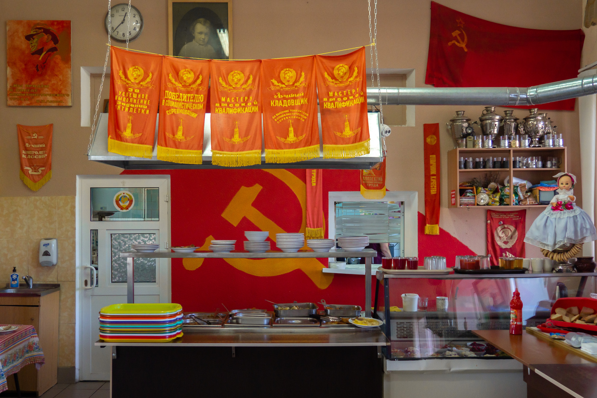
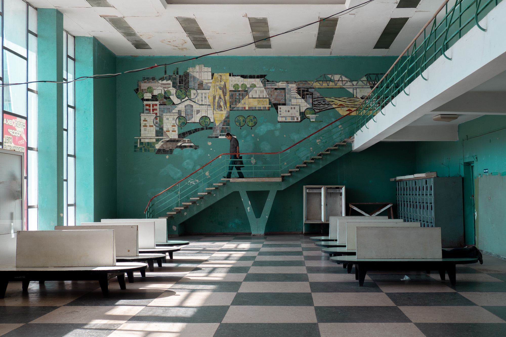
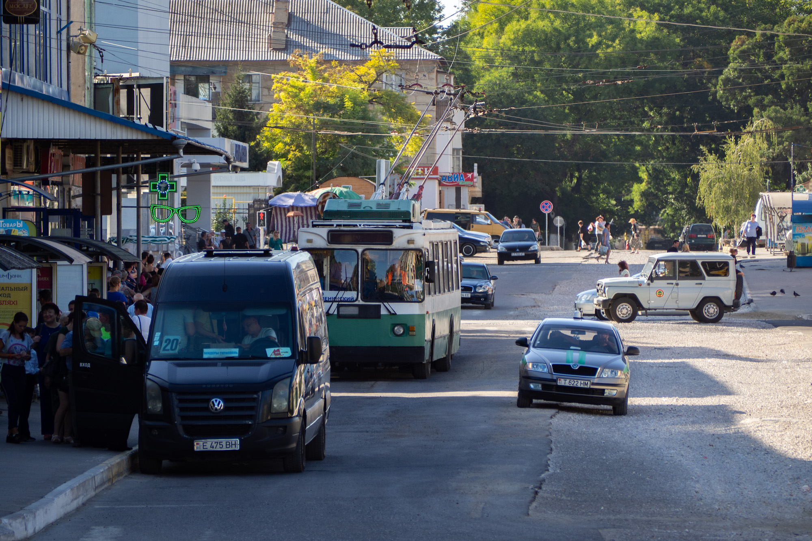
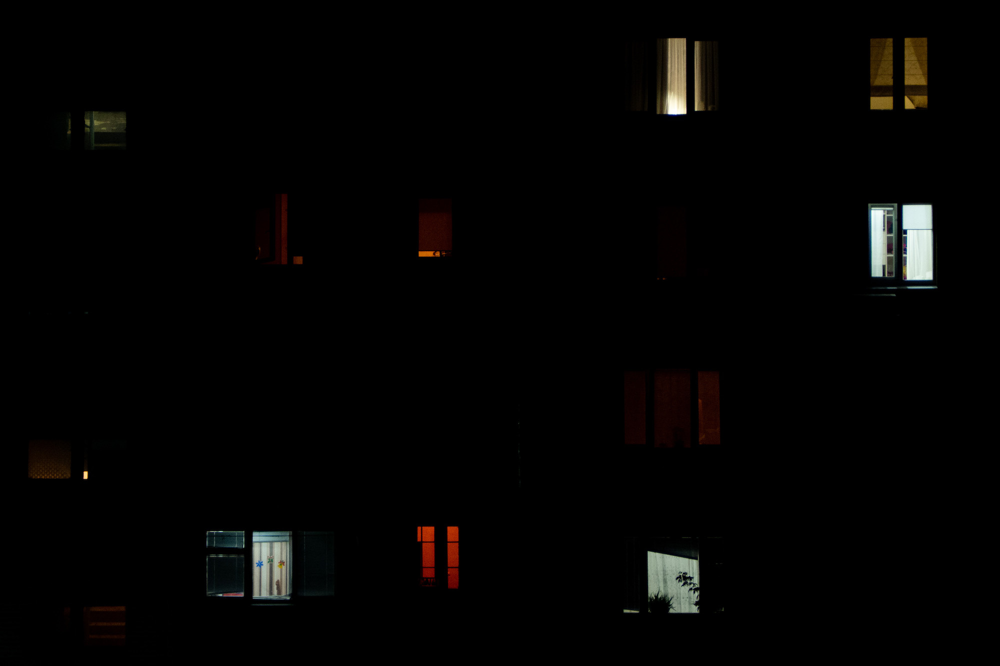

In Transnistria, a secessionist territory of Moldova, the clock has stopped at 
the time of the USSR. The bust of Lenin stands proudly in front of the town 
hall of the capital, Tiraspol, while the communist hammer and sickle is a 
prominent feature of town entrances and flags. Before its break-up in 1991, the 
Union of Soviet Socialist Republics was made up of autonomous and federated 
regions and republics. Today's Transnistria and Moldova were then part of the 
same entity, but the former separated from the latter even before the fall of 
the Soviet regime. Almost thirty years later, the linguistic differences that 
led to the split have obviously not disappeared.

## Russian influence

The most economical way to reach Transnistria is by minibus, from Chisinau to 
Tiraspol (1). The cars provided by the few rental agencies in the Moldovan 
capital do not allow you to get to the other side of the Dniestr, a river that 
straddles the two countries. The visa required for entry into Transnistria is 
issued at a checkpoint before the city of Bender. Looking like a toll station,
it bears the red and green of the region, as well as the Soviet-era coat of 
arms.

The soldiers who guard the border post are Transnitrian, and not Moldovan. For
Moldova, controlling the border would be tantamount to _de facto_ accepting the 
existence of a secessionist region, which it still considers to be an integral 
part of its territory. If there is strict control on the outward journey and 
regular police stations on the way to Bender, this is therefore not the case 
on the return journey. The expressway leading to Chisinau, whose air is 
regularly full of sulphur, is calm and only monitored by its automatic 
radars - which, at night, dazzle drivers like trucks with their headlights 
on...

On the coat of arms of Transnistria, as on the road signs and on the arrival 
station, the Cyrillic alphabet is used to the detriment of Latin. In Moldova, 
however, they coexist and are used to write Moldavian and Russian - the first 
language being transcribed in both alphabets, the second in Cyrillic only. The 
Russian influence is much more noticeable here (2). The leu is abandoned in 
favour of the Transnistrian rouble, whose exchange rate varies around one euro 
for seventeen roubles (3). As this currency is not recognised elsewhere, 
foreign banks mistake withdrawals made in Transnistrian rouble for withdrawals 
in Russian rouble.

## International isolation

The country itself is not recognised internationally. Its diplomatic relations 
are limited to three other secessionist states from the time of the fall of the 
USSR: Nagorno-Karabakh, separatist from Azerbaijan, and Abkhazia and South 
Ossetia, separatists from Georgia (read [Abandoned Georgia](/en/abandoned-georgia)). 
Its borders are not delineated on Google Maps, integrating the territory into 
Moldova as an autonomous region, as recognised by the United Nations (UN). 
Hence its name, ironically given by its inhabitants but not without a touch of 
disappointment, of "country that does not exist".

Yet, beyond their distinctive central bank and currency, the Trasnitrians have 
their own president, government and institutions. However, their passports do 
not allow them to travel. Depending on where their parents were born in Soviet 
times, they may travel to Chisinau to claim a Moldovan, Russian or Ukrainian 
passport. The recent tensions in the Crimea have thus had a significant impact 
on them. Against a background of military suspicion, holders of Russian 
passports are sometimes banned from the Ukrainian territory, just a few 
kilometres from their lands. Those who wish to stay there are subject to 
geopolitical uncertainties which are often beyond their control.

## On the margins of tourism

The Ukrainian city of Odessa, on the Black Sea, is an example of a popular 
destination. Much more so than Chisinau, capital of one of the least visited 
countries in Europe - if not the world (4). And it is easy to see why: the 
city is deserted, dotted with abandoned buildings and underground passages in 
a pitiful state. Only the adventurous tourists will be intrigued, to the 
detriment of a population that would benefit from a less disastrous urban 
planning (5).

Tiraspol, obviously even less visited, is nevertheless pleasant to explore. The 
Dniestr, which is used by dancing boats until sunset, is bordered by a steep 
beach in the city centre. The narrow bridge that joins it is the only one, 
within a radius of several kilometres, that connects the two shores. A few 
hundred metres away, the only other way to cross the river is an old Soviet 
ferry. It is a sort of platform where a few cars can go, held by a rope to help 
it stay on course for the sixty metres or so separating the two banks. 
Pleasantly surprised by the presence of foreigners, Tiraspolians see an
opportunity to ask the reasons for a visit so far from the traditional 
tourist circuits. Part of the answer lies in the question...

## Economic difficulties

At nightfall, along the broad 25th October street, the fountains light up and 
music resounds. Chisinau was swarming with newlyweds and Tiraspol is not to be 
outdone: the public place is hosting a wedding party this evening. Apart from 
these festivities, the city is a dark desert that almost nothing populates. 
The opportunity to visit one of the factories that made the reputation of 
Moldova in the time of the USSR. Transnistria was indeed the spearhead of the 
socialist republic (6). Now abandoned, the car repair factory is under 
surveillance and forbidden to visit. But walking around the town with a local 
offers passes and a touch of confidence.

His presence allows other activities otherwise impossible: taking a ride in a 
permanent funfair, set up in 1982 and never renovated; climbing to the top of 
a high-rise residential building to get a rare view of the capital; 
unexpectedly chatting with locals, in the line 19 of the trolleybus linking 
Bender to Tiraspol...  Seven other such lines exist, designated by the first 
seven Arabic numerals. The number 19 was therefore not chosen at random: it is 
a tribute to the escalation of violence that took place on the 19th of June 
1992, during the Dniester War.

Above all, hiring a native is a way to learn more about local life. How and 
why, when the Soviet empire was in full swing, thousands of people decided to 
come and live here. How and why, today, thousands of people are fleeing one of 
the world's last frozen conflicts (7). From a planned economy under the hot 
Eastern European sun to the merciless competition of the globalised world 
economy...

-----

(1) Less economical, it is possible to take a taxi.

(2) See the [referendum](https://en.wikipedia.org/wiki/2006_Transnistrian_independence_referendum) 
of 2006, around the issue of independence.

(3) [Some coins](https://en.wikipedia.org/wiki/Transnistrian_ruble#Coins),
dating back to 2014, are made of a composite of fibre and plastic. They are the 
only plastic parts in the world.

(4) See, for example, statistics from [2017](https://www.travelawaits.com/2458248/the-8-least-visited-european-countries/)
or from [2019](https://statistica.gov.md/newsview.php?l=en&idc=168&id=6593).

(5) [Work](https://www.kp.md/daily/26981/4041186/) has begun following the
passage of a blogger showing the state of the capital,  whose
[video](https://www.youtube.com/watch?v=wnDxHTaeNX0) has gone viral in Moldova.

(6) https://en.wikipedia.org/wiki/Moldavian_Soviet_Socialist_Republic#Economy

(7) See this [data](https://www.citypopulation.de/en/moldova/transnistria/admin/)
and read this really good [article](https://www.equaltimes.org/transnistria-the-price-of?lang=en).
