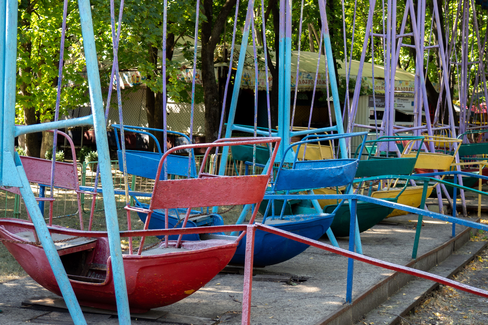

En Transnitrie, territoire sécessioniste de la Moldavie, l'horloge s'est arrêtée 
au temps de l'URSS. Le buste de Lénine trône fièrement devant la mairie de la 
capitale, Tiraspol, tandis que la faucille et le marteau communistes se font une 
place de choix à l'entrée des villes et sur les drapeaux. Avant sa dislocation
en 1991, l'Union des républiques socialistes soviétiques était composée de 
régions et de républiques autonomes et fédérées. Les actuelles Transnitrie et
Moldavie faisaient alors partie de la même entité, mais la première s'en est
séparée avant même la chute du régime soviétique. Presque trente ans plus tard,
les différences linguistiques à l'origine de la scission ne se sont évidemment
pas résorbées.

## Influence russe

Pour se rendre en Transnitrie, le moyen le plus économique est d'emprunter 
l'un des minibus ralliant Chisinau à Tiraspol (1). Les voitures procurées par les 
rares agences de location de la capitale moldave ne permettent de toute façon 
pas de se rendre de l'autre côté du Dniestr, fleuve à cheval entre les deux 
pays. Le visa nécessaire à l'entrée sur le territoire transnitrien est 
délivré à un point de contrôle, avant la ville de Bender. Avec ses allures de 
gare de péage, il arbore le rouge et le vert de la région ainsi que ses 
armoiries, datant de l'époque soviétique.

Le poste frontière est gardé par des militaires transnitriens, et non moldaves.
Pour la Moldavie, contrôler la frontière reviendrait à accepter _de facto_ 
l'existence d'une région sécessioniste, qu'elle considère toujours comme
partie intégrante de son territoire. Si le contrôle est strict à l'aller et
les postes de police réguliers sur le chemin rejoignant Bender, il n'en est 
rien au retour. La voie rapide menant à Chisinau, dont l'air est régulièrement 
gorgé de soufre, est calme et n'est surveillée que de ses radars 
automatiques - qui, la nuit, éblouissent les conducteurs à la manière de poids 
lourds en pleins phares...

Sur le blason de la Transnitrie, comme sur les panneaux de signalisation ou sur 
la gare d'arrivée, l'alphabet cyrillique est utilisé au détriment du latin. En 
Moldavie, ils coexistent pourtant et servent à écrire moldave et russe - la 
première langue étant retranscrite dans les deux alphabets, la seconde l'étant 
en cyrillique uniquement. L'influence russe se ressent ici beaucoup plus (2),
le leu étant par ailleurs délaissé au profit de la rouble transnitrienne, dont 
le taux de change varie autour d'un euro pour dix-sept roubles (3). Cette 
monnaie n'étant reconnue nulle par ailleurs, les banques étrangères prennent 
les retraits effectués en rouble de Transnitrie pour des retraits en rouble 
russe.

## Isolement international

Le pays n'est lui-même pas reconnu sur la scène internationale. Ses relations
diplomatiques se limitent à trois autres États sécessionistes de l'époque de
la chute de l'URSS : le Haut-Karabagh, séparatiste de l'Azerbaïdjan, ainsi 
que l'Abkhazie et l'Ossétie du Sud, séparatistes de la Géorgie (lire
[En Géorgie abandonnéee](/fr/en-géorgie-abandonnée)). Ses frontières ne sont
pas délimitées sur Google Maps, intégrant le territoire à la Moldavie en tant 
que région autonome, comme reconnu par l'Organisation des Nations Unies (ONU).
D'où son appellation, ironique mais non sans une pointe de déception de la part
de ses habitants, de "pays qui n'existe pas".

Pourtant, au-delà de leur banque centrale et de leur monnaie distinctives, les 
Trasnitriens ont un président, un gouvernement et des institutions 
propres. Leur passeport ne leur permet en revanche pas de voyager. 
Selon l'endroit de naissance de leurs parents en période soviétique, 
ils peuvent se rendre à Chisinau pour réclamer un passeport moldave, russe, 
ou ukrainien. Les récentes tensions en Crimée ont ainsi eu un impact non 
négligeable sur eux. Sur fond de suspicion militaire, les tenants d'un passeport 
russe sont parfois interdits de territoire ukrainien, à quelques kilomètres à 
peine de leurs terres. Ceux qui souhaitent y séjourner sont soumis à des aléas 
géopolitiques qui bien souvent les dépassent.

## Aux marges du tourisme

La ville ukrainienne d'Odessa, sur la Mer Noire, est un exemple de destination 
populaire. Bien plus que Chisinau, capitale de l'un des pays les moins visités 
d'Europe - voire du monde (4). Et l'on comprend très vite pourquoi : la ville 
est délaissée, parsemée de bâtiments abandonnés et de passages sous-terrains en 
piteux état. Seuls les amateurs de tourisme aventureux y trouvent alors leur 
compte, au détriment d'une population qui bénéficierait d'une planification 
urbaine moins désastreuse (5).

Tiraspol, évidemment moins visitée encore, est toutefois agréable à explorer.
Le Dniestr, que des bâteaux dansants empruntent jusqu'au coucher du soleil, est 
bordé d'une plage escarpée en plein centre ville. Le pont étroit la rejoignant 
est le seul, à des kilomètres à la ronde, permettant de rallier les deux rives. 
À quelques centaines de mètres, l'unique autre moyen de traverser le fleuve est 
un vieux ferry soviétique en sorte de plate-forme, retenu par une corde l'aidant 
à garder le cap sur la soixantaine de mètres séparant les deux berges. 
Agréablement étonnés de la présence d'étrangers, les Tiraspoliens en profitent 
pour s'intéresser aux raisons d'une visite si loin des circuits touristiques 
traditionnels. Une partie de la réponse est dans la question...

## Difficultés économiques

À la nuit tombée, le long de la large avenue du 25 octobre, les fontaines
s'illuminent et la musique retentit. Chisinau gargouillait de nouveaux 
mariés et Tiraspol n'est pas en reste : le lieu public accueille ce soir une 
fête maritale. En dehors de ces festivités, la ville est un désert obscur
que presque rien ne vient peupler. L'occasion de visiter l'une des usines
qui faisaient la renommée de la Moldavie au temps de l'URSS. La Transnitrie 
était en effet le fer de lance de la république socialiste (6). Aujourd'hui
abandonnée, l'usine de réparation automobile est surveillée et interdite à la 
visite. Mais arpenter la ville avec un local offre des laisser-passer et un
brin de confiance.

Sa présence permet d'autres activités autrement impossibles : faire un tour de 
manège dans une fête foraine permanente, montée en 1982 et jamais rénovée ;
monter au sommet d'une tour d'habitation, afin d'avoir une rare vue d'ensemble
de la capitale ; discuter avec des locaux, à l'improviste, dans la ligne 19 du 
trolleybus reliant Bender à Tiraspol... Sept autres lignes du genre existent, 
désignées par les sept premiers chiffres arabes. Le numéro 19 n'a donc pas été 
choisi au hasard : il s'agit d'un hommage à l'escalade de violence survenue le 
19 juin 1992, lors de la guerre du Dniestr. 

S'attacher les services d'un natif permet donc, par dessus tout, d'en apprendre 
davantage sur la vie locale. Comment et pourquoi, quand l'empire soviétique 
battait son plein, des milliers de personnes décidaient de venir habiter ici. 
Comment et pourquoi, aujourd'hui, des milliers de personnes fuient l'un des 
derniers conflits gelés de la planète (7). D'une économie planifiée sous le
chaud soleil d'Europe de l'Est à la concurrence sans merci de l'économie 
mondiale globalisée...

-----

(1) Moins économique, il est en revanche possible de prendre un taxi.

(2) Cf. le [référendum](https://en.wikipedia.org/wiki/2006_Transnistrian_independence_referendum) 
de 2006, autour de la question de l'indépendence.

(3) [Certaines pièces](https://en.wikipedia.org/wiki/Transnistrian_ruble#Coins),
datant de 2014, sont fabriquées en composite de fibre et de plastique. Il s'agit
des seules pièces en plastique au monde.

(4) Voir, par exemple, les statistiques de [2017](https://www.travelawaits.com/2458248/the-8-least-visited-european-countries/)
ou de [2019](https://statistica.gov.md/newsview.php?l=en&idc=168&id=6593).

(5) Des [travaux](https://www.kp.md/daily/26981/4041186/) ont commencé suite au 
passage d'un blogger montrant l'état de la capitale, dont 
la [vidéo](https://www.youtube.com/watch?v=wnDxHTaeNX0) est devenue virale en 
Moldavie. 

(6) https://en.wikipedia.org/wiki/Moldavian_Soviet_Socialist_Republic#Economy

(7) Voir ces [données](https://www.citypopulation.de/en/moldova/transnistria/admin/)
et lire cet excellent [article](https://www.equaltimes.org/transnistria-the-price-of?lang=en).
