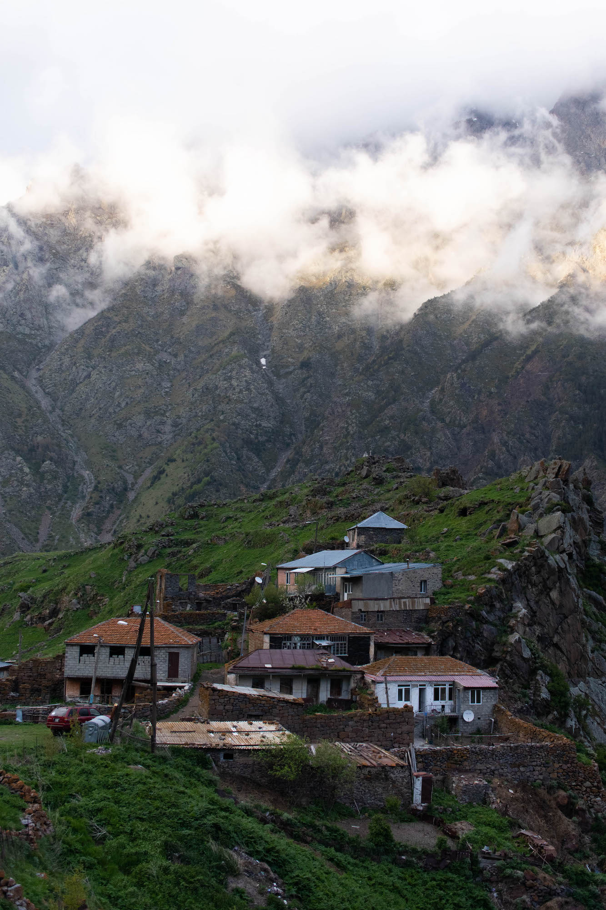

From the air, the Georgian countryside seems desolated, abandoned. Ruins dot the plain and, far away, the hills ruling Tbilisi. The capital, where about a third of the population lives, has some of its infrastructures dilapidated too. Surprisingly charming, Tbilisi is also the base to go and visit the superb Caucasian landscapes. The effects of the fall of the Soviet block are still palpable and, if Stalin was born a few hours away, it is not possible to be mistaken: today, Georgia is absolutely pro-European.

Almost thirty years after the dissolution of the USSR, the country has lost about a fifth of its population, which fell at 3.7 million. The figure is even more important if the loss of the breakaway regions of Abkhazia, in the West, and South Ossetia, landlocked between Russia and Georgia, is counted. Despite being separated from Europe by a sea that is more than a thousand kilometres wide, the country is regularly subject to pro-European claims (1) and diplomatic incidents with its Russian neighbour (2). Military controlled by Russia since 2008, both separatist territories are symptomatic of the complex relations the two states maintain.

## Independence day

On May the 26th, a bank holiday to celebrate independence, the atmosphere is friendly and the sun uncompromising. Before they enter the Pushkin square, soldiers and special forces are happy to take pictures with kids, teenagers and adults. Later, when the ceremony is over, the tanks facing the presidential rostrum will be stormed by a horde of children, offering an oxymoronic sight: joyful chaos on destructive war machines.

In front of the parliament, when going up the Shota Rustaveli Avenue, signs guarded by European flags qualify Russia as an invader. The blue flags with yellow stars are common across the country. Despite the distance, Georgia has, for instance, close diplomatic relations with France: the president, Salome Zourabichvili, was born in France and was Ambassador of France to Georgia under the presidency of Jacques Chirac, fifteen years ago. Furthermore, Georgians are amongst the first asylum seekers in France (3).

There is probably more police force in the streets than usual for this 91st anniversary. They are everywhere and patrol all around. The day before, crossing the large avenue, where the stark Museum of Fine Arts faces the parliament, was enough to get arrested on the roadside. And to get a fine of 10 laris (3 euros). Truth is, despite the very few underground passages, crossing on the asphalt can be dangerous given the traffic and the road span, even in the heart of the city. In the end, the foreign identity documents discouraged the policemen. They ended up fining some locals only, who were given a receipt. They then have to pay it off on one of the orange terminals, which seem to be used for about anything - transport, phone subscriptions, tickets...

## Urban exploration

Along the Georgian Military Road, joining Russia to the North, traffic is calmer. As in Tbilisi, vehicles have their steering wheel sometimes to the left, sometimes to the right. As in Tbilisi, some cars do not have a front bumper, a back bumper, or any bumper at all - here are the so-called "Georgian cars". If the state of the road is acceptable, some parts remain interesting. A few tunnels, on the mountainside, are blocked by ice and diverted by a bordering open-air path; others are still in use, but inhabited by darkness and offering nothing else but their smashed bitumen. Through the windows of the car, landscapes are nonetheless outstanding and more breathtaking as Stepantsminda is getting closer.

Outside Winter, Gudauri's ski resort, one hour before our destination, is ghostly. The hotels are odd and form a patchwork of which some pieces will never be finished. At an altitude of more than two thousand metres, aborted buildings, with an atmosphere as frozen as outside, became the home of urban explorers. Further, next to a crossroad where branching off the main way leads to a path made of rocks and holes, a cableway links to the slopes. Or rather linked: when following the cables, high on another mountain, the floor actually collapsed. The pillars slipped with it and, even if they are still standing, their balance is questionable.

If its ski resorts are known, Georgia is also reputed for its underground techno scene. In May 2018, police violently entered Bassiani, flagship club of the capital located under the national stadium. Support from all over the world followed, as well as a massive protest - a rave, to be more accurate - in front of the parliament (4). Intrinsically political, techno remains a fertile ground for contemporary fights: minority rights, freedom... It is therefore easy to understand why a lot of tourists find their way, at night, through Bassiani, Khidi, Drama, Art-Café, or, for a different experience, in a festival. For example, 4GB takes place in a disused spatial research centre, forty-five minutes from Tbilisi, at the end of a pretty chaotic road.

## In the villages

Between Stepantsminda and the Russian border, separated by a dozen kilometres, a small town named Tsdo snuggles in the heights. The last kilometres to the festival were of gravel and potholes; the way up the hamlet is of soil and mountains. As many stone houses felt apart a long time ago as homes which are still preserved. Scarce pick-ups are parked in front of some of the worn-out buildings. One thing is for sure: none of these houses could have picked more peaceful living conditions. The last sun rays ground on the peak of the immense mountain facing us and signals the end of another interesting day.

The old soviet building, nested in the Borjomi valley, in the very centre of the country, probably accommodates more inhabitants than the entire Tsdo. The city is known for its sparkling mineral water and the impeccable park surrounding its source. This is the reason why obsolete soviet sanatoriums are still standing in the neighbouring cities. The block of flats, darkened by the smoke escaping its balconies, reign over one of them. Its mosaics are wonderfully well kept; the apartments, however, a bit less. If some floors are deserted, some others do are still used: from the fifth storey, a really old woman, who used to live in Abkhazia when USSR was still standing, asks us to come over.

The ground floor, which will probably never be finished, is open to the outside and covered in white dust. Before finding any life form, levels deprived of light and stuck at the time of their construction come one after the other. After welcoming us on the staircase platform, from where she called, the grandmother invites us into her home. The only room consists of three beds, two chairs and a table, on which a kettle lays. After putting a few bills in her neighbour's hand, he scurries to climb up the stairs and buy soluble coffee and chocolate waffles. Meanwhile, the water boils and the grandmother laughs between to unintelligible stories, as they are told in Russian. The flat is now a mill where children and parents come and try to communicate with us - smiles and gestures are sometimes better than speaking. When leaving, a dozen kids hold us to play with them: from what should have been a short stop, several hours will lengthen in a childish euphoria.

Back on the road, the freedom that renting a car gives allows us to discover other abandoned gems. Gas stations, churches or farms, part of these buildings are sometimes still used. This is true for a school, near Gori, of which the facade indicates a double life as it has a clear demarcation between concrete and fresh pink paint. A few kilometres away is Uplistsikhe, an impressing troglodyte heritage that Christians took over; Norther, at the border with separatist South Ossetia, a bizarre religious parade will take place when we are there. A good reason to write another story in the future...

-----

(1) https://www.euractiv.com/section/eastern-europe/news/georgia-suggest-taking-an-unconventional-path-to-eu-accession/

(2) https://www.bbc.com/news/world-europe-48710042

(3) https://www.asylumineurope.org/reports/country/france/statistics

(4) https://www.residentadvisor.net/news/41732